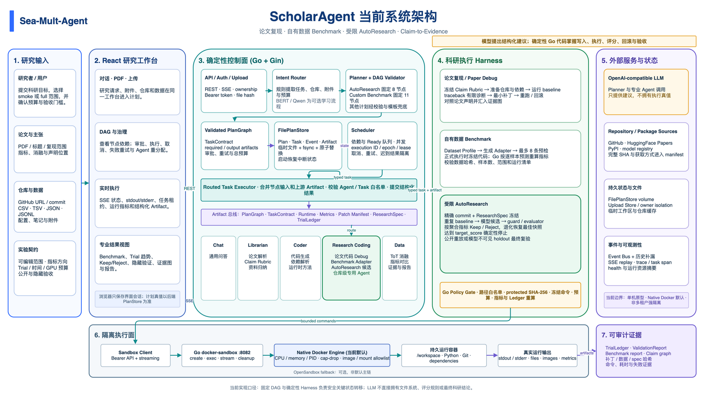
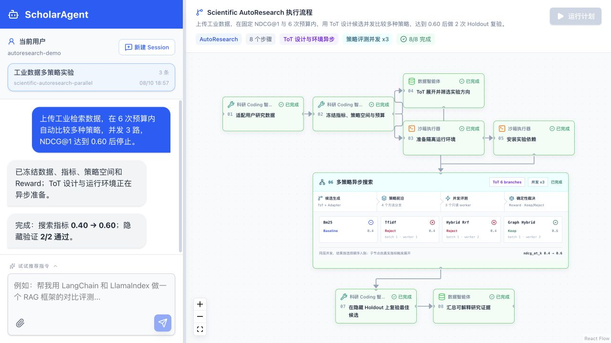
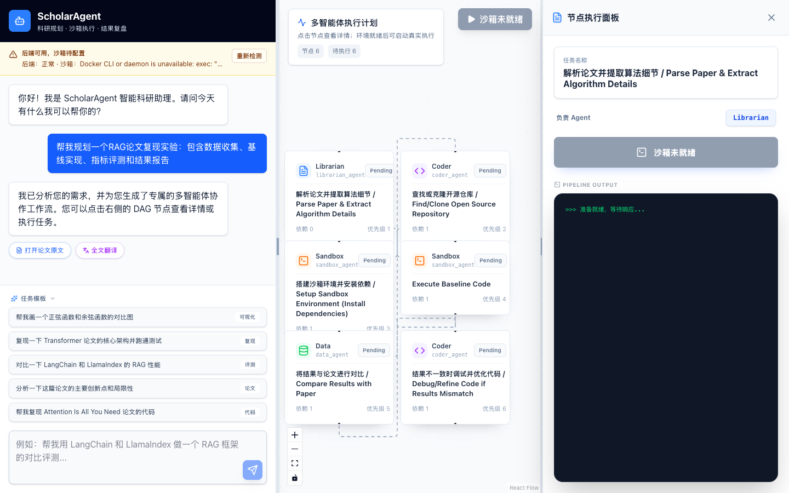

<div align="center">

# Sea-Mult-Agent

**ScholarAgent: 从论文理解到沙箱实验的多智能体科研执行系统**

[](https://go.dev/)
[](https://react.dev/)
[](https://docs.docker.com/compose/)
[](LICENSE)
[](#project-status)

[快速开始](#quick-start) · [系统架构](#architecture) · [API](#api) · [实验记录](#reproduction) · [贡献指南](scholar-agent/docs/CONTRIBUTING.md)

</div>



Sea-Mult-Agent 面向论文阅读、代码仓库发现、环境准备、受控实验和结果分析等科研工作流。用户提交研究目标后，Planner 会生成 DAG，Scheduler 按依赖调度 Librarian、Coder、Sandbox 和 Data 等角色，并通过 SSE 将日志、状态和结构化产物实时推送到前端。

> [!NOTE]
> 本项目目前是具备持久化、恢复、审批、预算和受限沙箱能力的单机研究原型，不是已完成多租户安全认证的生产服务。Docker 沙箱仍具有较高宿主机权限，部署前请阅读[项目状态与安全说明](#project-status)。



## Why Sea-Mult-Agent

| 能力 | 当前实现 |
|---|---|
| **面向科研的任务规划** | 将论文复现、代码执行、框架对比等目标拆解为可执行 DAG |
| **专业 Agent 路由** | 根据任务类型路由到 Librarian、Coder、Sandbox、Data 或 Chat 角色 |
| **真实隔离执行** | 通过独立 Go 沙箱服务调用原生 Docker，支持持久工作区与产物回传 |
| **仓库优先的论文复现** | 发现或使用指定 GitHub 仓库，准备依赖并运行受控 smoke 实验 |
| **预算受限的消融设计** | ToT 评估参数、模块、数据规模、随机种子和运行成本候选，只执行预算内的高价值组合 |
| **研究材料上传** | 在工作台附加论文、配置、笔记和小型数据文件，按用户隔离并传入复现流程 |
| **科研仓库 Coding Agent** | 对论文代码做受限调试、补丁回滚和重跑，也能为自有数据生成仓库 Benchmark 适配器 |
| **自有数据仓库评测** | Research Coding Agent 生成受限适配器，经 8 条预检、ReAct 修复和指标重算后运行用户数据 |
| **逐主张复现验收** | 实验前冻结分层 Rubric，实验后把论文主张、判定准则与真实 Artifact 绑定成可视化证据图 |
| **实时可观测执行** | SSE 推送计划、节点、日志和 Artifact 事件，前端同步展示执行状态 |
| **可靠执行与治理** | 任务租约、迟到结果隔离、取消/重试、持久化恢复、预算和人工审批 |
| **研究工作台** | 集成对话、PDF 阅读、DAG 看板、节点日志、代码、报告与图表视图 |

## Quick Start

### Prerequisites

- Docker Engine 20.10+ 与 Docker Compose v2
- Git
- 一个 OpenAI-compatible LLM API Key
- 本地开发时需要 Go（支持 `GOTOOLCHAIN=auto`）与 Node.js 20+

### Start with Docker Compose

```bash
git clone https://github.com/yu-xin-c/Sea-mult-agent.git
cd Sea-mult-agent/scholar-agent

cp backend.env.example backend.env
# 编辑 backend.env，至少填写 OPENAI_API_KEY

docker compose up --build -d
```

启动后访问：

| 服务 | 地址 |
|---|---|
| Web UI | http://localhost:5173 |
| Backend API | http://localhost:8080 |
| Health Check | http://localhost:8080/api/health |
| Sandbox API | http://localhost:8082 |

确认后端与沙箱均已就绪：

```bash
curl -s http://localhost:8080/api/health
```

期望响应中同时出现 `backend.ok=true` 与 `sandbox.ok=true`。查看日志或停止服务：

```bash
docker compose logs -f
docker compose down
```

### Try a Reproduction Plan

在 Web UI 中输入：

```text
请使用 https://github.com/harvardnlp/annotated-transformer 复现
Attention Is All You Need，使用 smoke 模式运行轻量注意力消融，
不要执行 WMT14 完整训练。
```

系统会生成并执行如下主链：

```text
解析论文 -> 冻结主张 Rubric -----------+
    \-> 检索仓库 -> 准备工作区 -> 解析依赖
        -> 准备运行时 -> 安装依赖 -> 执行实验 -> 对比论文声明
                                                  -> 主张证据图
```

### Benchmark a Repository with Your Data

在 Web UI 上传 `CSV`、`TSV`、`JSON` 或 `JSONL`，然后输入：

```text
用 https://github.com/OWNER/REPOSITORY 跑 benchmark，
输入列是 review，标签列是 label，最多运行 500 条样本。
```

系统会分析数据契约、克隆仓库、生成独立适配器，并在正式运行前用最多 8 条样本预检。分类和回归指标会根据逐样本预测由 Go harness 重算。论文代码运行失败时，同一 Agent 还能在有限源码上下文中生成最小补丁并重跑。组件架构、状态机、Artifact 契约和限制见 [Research Coding Agent](scholar-agent/docs/research_coding_agent.md)。

## Interface

执行图仅突出主控制链和必要的数据依赖，重复连线会自动合并。节点编号、Agent 类型和状态共同建立阅读顺序；长链使用紧凑蛇形布局，移动端可在“对话 / 流程”视图间切换。

点击节点后可以查看任务描述、实时日志、生成代码、报告、指标和图表。论文复现末端还会提供三泳道 Claim-to-Evidence Graph，可缩放查看每条主张、独立准则、证据状态和 Artifact 哈希。



## Architecture

```text
User / Researcher
       |
       v
React Workbench -- REST --> Go API / Intent Router
       ^                         |
       | SSE                     v
       +---------------- Plan Store <--> Planner / Scheduler
                                      |
                         +---------+---------+---------+
                         |         |         |         |
                    Librarian    Coder   ResearchCoding   Data
                         |         |         |
                         +---------+----+----+
                                        |
                                  Docker Sandbox
                                      |
                           Logs / Metrics / Artifacts
```

### Core Components

| 组件 | 目录 | 职责 |
|---|---|---|
| Frontend | `scholar-agent/frontend` | React 工作台、DAG 可视化、PDF 与执行结果展示 |
| Backend | `scholar-agent/backend` | Gin API、意图识别、Planner、Scheduler、Agent 与 SSE |
| Docker Sandbox | `scholar-agent/docker-sandbox` | 容器创建、命令执行、文件与运行时生命周期管理 |
| Python AI Service | `scholar-agent/ai-services` | 可选的 Python 意图识别服务，不在默认 Compose 中启动 |
| Documentation | `scholar-agent/docs` | 启动、架构、规划、实验和用户文档 |

### Agent Roles

| Role | Responsibility |
|---|---|
| **Librarian** | 论文解析、资料检索、方法与声明提取，以及实验前冻结分层 Rubric |
| **Coder** | 仓库发现、代码准备、依赖分析和修复 |
| **Sandbox** | 运行时准备、依赖安装与隔离实验执行 |
| **Data** | 指标汇总、论文声明对比、证据图判定、报告与图表生成 |
| **Research Coding** | 论文仓库代码调试、受限补丁与重跑，以及自有数据 Benchmark 适配和证据校验 |
| **Chat** | 通用问答与轻量任务入口 |

## API

| Method | Endpoint | Description |
|---|---|---|
| `GET` | `/api/health` | 检查后端、沙箱与 GPU runtime 状态 |
| `POST` | `/api/plan` | 根据用户意图创建并保存 DAG |
| `GET` | `/api/plans/:id` | 查询计划、节点状态和产物 |
| `POST` | `/api/plans/:id/execute` | 启动整张计划图 |
| `POST` | `/api/plans/:id/approve` | 批准需要人工确认的计划 |
| `POST` | `/api/plans/:id/cancel` | 取消计划与未完成节点 |
| `POST` | `/api/plans/:id/tasks/:taskId/retry` | 重试失败、阻塞或取消节点 |
| `POST` | `/api/plans/:id/tasks/:taskId/reassign` | 重分配节点并使旧执行租约失效 |
| `GET` | `/api/plans/:id/events` | 获取计划事件历史 |
| `GET` | `/api/plans/:id/stream` | 订阅计划级 SSE 事件流 |
| `POST` | `/api/execute` | 直接执行单个 Agent 任务并流式返回结果 |
| `POST` | `/api/uploads` | 上传论文、配置或小型 Benchmark 数据并返回附件 ID |
| `GET` | `/api/uploads/:id/content` | 按用户所有权读取上传内容 |
| `POST` | `/api/chat` | 通用对话接口 |
| `GET` | `/api/pdf-proxy?url=...` | 代理读取远端 PDF |

## Configuration

复制 `scholar-agent/backend.env.example` 为 `backend.env` 后配置：

| Variable | Required | Default / Purpose |
|---|---:|---|
| `OPENAI_API_KEY` | Yes | OpenAI-compatible API 密钥 |
| `OPENAI_BASE_URL` | No | 默认示例为 DashScope compatible endpoint |
| `OPENAI_MODEL_NAME` | No | 默认示例为 `qwen3-coder-plus` |
| `SANDBOX_URL` | No | 本地默认 `http://localhost:8082`；Compose 会覆盖为服务地址 |
| `SANDBOX_DEFAULT_IMAGE` | No | 论文 smoke test 使用的预装运行时镜像 |
| `REDIS_ADDR` | No | 启用会话记忆；未设置时使用 No-op memory store |
| `REDIS_USERNAME` / `REDIS_PASSWORD` / `REDIS_DB` | No | 可选 Redis 认证与数据库配置 |
| `PLAN_STORE_PATH` | No | 单机计划和事件 JSON 存储；Compose 默认启用持久卷 |
| `PLAN_MAX_TASK_ATTEMPTS` / `PLAN_MAX_DURATION_SECONDS` | No | 计划尝试次数与时长预算 |
| `REQUIRE_PLAN_APPROVAL` | No | 强制计划在执行前人工审批 |
| `API_AUTH_TOKEN` / `SANDBOX_API_TOKEN` | No | 部署 API 与内部沙箱的静态 Bearer 保护 |
| `CORS_ALLOWED_ORIGINS` | No | 允许访问后端的前端 Origin 列表 |

GPU 透传需要宿主机安装 NVIDIA Container Toolkit，并在 Compose 环境中设置：

```bash
SANDBOX_DOCKER_GPUS=all docker compose up --build -d
```

这只启用 GPU 设备透传；`SANDBOX_DEFAULT_IMAGE` 仍需指向包含 CUDA 与所需框架的镜像。

## Development

```bash
cd scholar-agent

make install       # 安装前端依赖并整理 Go modules
make lint          # 前端 ESLint
make test          # 后端、沙箱与离线示例测试
make build         # 构建前端、后端与沙箱
make package       # 构建带嵌入式前端的单文件服务
```

分别启动本地服务时，请在三个终端中运行：

```bash
make run-sandbox
make run-backend
make run-frontend
```

Windows 用户可使用 `scholar-agent/scripts/windows/` 中的 PowerShell 脚本。更完整的环境说明见[本地启动指南](scholar-agent/docs/local_startup_guide.md)。

## Reproduction

项目包含可审计的轻量论文复现记录，用于验证 ScholarAgent 的执行链和结构行为，不替代论文完整训练结果。

从 [`examples/paper-reproduction`](scholar-agent/examples/paper-reproduction/) 开始，可以通过 Web API
重跑同一条项目原生链路，并自动验收 DAG 状态、仓库选择、关键 Artifact 和事件历史。

| Record | Execution Boundary | Result |
|---|---|---|
| [项目原生 DAG 消融](scholar-agent/docs/experiments/2026-07-17_attention_project_native_ablation.md) | `/api/plan` -> Scheduler -> Agent -> Docker -> SSE/Artifact | 8/8 节点完成，15 个产物，61 个事件 |
| [真实仓库 smoke test](scholar-agent/docs/experiments/2026-07-17_attention_repo_smoke.md) | 指定论文仓库的受控集成测试 | 验证仓库发现、准备与执行链 |
| [单节点 CPU 消融](scholar-agent/docs/experiments/2026-07-17_attention_light_ablation.md) | ScholarAgent `/api/execute` | 标准库 CPU 微基准 |
| [独立 V100 消融](scholar-agent/docs/experiments/2026-07-17_attention_gpu_ablation.md) | 项目外独立 PyTorch CUDA 脚本 | 非 ScholarAgent DAG，单独记录 |

上述 smoke 实验不下载 WMT14、不复现 BLEU，也不应外推为完整论文训练结论。

## Project Layout

```text
Sea-mult-agent/
├── README.md
├── LICENSE
├── ArchitectureDiagram.png
├── docker-core/                 # 早期/底层 Docker 执行组件
└── scholar-agent/
    ├── backend/                 # Go API 与多 Agent 编排核心
    ├── frontend/                # React + TypeScript 工作台
    ├── docker-sandbox/          # 独立 Go Docker 沙箱服务
    ├── ai-services/             # 可选 Python 服务
    ├── examples/                # 可运行示例与验收脚本
    ├── test/                    # 功能 golden test 数据、运行器与截图
    ├── docs/                    # 文档与实验记录
    ├── scripts/                 # Unix / Windows 启动脚本
    ├── backend.env.example
    ├── docker-compose.yml
    └── Makefile
```

## Documentation

- [项目架构](scholar-agent/docs/project_architecture.md)
- [本地启动指南](scholar-agent/docs/local_startup_guide.md)
- [用户手册](scholar-agent/docs/user_manual.md)
- [可运行示例](scholar-agent/examples/)
- [前后端项目结构](scholar-agent/docs/project_structure_frontend_backend.md)
- [规划与调度设计](scholar-agent/docs/plan/)
- [Agent Runtime P0/P1](scholar-agent/docs/agent_runtime_p0_p1.md)
- [受限 ToT 消融与文件上传](scholar-agent/docs/tot_ablation_and_uploads.md)
- [Research Coding Agent](scholar-agent/docs/research_coding_agent.md)
- [Claim-to-Evidence Graph](scholar-agent/docs/claim_evidence_graph.md)
- [Claim-to-Evidence 可运行验收](scholar-agent/test/claim-evidence/)
- [论文仓库发现](scholar-agent/docs/papers_with_code/)
- [意图识别与评测](scholar-agent/docs/intent/)
- [贡献指南](scholar-agent/docs/CONTRIBUTING.md)

<a id="project-status"></a>
## Project Status

- **Research prototype**：接口和数据结构仍可能调整，不承诺向后兼容。
- **Persistent single-node runtime**：配置 `PLAN_STORE_PATH` 后会原子持久化计划与事件，并在重启时恢复中断任务；多副本部署仍需要共享事务数据库和 leader election。
- **Authentication**：已支持静态 API token 和计划所有权检查，但用户 ID/游客会话仍不是 OIDC、RBAC 或生产级多租户认证。
- **Sandbox privilege**：已有 CPU、内存、PID、capability、镜像与挂载限制，Compose 仅本机暴露沙箱端口；但 Docker socket 仍等同于较高宿主机权限。
- **GPU runtime**：GPU 透传已在 V100 主机验证，但默认运行时镜像为 CPU/通用 Python 镜像。
- **Full reproduction**：当前重点是轻量 smoke 与结构消融，不包含大规模数据集训练。

## Contributing

Issue、文档改进、测试和小范围 PR 都欢迎提交。重大功能或架构调整请先创建 Issue 讨论，并在提交前运行：

```bash
cd scholar-agent
make lint
make test
make build
```

详细约定见[贡献指南](scholar-agent/docs/CONTRIBUTING.md)。

## License

Sea-Mult-Agent 使用 [MIT License](LICENSE)。
