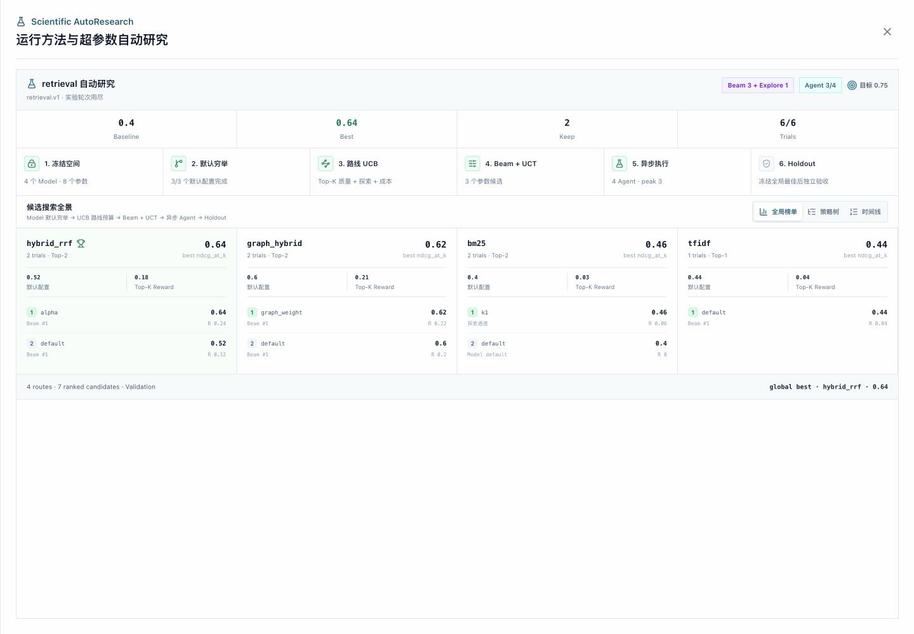
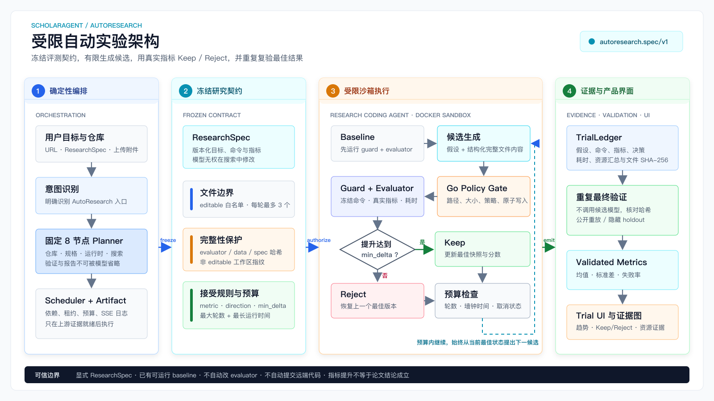
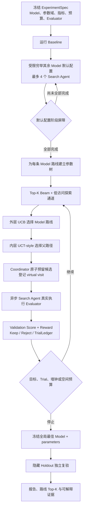

<div align="center">

# Sea-Mult-Agent

**ScholarAgent: 面向论文复现与预算受限自动研究的多智能体科研执行系统**

[](https://go.dev/)
[](https://www.python.org/)
[](https://react.dev/)
[](https://docs.docker.com/compose/)
[](LICENSE)
[](#project-status)

[快速开始](#quick-start) · [AutoResearch](#run-bounded-autoresearch) · [系统架构](#architecture) · [API](#api) · [实验记录](#reproduction) · [贡献指南](scholar-agent/docs/CONTRIBUTING.md)

</div>


Sea-Mult-Agent 面向论文复现、自有数据评测和预算受限的 Scientific AutoResearch。用户可以给出论文仓库，也可以上传自己的研究数据、评测目标和候选方法空间；系统在固定指标与预算下自动尝试代码补丁或方法/超参数配置，真实执行后 Keep/Reject，达到目标即停止，并在 Holdout 上复验最佳候选。RAG 只是首个内置领域 Adapter，不是项目边界。

Intent Router 与 Planner 把目标转换为经过校验的 DAG，Scheduler 通过类型化 Artifact 路由给 Librarian、Benchmark、Coder、Research Coding 和 Data 等专业 Agent。Benchmark Agent 先冻结数据划分、主指标、Reward 和隐藏验收；模型负责论文理解、仓库适配和提出可证伪候选；Python Research Optimizer 先用外层 UCB 在 Model 参数树之间分配预算，再用 Beam + UCT-style 选择树内路径；确定性 Go Harness 掌握候选合法性、4 Agent 异步执行、指标判定、回滚、预算和最终验收。日志、状态和结构化证据通过 SSE 返回工作台。

总图用五个步骤说明系统如何完成一次复现或预算受限自动研究，可编辑源文件见 [ArchitectureDiagram.drawio](ArchitectureDiagram.drawio)，完整组件边界见[项目架构文档](scholar-agent/docs/project_architecture.md)。其中 Native Docker 是当前默认执行引擎；OpenSandbox 仅为可选 fallback，BERT/Qwen 意图模型也未接入默认生产请求链。

> [!NOTE]
> 本项目目前是具备持久化、恢复、审批、预算和受限沙箱能力的单机研究原型，不是已完成多租户安全认证的生产服务。Docker 沙箱仍具有较高宿主机权限，部署前请阅读[项目状态与安全说明](#project-status)。


界面截图由当前 React 组件回放 [`experiment.ledger/v1` 异步搜索记录](scholar-agent/frontend/test/fixtures/scientific-autoresearch-ledger.json)生成，不是手工绘制的流程图。外层 DAG 展示数据适配、契约冻结、ToT 设计与环境准备的异步分支、Holdout 和报告；搜索复合节点展示 Model 默认配置阶段屏障、路线 UCB、Beam/探索前沿、树内 UCT、4 个 Search Agent 以及真实 Reward。调度行为由 Go 集成测试实际执行验证，截图 fixture 用于稳定复现界面。

## Why Sea-Mult-Agent

| 能力 | 当前实现 |
|---|---|
| **面向科研的任务规划** | 将论文复现、代码执行、框架对比等目标拆解为可执行 DAG |
| **专业 Agent 路由** | 根据任务类型路由到 Chat、Librarian、Benchmark、Coder、Research Coding 或 Data；沙箱作为确定性执行服务独立运行 |
| **真实隔离执行** | 通过独立 Go 沙箱服务调用原生 Docker，支持持久工作区与产物回传 |
| **仓库优先的论文复现** | 发现或使用指定 GitHub 仓库，准备依赖并运行受控 smoke 实验 |
| **预算受限的消融设计** | 两层 ToT 先比较参数、模块、数据、种子和成本方向，再细化高价值父分支；Scientific AutoResearch 中该节点与沙箱环境准备异步执行，Go 校验谱系并只选择预算内组合 |
| **研究材料上传** | 在工作台附加论文、配置、笔记和小型数据文件，按用户隔离并传入复现流程 |
| **科研仓库 Coding Agent** | 对论文代码做受限调试、补丁回滚和重跑，也能为自有数据生成仓库 Benchmark 适配器 |
| **可信 Benchmark Agent** | 自动审计任务与列映射，生成 train/validation/test，执行分层/group/time 划分和泄漏检查，冻结 Metric/Reward 契约，并在仓库不可见的标签上重算最终指标 |
| **自有数据仓库评测** | Research Coding Agent 生成受限适配器，经有标签指标预检、无标签推理预检和有限 ReAct 修复后运行 validation；test 仅提供特征与 ID，最终指标由 Benchmark Agent 对隐藏标签重算 |
| **受限 AutoResearch 循环** | 冻结仓库提交、评测器与数据，只允许修改白名单文件；重复测量后 Keep/Reject、退化回滚、目标分数停止，并隐藏复验最佳候选 |
| **通用实验配置搜索** | 通过 `experiment.spec/v1` 描述 Model 组合与参数有限域；先受限穷举所有默认配置，再由外层 UCB 分配调参预算、Top-K Beam 保留高分路径、UCT-style 选择树内扩展；只读 evaluator 默认支持 4 个异步 Search Agent，Portable Adapter 默认串行 |
| **跨任务策略经验** | Python Optimizer 将数据特征、候选选择概率、实际 Reward 和 Holdout 状态写入 SQLite；仅使用已验证 campaign 的历史提供 Contextual Bandit 先验，当前 Validation 结果始终优先，服务异常时回退到同结构的 Go 策略 |
| **检索/RAG 示例 Adapter** | 上传语料、查询与相关文档标注后，自动比较 BM25、TF-IDF、RRF 和显式关系边图增强检索；它是通用协议示例，不是产品边界 |
| **逐主张复现验收** | 实验前冻结分层 Rubric，实验后把论文主张、判定准则与真实 Artifact 绑定成可视化证据图 |
| **实时可观测执行** | SSE 推送计划、节点、日志和 Artifact 事件，前端同步展示执行状态 |
| **可靠执行与治理** | 任务租约、迟到结果隔离、取消/重试、持久化恢复、预算和人工审批 |
| **研究工作台** | 集成对话、PDF 阅读、DAG 看板、节点日志、代码、报告与图表视图 |

## Quick Start

### Prerequisites

- Docker Engine 20.10+ 与 Docker Compose v2
- Git
- 一个 OpenAI-compatible LLM API Key
- 本地开发时需要 Go（支持 `GOTOOLCHAIN=auto`）与 Node.js 20+

### Start with Docker Compose

```bash
git clone https://github.com/yu-xin-c/Sea-mult-agent.git
cd Sea-mult-agent/scholar-agent

cp backend.env.example backend.env
# 编辑 backend.env，至少填写 OPENAI_API_KEY

docker compose up --build -d
```

启动后访问：

| 服务 | 地址 |
|---|---|
| Web UI | http://localhost:5173 |
| Backend API | http://localhost:8080 |
| Health Check | http://localhost:8080/api/health |
| Sandbox API | http://localhost:8082 |

确认后端与沙箱均已就绪：

```bash
curl -s http://localhost:8080/api/health
```

期望响应中同时出现 `backend.ok=true`、`repository.ok=true`、`sandbox.ok=true` 与 `research_optimizer.ok=true`。`repository.ok` 会在运行镜像缺少 Git 时明确失败，避免服务表面健康但外部仓库任务不可用。查看日志或停止服务：

```bash
docker compose logs -f
docker compose down
```

### Try a Reproduction Plan

在 Web UI 中输入：

```text
请使用 https://github.com/harvardnlp/annotated-transformer 复现
Attention Is All You Need，使用 smoke 模式运行轻量注意力消融，
不要执行 WMT14 完整训练。
```

系统会生成并执行如下主链：

```text
解析论文 -> 冻结主张 Rubric -----------+
    \-> 检索仓库 -> 准备工作区 -> 解析依赖
        -> 准备运行时 -> 安装依赖 -> 执行实验 -> 对比论文声明
                                                  -> 主张证据图
```

### Benchmark a Repository with Your Data

在 Web UI 上传 `CSV`、`TSV`、`JSON` 或 `JSONL`，然后输入：

```text
用 https://github.com/OWNER/REPOSITORY 跑 benchmark，
输入列是 review，标签列是 label，最多运行 500 条样本。
```

系统会先由独立 Benchmark Agent 审计任务和列映射，再按任务选择分层哈希、回归分位数、group 或 time 划分，物理生成 `train / validation / preflight_features / test_features`。后两份数据都不含标签：`preflight_features` 用于在最多 3 次有限修复中确认 Adapter 能纯推理，正式 `test_features` 只用于最终验收。主指标、方向、目标阈值和仅用于候选排序的 Reward 会写入冻结契约；最终 Adapter 只提交 `id + prediction`，隐藏指标由 Backend 重算。完整协议见 [Benchmark Agent](scholar-agent/docs/benchmark_agent.md)，可运行小样本见 [classification example](scholar-agent/examples/benchmark-agent/classification/)。

### Run Bounded AutoResearch

AutoResearch 有两个入口：论文仓库的代码候选模式，以及自有数据的方法/配置候选模式。

#### Search Methods And Hyperparameters On Your Data

例如在 Web UI 上传带 `id/text/links` 的语料，以及带 `query/relevant_doc_ids/split` 的评测问题后输入：

```text
请在这批工业数据上做自动研究，比较 RAG 检索策略和超参数。
固定 NDCG@1，最多 6 次实验，4 个 Search Agent，总时长 3 分钟，目标分数 0.60，独立复验 2 次。
```

系统会执行 `数据适配 -> 冻结 Model 与参数空间 -> (ToT 设计 || 沙箱准备) -> 分层异步搜索 -> Holdout -> 报告`。所有合法 Model 组合先以默认配置各运行一次；阶段屏障通过后，外层 UCB 在多棵参数树之间分配预算，内层 Top-K Beam + 探索通道形成前沿，再由 UCT-style 分数选择父路径。最多 4 个隔离 Search Agent 按结果返回立即补位，virtual visit 避免并发任务重复涌入同一路线。每轮保存父节点、完整配置、真实指标、Reward、UCB/UCT 组成、派发/完成顺序和 Keep/Reject 原因。非检索论文可以上传 `experiment.json`、领域 evaluator 和数据，通过 Portable Adapter 复用同一 Harness；未显式声明只读隔离时保持串行。

真实轻量示例中，固定 `NDCG@1` 后，BM25 baseline 为 `0.4000`，图增强分支达到 `0.6000`；未参与搜索的 Holdout 从 `0.3333` 提升到 `0.6667`，两个新进程通过 `2/2`。随后连续运行两个真实 HTTP campaign：第一轮冷启动用了 2 个候选，第二轮读取已验证经验后直接优先 `graph_hybrid`，只用 1 个候选达到同一结果。详见[检索 Adapter 示例](scholar-agent/examples/scientific-autoresearch/retrieval/)和[通用 Scientific AutoResearch 协议](scholar-agent/docs/autoresearch/09_general_scientific_autoresearch.md)。这表示“给定候选空间与预算内观察到的最佳结果”，不表示全局最优或已经具备跨数据集泛化。



这不是单独绘制的示意图，而是产品中的交互式候选搜索视图。后端把冻结的 Model/参数空间和 Trial 谱系写入 `experiment.ledger/v1`；前端默认显示跨路线 Top-K 全局视图，也可切换参数树和异步时间线。用户可以查看每个候选为何被提出、相对父节点的参数变化、Beam 或探索身份、路线 UCB、节点 UCT、virtual visits、真实 Reward、Search Agent、派发/完成顺序以及 Keep/Reject 原因。根节点默认分数与后代调度统计分开保存，不会因回传而被改写；最终只冻结全局最佳 `Model + parameters` 进入 Holdout。完整协议见[分层候选搜索引擎](scholar-agent/docs/autoresearch/11_hierarchical_search_engine.md)。

#### Optimize A Paper Repository

仓库中准备 `autoresearch.spec/v1` 配置后，在 Web UI 输入：

```text
用 https://github.com/OWNER/REPOSITORY 做 AutoResearch，
按 autoresearch.json 运行，最多 3 轮，总时长不超过 15 分钟，最终验证 3 次。
```

系统会冻结 ResearchSpec 和可选 `repository_revision`，先按 `search_runs` 重复测量 baseline，再让 Research Coding Agent 生成白名单内的小改动。只有聚合主指标达到最小提升才保留候选；退化或部分执行失败的候选会回滚。Keep 候选达到可选 `target_score` 后由 harness 确定性停止。循环结束后可启动 1 至 5 次新进程验证：未配置 holdout 时标记为 `search_evaluator_replay`，只证明公开评测可重复；配置模型不可见 holdout 时标记为 `hidden_holdout`，最终接受由隐藏指标决定。报告包含原始搜索样本、标准差、逐次验证分数、失败率以及命令资源摘要。可运行样例见 [Intent Router AutoResearch](scholar-agent/examples/autoresearch/intent_router/)和[四仓库真实实验](scholar-agent/examples/autoresearch/real_repositories/)，实现边界见 [AutoResearch 模块文档](scholar-agent/docs/autoresearch/)。

#### Research Foundations

这里的“借鉴”是方法组合与工程落地，不表示复制了来源项目的代码，也不表示 ScholarAgent 已具备原工作的全部能力。

| 项目或论文 | 借鉴到 ScholarAgent 的内容 | 当前边界 |
|---|---|---|
| [karpathy/autoresearch](https://github.com/karpathy/autoresearch) | 小改动、固定预算、真实指标以及 Keep/Reject 循环 | 核心循环已实现，并扩展为跨仓库 ResearchSpec、多文件白名单、回滚和 TrialLedger |
| [ReAct](https://arxiv.org/abs/2210.03629) | 错误观察、结构化修复动作和重跑 | 已用于依赖安装与 Benchmark 预检；不负责科研指标判定 |
| [Tree of Thoughts](https://arxiv.org/abs/2305.10601) | 展开、评估和剪枝多个候选路径 | 两层 ToT 选择高信息增益消融；在 Scientific AutoResearch 中与环境准备异步执行并冻结计划哈希。运行期仍由真实指标候选树裁决，不把模型私有思维当证据 |
| [The AI Scientist](https://arxiv.org/abs/2408.06292) | 将想法、代码、实验、可视化和报告连接为长科研链 | 属于端到端方向启发，不宣称全自动科学发现或自动科学真值 |
| [Agent Laboratory](https://arxiv.org/abs/2501.04227) | 文献、实验和写作阶段的专业 Agent 分工与用户介入 | 专业角色已实现；完整人工审批检查点仍在路线图 |
| [PaperBench](https://arxiv.org/abs/2504.01848) | 用分层 Rubric 拆解论文复现，并逐项绑定证据 | 已实现 Claim Rubric 与 Claim-to-Evidence Graph；它属于上层复现验收，不替代主指标 |
| [CORE-Bench](https://arxiv.org/abs/2409.11363) | 真实论文仓库、真实执行环境与任务专用复现 Agent | 已实现 Research Coding Agent 和可复查 Artifact；尚未完成公开 CORE-Bench 全量对照 |
| [SWE-agent](https://arxiv.org/abs/2405.15793) | 仓库级受限阅读、代码编辑和测试反馈 | 仅作 Engineering scaffold 对照，没有移植 SWE-agent ACI 或宣称其评测结果 |
| [CORE-Bench 2026 analysis](https://arxiv.org/abs/2606.26158) | 从准确率扩展到可靠性、效率、OOD、scaffold 和人机协作 | 已覆盖重复复验和部分资源证据；OOD、多 seed 与人机协作尚未完成 |
| [MLE-bench](https://arxiv.org/abs/2410.07095) | 同时观察任务效果和计算资源投入 | 已记录命令次数与耗时，尚不包含 GPU、token 和费用账本 |
| [Microsoft R&D-Agent](https://github.com/microsoft/RD-Agent) | Research/Development 分工，以及多次实验的统计报告方式 | 已输出重复验证的均值、标准差和失败率；当前不会自动注入不同 seed |
| [Auto-Research-Recipes](https://github.com/cxcscmu/Auto-Research-Recipes) | 任务无关核心、Task Adapter、外部 evaluator 和可发布 Artifact | 已实现通用 `experiment.* /v1`、内置/Portable Adapter 与配置候选 lineage；代码补丁模式仍使用线性 TrialLedger |
| [Arbor](https://github.com/RUC-NLPIR/Arbor) | Coordinator/Executor、想法树、隔离 worktree 和开发/heldout 分离 | 配置模式已实现中央 Coordinator、4 Agent 异步参数树和搜索/隐藏验收边界；尚未实现并行 Git worktree 与逐轮 checkpoint 恢复 |
| [AI Scientist v2](https://github.com/SakanaAI/AI-Scientist-v2) | 渐进式 Agent tree search 与实验管理 | 配置模式已有真实 Validation 驱动的 UCT-style 参数树；没有模拟 rollout，代码补丁模式仍使用线性 TrialLedger，因此不宣称完整 MCTS |
| [Deep Research Agent Stochasticity](https://arxiv.org/abs/2602.23271) | 独立运行存在方差，需要重复测量和聚合 | baseline 与每个候选已支持重复 evaluator、标准差和方向相关 worst |

这些方法位于不同决策层：ToT 选择高价值消融，ReAct 处理有限故障恢复，AutoResearch 按冻结指标执行 Keep/Reject，PaperBench 风格 Rubric 与证据图负责上层论文验收。完整来源事实、代码落点和过度声明风险见 [AutoResearch 项目介绍](scholar-agent/docs/autoresearch/00_project_introduction.md)与[证据表](scholar-agent/docs/autoresearch/refs/evidence-map.md)。

真实外部仓库审计（2026-08-10）：通过完整 API/Docker 链运行 [rank-bm25、Tenacity、LightRAG 和 Microsoft GraphRAG](scholar-agent/examples/autoresearch/real_repositories/)，四份原始结果都记录实际 commit。四组搜索均使用 `3 x worst`，公开分数分别从 `5/9、6/7、4/8、6/12` 提升到满分，新的模型不可见 holdout 均从低基线提升到 `4/4`，且最终 `3/3` 重复验证通过。实验同时推动三项架构修复：重复搜索测量防止单次尖峰、`repository_revision` 防止 HEAD 漂移、`target_score` 防止满分平台浪费预算；后两项用固定 LightRAG 提交做了独立对照。早期 GraphRAG `11/11` 公开满分但隐藏 `3/4` 的失败记录仍原样保留。完整机器记录和不足复盘见[真实外部仓库实验](scholar-agent/docs/autoresearch/08_real_repository_experiments.md)。



架构图的可编辑矢量源文件见 [autoresearch-architecture.svg](scholar-agent/docs/assets/autoresearch-architecture.svg)。模型只负责提出候选；固定 Planner、ResearchSpec、Go policy gate、Docker 沙箱和最终验证共同掌握执行与接受边界。重复进程不等于多 seed，公开 evaluator 重放也不等于隐藏验证；统计规则和资源口径见 [重复验证与执行资源证据](scholar-agent/docs/autoresearch/07_repeated_validation_and_resource_evidence.md)。


## Interface

执行图突出主控制链和必要的数据依赖，重复连线会自动合并。普通任务使用紧凑 DAG；Scientific AutoResearch 会把搜索节点展开为“默认配置穷举、路线 UCB、Beam + UCT 前沿、4 Agent 异步评测、Holdout”复合节点，并从账本显示 Search Agent、派发/完成顺序、Reward、Keep/Reject 和分数。移动端可在“对话 / 流程”视图间切换。

点击节点后可以查看任务描述、实时日志、生成代码、报告、指标和图表。论文复现末端还会提供三泳道 Claim-to-Evidence Graph，可缩放查看每条主张、独立准则、证据状态和 Artifact 哈希。


## Architecture

```text
Researcher / Paper / Repository / Dataset
                    |
                    v
             React Workbench
                    |
            REST / Upload / SSE
                    |
                    v
    API -> Intent Router -> Planner + DAG Validator
                               |
                 Validated PlanGraph + FilePlanStore
                               |
          Scheduler (lease / retry / cancel / budget)
                               |
                    Routed Task Executor
          +--------+----------+----------+-----------------+------+
          |        |          |          |                 |      |
         Chat  Librarian  Benchmark   Coder       Research Coding  Data
                    |       /    \       |          /          \     |
             Claim Rubric Split Metric Runtime  Paper Debug  AutoResearch
                              \ Contract         /       \       |
                               Hidden Eval   Repository Adapter  |
                                      \        |     +----+----------------+
                                       Go Policy Gate  Code Patch   Config Search
                                                               Domain Adapter
                                                                    |
                                                  Python Research Optimizer
                                      Context / Route UCB / Beam + UCT / Experience
                                   |
              Sandbox Client -> docker-sandbox -> Native Docker
                                   |
           stdout / metrics / files / TrialLedger / evidence graph
                                   |
                         Artifact + Event -> SSE
```

### Core Components

| 组件 | 目录 | 职责 |
|---|---|---|
| Frontend | `scholar-agent/frontend` | React 工作台、DAG 可视化、PDF 与执行结果展示 |
| Backend | `scholar-agent/backend` | Gin API、意图识别、Planner、Scheduler、Agent 与 SSE |
| Docker Sandbox | `scholar-agent/docker-sandbox` | 容器创建、命令执行、文件与运行时生命周期管理 |
| Research Optimizer | `scholar-agent/research-optimizer` | Python 数据特征、候选优先级与 SQLite 跨任务经验；不掌握执行和验收 |
| Python AI Service | `scholar-agent/ai-services` | 可选的 Python 意图识别服务，不在默认 Compose 中启动 |
| Documentation | `scholar-agent/docs` | 启动、架构、规划、实验和用户文档 |

### Agent Roles

| Role | Responsibility |
|---|---|
| **Librarian** | 论文解析、资料检索、方法与声明提取，以及实验前冻结分层 Rubric |
| **Coder** | 仓库发现、代码准备、依赖分析和修复 |
| **Sandbox** | 运行时准备、依赖安装与隔离实验执行 |
| **Data** | 指标汇总、论文声明对比、证据图判定、报告与图表生成 |
| **Research Coding** | 论文仓库调试、自有数据 Benchmark 适配、代码补丁 AutoResearch，以及由 Domain Adapter 驱动的方法/超参数候选搜索 |
| **Benchmark Agent** | 数据审计、可复现 split、泄漏检查、Metric/Reward 契约、公开/隐藏 evaluator 和最终指标重算 |
| **Chat** | 通用问答与轻量任务入口 |

## API

| Method | Endpoint | Description |
|---|---|---|
| `GET` | `/api/health` | 检查后端、沙箱与 GPU runtime 状态 |
| `POST` | `/api/plan` | 根据用户意图创建并保存 DAG |
| `GET` | `/api/plans/:id` | 查询计划、节点状态和产物 |
| `POST` | `/api/plans/:id/execute` | 启动整张计划图 |
| `POST` | `/api/plans/:id/approve` | 批准需要人工确认的计划 |
| `POST` | `/api/plans/:id/cancel` | 取消计划与未完成节点 |
| `POST` | `/api/plans/:id/tasks/:taskId/retry` | 重试失败、阻塞或取消节点 |
| `POST` | `/api/plans/:id/tasks/:taskId/reassign` | 重分配节点并使旧执行租约失效 |
| `GET` | `/api/plans/:id/events` | 获取计划事件历史 |
| `GET` | `/api/plans/:id/stream` | 订阅计划级 SSE 事件流 |
| `POST` | `/api/execute` | 直接执行单个 Agent 任务并流式返回结果 |
| `POST` | `/api/uploads` | 上传论文、配置或小型 Benchmark 数据并返回附件 ID |
| `GET` | `/api/uploads/:id/content` | 按用户所有权读取上传内容 |
| `POST` | `/api/chat` | 通用对话接口 |
| `GET` | `/api/pdf-proxy?url=...` | 代理读取远端 PDF |

## Configuration

复制 `scholar-agent/backend.env.example` 为 `backend.env` 后配置：

| Variable | Required | Default / Purpose |
|---|---:|---|
| `OPENAI_API_KEY` | Yes | OpenAI-compatible API 密钥 |
| `OPENAI_BASE_URL` | No | 默认示例为 DashScope compatible endpoint |
| `OPENAI_MODEL_NAME` | No | 默认示例为 `qwen3-coder-plus` |
| `SANDBOX_URL` | No | 本地默认 `http://localhost:8082`；Compose 会覆盖为服务地址 |
| `SANDBOX_DEFAULT_IMAGE` | No | 默认 Python 运行时；根 `pyproject.toml` 声明更高 `requires-python` 时只向上适配 |
| `REDIS_ADDR` | No | 启用会话记忆；未设置时使用 No-op memory store |
| `REDIS_USERNAME` / `REDIS_PASSWORD` / `REDIS_DB` | No | 可选 Redis 认证与数据库配置 |
| `PLAN_STORE_PATH` | No | 单机计划和事件 JSON 存储；Compose 默认启用持久卷 |
| `RESEARCH_OPTIMIZER_URL` | No | Python Research Optimizer 地址；不配置时使用同结构的确定性 Go UCB/UCT fallback |
| `RESEARCH_OPTIMIZER_API_TOKEN` | No | Backend 与内部 Optimizer 之间的 Bearer Token |
| `PLAN_MAX_TASK_ATTEMPTS` / `PLAN_MAX_DURATION_SECONDS` | No | 计划尝试次数与时长预算 |
| `REQUIRE_PLAN_APPROVAL` | No | 强制计划在执行前人工审批 |
| `API_AUTH_TOKEN` / `SANDBOX_API_TOKEN` | No | 部署 API 与内部沙箱的静态 Bearer 保护 |
| `CORS_ALLOWED_ORIGINS` | No | 允许访问后端的前端 Origin 列表 |

后端镜像构建还支持 `DEBIAN_MIRROR` 与 `DEBIAN_SECURITY_MIRROR`。它们由执行 `docker compose` 的 shell 或项目 `.env` 读取，不是 `backend.env` 中的运行时变量；默认仍使用 Debian 官方源。网络受限环境可以显式覆盖：

```bash
DEBIAN_MIRROR=https://your-mirror.example/debian \
DEBIAN_SECURITY_MIRROR=https://your-mirror.example/debian-security \
docker compose up --build -d
```

GPU 透传需要宿主机安装 NVIDIA Container Toolkit，并在 Compose 环境中设置：

```bash
SANDBOX_DOCKER_GPUS=all docker compose up --build -d
```

这只启用 GPU 设备透传；`SANDBOX_DEFAULT_IMAGE` 仍需指向包含 CUDA 与所需框架的镜像。

## Development

```bash
cd scholar-agent

make install       # 安装前端依赖并整理 Go modules
make lint          # 前端 ESLint
make test          # 后端、沙箱与离线示例测试
make build         # 构建前端、后端与沙箱
make package       # 构建带嵌入式前端的单文件服务
```

分别启动本地服务时，请在三个终端中运行：

```bash
make run-sandbox
make run-backend
make run-frontend
```

Windows 用户可使用 `scholar-agent/scripts/windows/` 中的 PowerShell 脚本。更完整的环境说明见[本地启动指南](scholar-agent/docs/local_startup_guide.md)。

## Reproduction

项目包含可审计的轻量论文复现记录，用于验证 ScholarAgent 的执行链和结构行为，不替代论文完整训练结果。

从 [`examples/paper-reproduction`](scholar-agent/examples/paper-reproduction/) 开始，可以通过 Web API
重跑同一条项目原生链路，并自动验收 DAG 状态、仓库选择、关键 Artifact 和事件历史。

| Record | Execution Boundary | Result |
|---|---|---|
| [项目原生 DAG 消融](scholar-agent/docs/experiments/2026-07-17_attention_project_native_ablation.md) | `/api/plan` -> Scheduler -> Agent -> Docker -> SSE/Artifact | 8/8 节点完成，15 个产物，61 个事件 |
| [真实仓库 smoke test](scholar-agent/docs/experiments/2026-07-17_attention_repo_smoke.md) | 指定论文仓库的受控集成测试 | 验证仓库发现、准备与执行链 |
| [单节点 CPU 消融](scholar-agent/docs/experiments/2026-07-17_attention_light_ablation.md) | ScholarAgent `/api/execute` | 标准库 CPU 微基准 |
| [独立 V100 消融](scholar-agent/docs/experiments/2026-07-17_attention_gpu_ablation.md) | 项目外独立 PyTorch CUDA 脚本 | 非 ScholarAgent DAG，单独记录 |

上述 smoke 实验不下载 WMT14、不复现 BLEU，也不应外推为完整论文训练结论。

## Project Layout

```text
Sea-mult-agent/
├── README.md
├── LICENSE
├── ScholarAgentOverview.png     # 面向新用户的五步流程总图
├── ArchitectureDiagram.drawio   # 可编辑的当前系统总架构图
├── docker-core/                 # 早期/底层 Docker 执行组件
└── scholar-agent/
    ├── backend/                 # Go API 与多 Agent 编排核心
    ├── frontend/                # React + TypeScript 工作台
	├── docker-sandbox/          # 独立 Go Docker 沙箱服务
	├── research-optimizer/      # Python 特征、候选策略与 Experience Store
	├── ai-services/             # 可选 Python 服务
    ├── examples/                # 可运行示例与验收脚本
    ├── test/                    # 功能 golden test 数据、运行器与截图
    ├── docs/                    # 文档与实验记录
    ├── scripts/                 # Unix / Windows 启动脚本
    ├── backend.env.example
    ├── docker-compose.yml
    └── Makefile
```

## Documentation

- [项目架构](scholar-agent/docs/project_architecture.md)
- [本地启动指南](scholar-agent/docs/local_startup_guide.md)
- [用户手册](scholar-agent/docs/user_manual.md)
- [可运行示例](scholar-agent/examples/)
- [前后端项目结构](scholar-agent/docs/project_structure_frontend_backend.md)
- [规划与调度设计](scholar-agent/docs/plan/)
- [Agent Runtime P0/P1](scholar-agent/docs/agent_runtime_p0_p1.md)
- [受限 ToT 消融与文件上传](scholar-agent/docs/tot_ablation_and_uploads.md)
- [Research Coding Agent](scholar-agent/docs/research_coding_agent.md)
- [AutoResearch 项目介绍](scholar-agent/docs/autoresearch/00_project_introduction.md)
- [AutoResearch 模块文档](scholar-agent/docs/autoresearch/)
- [Python Research Optimizer](scholar-agent/docs/autoresearch/10_python_research_optimizer.md)
- [分层候选搜索引擎](scholar-agent/docs/autoresearch/11_hierarchical_search_engine.md)
- [Claim-to-Evidence Graph](scholar-agent/docs/claim_evidence_graph.md)
- [Claim-to-Evidence 可运行验收](scholar-agent/test/claim-evidence/)
- [论文仓库发现](scholar-agent/docs/papers_with_code/)
- [意图识别与评测](scholar-agent/docs/intent/)
- [贡献指南](scholar-agent/docs/CONTRIBUTING.md)

<a id="project-status"></a>
## Project Status

- **Research prototype**：接口和数据结构仍可能调整，不承诺向后兼容。
- **Persistent single-node runtime**：配置 `PLAN_STORE_PATH` 后会原子持久化计划与事件，并在重启时恢复中断任务；多副本部署仍需要共享事务数据库和 leader election。
- **Authentication**：已支持静态 API token 和计划所有权检查，但用户 ID/游客会话仍不是 OIDC、RBAC 或生产级多租户认证。
- **Sandbox privilege**：已有 CPU、内存、PID、capability、镜像与挂载限制，Compose 仅本机暴露沙箱端口；但 Docker socket 仍等同于较高宿主机权限。
- **GPU runtime**：GPU 透传已在 V100 主机验证，但默认运行时镜像为 CPU/通用 Python 镜像。
- **Full reproduction**：当前重点是轻量 smoke 与结构消融，不包含大规模数据集训练。
- **Learning policy**：当前实现是基于真实 Validation Reward 的分层 UCB、Top-K Beam 和 UCT-style 搜索，并使用已验证历史提供 Contextual Bandit 先验；它不是 Q-learning、完整 MCTS 或已经充分训练的通用 RL Policy。

## Contributing

Issue、文档改进、测试和小范围 PR 都欢迎提交。重大功能或架构调整请先创建 Issue 讨论，并在提交前运行：

```bash
cd scholar-agent
make lint
make test
make build
```

详细约定见[贡献指南](scholar-agent/docs/CONTRIBUTING.md)。

## License

Sea-Mult-Agent 使用 [MIT License](LICENSE)。

## Search Strategy Matrix

Scientific AutoResearch 没有用一种算法处理所有候选。Model 组合、离散参数、连续参数和渐进训练预算是不同的搜索对象，错误地把它们全部平铺成 Bandit 手臂会迅速产生组合爆炸，也很难解释为什么某条路径获得了预算。

### Why These Algorithms

| 决策层 | 当前选择 | 选择原因 | 明确边界 |
|---|---|---|---|
| Model 组合冷启动 | 受限穷举 | 每个合法组合先用同一默认预算真实运行一次，避免先验在没有本任务证据时提前淘汰路线 | 穷举的是 Adapter/ToT 已冻结的有限合法组合，不是自动生成所有模块幂集；当前最多 16 条路线 |
| Model 路线预算 | UCB + Contextual Bandit prior | 路线是有限离散选项，实验后立即得到 Validation Reward，适合平衡利用和探索 | 只优化下一次预算分配，不建模长期环境状态，因此不是 Q-learning |
| 路线内活跃前沿 | Top-K Beam + 探索通道 | Beam 保留当前主指标最好的 K 条父路径，探索通道防止一次早期低分永久剪掉潜在路径 | 默认 `K=3`、每条路线 1 个探索槽；所有 Trial 仍保留在账本中 |
| 路线内父路径选择 | UCT-style | 参数具有父子关系，真实 Reward 可以沿路径累计访问数和均值 | 没有模拟 rollout、价值网络或随机 playout，因此不是完整 MCTS |
| 候选执行 | 4 Agent 异步 worker pool | 慢候选不阻塞快候选补位，virtual visit 可避免并发任务重复选择同一路线 | 只有 `shared-readonly/v1` evaluator 才允许并发；Portable Adapter 默认串行 |
| 最终可信验收 | 隐藏 Holdout | 搜索只看 Validation，冻结全局最佳后再测试未参与搜索的数据 | Holdout 不提供给搜索 Policy，也不参与 UCB、Beam、UCT 或 Reward 更新 |

### End-To-End Search Flow



第一阶段是硬屏障。假设冻结空间包含 `A+B`、`A+C`、`A+B+C`，它们的默认配置必须全部产生真实分数，参数搜索才能开始。即使其中一条路线提前达到目标，也不会跳过其他默认配置；这样前端最终仍能同时展示每条路线的默认分数和最佳候选。

### Candidate Generation And Beam

每条 Model 路线有独立参数树，子候选一次只改变一个离散参数。例如：

```text
A+C 默认配置
├── top_k=10
├── top_k=20
│   ├── rerank_k=5
│   └── rerank_k=10
└── threshold=0.6
```

候选 ID 由 `Model + 完整参数 JSON` 的规范哈希生成，相同配置即使通过不同路径到达也只执行一次。离散参数值按 Adapter 冻结的顺序排列，每次只向当前值的相邻位置 `index-1/index+1` 扩展，避免一次跨越多个取值后无法判断是哪项变化带来效果。每轮按冻结主指标对每条路线的父节点排序：方向为 `maximize` 时高分优先，`minimize` 时低分优先，同分再比较耗时和 Trial 编号。默认保留 Top-3 Beam 父节点，并从 Beam 之外选择最低访问节点进入探索通道：

```text
ActiveFrontier(route) = TopKParentsByMetric + LowestVisitExplorationParents
```

Beam 只控制“谁还能继续长出子节点”，不删除历史。一个候选即使没有击败当前全局最佳而被标记为 Reject，只要 evaluator 成功，它的真实分数仍进入该路线榜单，也可以继续生成受限子候选；执行失败且没有可信分数的候选不会进入高分 Beam。

### Outer Route UCB

外层 UCB 决定下一份实验预算投给哪棵 Model 参数树。Python Optimizer 先组合本次任务的路线 Top-K Reward 与相似数据集先验：

\[
P_i = \frac{k_i \cdot \operatorname{TopKMeanReward}_i + w_i \cdot \operatorname{ContextMeanReward}_i}{k_i+w_i}
\]

其中 `k_i=min(3, 本路线已完成 Trial 数)`；只有 Holdout 已验证的历史 campaign 能成为 Contextual prior，并且每条路线的 `w_i` 被限制在 `[0, 0.75]`。默认配置阶段保证本任务至少已有一个真实观察，因此历史经验不能覆盖当前数据的真实结果。

当前路线选择分为：

\[
\operatorname{RouteScore}_i=P_i+0.35\sqrt{\frac{\ln(N+2)}{\max(1,n_i+v_i)}}-0.05v_i
\]

- `N`：全部路线的有效访问量；Go fallback 使用本次 campaign 已完成和已预留的访问，Python Policy 还计入封顶后的 Contextual 伪访问。
- `n_i`：当前路线的有效访问量；对外审计的 `route_visit_count` 始终只记录本次真实访问。
- `v_i`：路线中正在运行、尚未返回的 virtual visits。
- 第一项偏向当前高收益路线，平方根项奖励访问较少的路线，最后一项阻止 4 个 Agent 同时挤入同一路线。

Python 服务不可用或响应未通过 Go 校验时，Harness 使用同样结构的确定性 Go fallback；fallback 不使用跨任务先验，此时 `P_i=TopKMeanReward_i`。

### Inner UCT-Style Selection

路线选定后，内层分数决定从哪条参数父路径继续展开：

\[
\operatorname{NodeScore}_p=Q_p+0.35\sqrt{\frac{\ln(N_i+2)}{\max(1,n_p+v_p)}}-0.05v_p
\]

- `Q_p`：真实 Validation Reward 沿 `backprop_path` 回传后，该父路径的平均 Reward。
- `N_i`：当前 Model 路线的有效访问量，Python Policy 可包含不超过 `0.75` 的 Contextual 伪访问。
- `n_p`：父路径访问次数。
- `v_p`：该父路径正在执行的候选数。

这里的“回传”只更新 `visit_count`、`mean_reward` 和调度优先级。候选的 `score`、路线的 `default_score` 以及全局排行榜都来自真实 evaluator，绝不会因为祖先统计更新而被改写。系统最终比较的是 `A+C`、`A+B` 等路线各自真实最好的若干候选，而不是一个被回传值污染的根节点分数。

### Concrete Ledger Example

README 截图使用的稳定回放账本展示了这套规则如何留下证据，而不是只画一棵理想化的树：

| 阶段 | 候选 | Validation Score | 调度身份 | 全局判定 |
|---|---|---:|---|---|
| Baseline | `bm25` 默认配置 | `0.40` | Baseline | Keep |
| Model 默认穷举 | `tfidf` 默认配置 | `0.44` | bounded exhaustive | Reject，但保留路线分数 |
| Model 默认穷举 | `hybrid_rrf` 默认配置 | `0.52` | bounded exhaustive | Keep |
| Model 默认穷举 | `graph_hybrid` 默认配置 | `0.60` | bounded exhaustive | Keep |
| 参数搜索 | `bm25.k1=1.8` | `0.46` | exploration | Reject，成为 BM25 路线 Top-2 |
| 参数搜索 | `hybrid_rrf.alpha=0.8` | `0.64` | Beam #1 | Keep，成为全局最佳 |
| 参数搜索 | `graph_hybrid.graph_weight=0.75` | `0.62` | Beam #1 | Reject，但成为 Graph 路线最佳 |

最终全局榜单选择 `hybrid_rrf + alpha=0.8` 的 `0.64`，同时仍展示 `graph_hybrid` 的路线最佳 `0.62`、BM25 的 `0.46` 和 TF-IDF 的 `0.44`。这正是“根节点真实分数不被回传覆盖、每条 Model 路线保留自己的最好几条、最后再做全局比较”的产品行为。对应机器 fixture 是 [`scientific-autoresearch-ledger.json`](scholar-agent/frontend/test/fixtures/scientific-autoresearch-ledger.json)。

### Reward, Keep And Reject

Reward 用于安排下一次搜索，不直接决定科学验收。最大化指标时 `directional_delta=score-baseline`，最小化指标时方向相反；默认 Reward 为：

\[
\operatorname{Reward}=\frac{\operatorname{directional\_delta}}{\max(|baseline|,1)}-0.0001\times\operatorname{duration\_seconds}
\]

执行失败使用 `-1-duration_penalty`。Keep/Reject 则使用另一条确定性规则：候选相对**当前全局最佳主指标**至少提升冻结的 `min_delta` 才 Keep，否则 Reject。这样便宜但退化的候选不能仅凭较高性价比取代科学最佳候选。

由于执行是异步的，候选按照真实完成顺序与当时的全局最佳比较。账本同时保存 `dispatch_order` 和 `completion_order`，所以完成顺序造成的 Keep/Reject 差异可以复核；每条路线的 Top-K 与最终全局最佳仍按真实 Score 重算。

### Four-Agent Async Scheduling

Go Coordinator 是候选队列和 TrialLedger 的唯一写入者：

1. 计算冻结前沿并原子选择候选。
2. 从队列移除候选，分配 `search-agent-01` 至 `search-agent-04`。
3. 在结果返回前登记 virtual visit。
4. evaluator 在独立配置文件上运行；任一 Agent 完成后立即释放槽位并重新计算 UCB/UCT。
5. Coordinator 单线程写入 Score、Reward、Keep/Reject、路线 Top-K 和 `backprop_path`。
6. 达到目标后不再派发新候选，但已经启动的 Trial 会完成并写入账本。

这种结构实现的是共享只读数据上的异步实验搜索，并不意味着四个 LLM 共享上下文。每个 Search Agent 只接收自己的候选配置；并发安全由候选原子移除、virtual visit 和中央 Ledger 写入保证。

### Stop And Holdout

搜索在 `target_score_reached`、`trial_budget_exhausted`、`wall_time_budget_exhausted` 或 `candidate_space_exhausted` 时停止。随后冻结全局最佳候选及其哈希，在 Search Agent 和 Policy 看不到的 Holdout 上启动独立 evaluator 进程。只有全部请求轮次满足冻结阈值，结果才标记为 `validated`。

因此系统返回的是“给定 Model/参数空间、数据、指标与预算内观察到的最佳配置”，不是数学意义上的全局最优。当前版本已接入受限穷举、UCB/Contextual Bandit、Top-K Beam、UCT-style 与隐藏 Holdout；贝叶斯优化需要连续域提议器，Hyperband 需要 fidelity 和 checkpoint 契约，协议未满足时不会用离散枚举冒充这些算法。完整字段与实现入口见[分层候选搜索引擎](scholar-agent/docs/autoresearch/11_hierarchical_search_engine.md)。

| 搜索对象 | 算法 |
|---|---|
| 全部合法 Model 组合的默认配置 | 受限穷举 |
| 哪个 Model 值得继续调参 | UCB / Contextual Bandit |
| 离散、条件化参数路径 | UCT |
| 连续参数 | 贝叶斯优化 |
| epoch、数据量、训练步数 | Hyperband |
| 最终可信结果 | 隐藏 Holdout |
