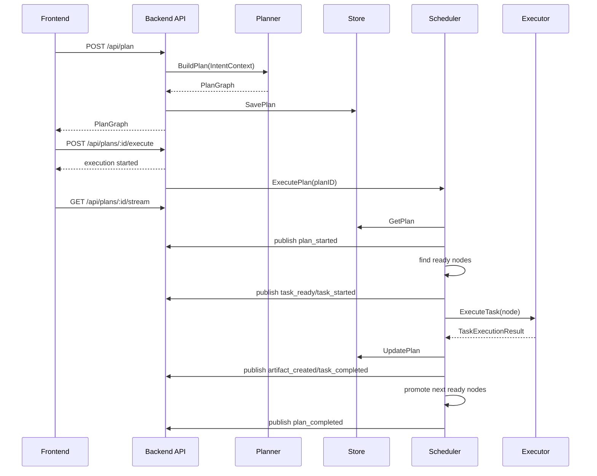
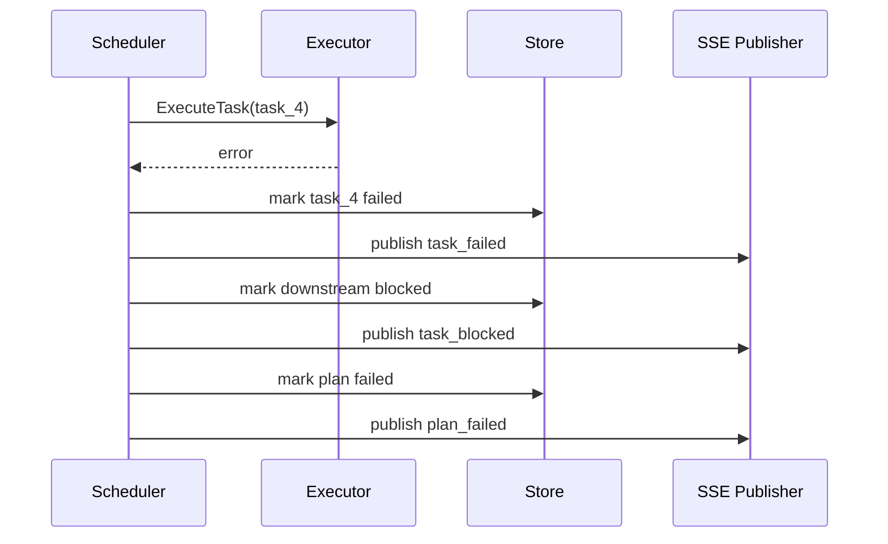

# Plan 模块执行规格说明

## 1. 文档定位

这份文档是 `Plan` 模块重构的执行级规格说明，目标是让后续开发可以直接按文档落代码，而不需要临时补设计。

与其他文档的关系：

- 总体方案： [plan_module_refactor_proposal.md](/D:/mygo/Sea-mult-agent/scholar-agent/docs/plan_module_refactor_proposal.md)
- 开发清单： [plan_module_implementation_checklist.md](/D:/mygo/Sea-mult-agent/scholar-agent/docs/plan_module_implementation_checklist.md)
- 当前代码索引： [backend_planner_models_reference.md](/D:/mygo/Sea-mult-agent/scholar-agent/docs/backend_planner_models_reference.md)

这份文档重点回答：

- 每个核心结构体到底长什么样
- 调度器每一步怎么跑
- 哪些状态怎么切换
- 失败时怎么处理
- 事件流发什么
- 前后端交互的精确语义是什么

---

## 2. 模块边界

本次重构涉及 5 个核心模块：

1. `intent adapter`
2. `planner`
3. `scheduler`
4. `store`
5. `api + event stream`

模块职责必须严格分开：

### `intent adapter`

负责把各种意图来源统一映射成 `IntentContext`

它不负责：

- 生成图
- 执行任务

### `planner`

负责生成拓扑图 `PlanGraph`

它不负责：

- 执行节点
- 推送事件
- 保存运行态

### `scheduler`

负责整图执行和状态推进

它不负责：

- 决定图长什么样
- 直接处理 HTTP

### `store`

负责保存计划、节点、产物、事件

它不负责：

- 执行任务
- 生成 DAG

### `api`

负责：

- 接 HTTP
- 调 planner
- 调 scheduler
- 开 SSE

它不应该承担复杂业务逻辑

---

## 3. 标准数据模型

以下结构是推荐实现目标，字段名可以根据 Go 风格微调，但语义不要变。

## 3.1 IntentContext

```go
type IntentContext struct {
    RawIntent   string                 `json:"raw_intent"`
    IntentType  string                 `json:"intent_type"`
    Entities    map[string]any         `json:"entities"`
    Constraints map[string]any         `json:"constraints"`
    Metadata    map[string]any         `json:"metadata"`
}
```

### 字段语义

- `RawIntent`
  - 用户原始输入

- `IntentType`
  - 统一意图类型
  - 当前建议值：
    - `General`
    - `Code_Execution`
    - `Framework_Evaluation`
    - `Paper_Reproduction`

- `Entities`
  - 识别出的关键实体
  - 例：
    - `paper_title`
    - `paper_url`
    - `framework_a`
    - `framework_b`
    - `dataset_name`

- `Constraints`
  - 执行约束
  - 例：
    - `need_chart: true`
    - `need_comparison: true`
    - `max_parallelism: 2`

- `Metadata`
  - 保留扩展位

## 3.2 TaskStatus

```go
type TaskStatus string

const (
    StatusPending    TaskStatus = "pending"
    StatusReady      TaskStatus = "ready"
    StatusInProgress TaskStatus = "in_progress"
    StatusCompleted  TaskStatus = "completed"
    StatusFailed     TaskStatus = "failed"
    StatusBlocked    TaskStatus = "blocked"
    StatusSkipped    TaskStatus = "skipped"
    StatusCanceled   TaskStatus = "canceled"
)
```

### 状态使用规则

- 新图生成后：
  - 无依赖节点 -> `ready`
  - 有依赖节点 -> `pending`

- 进入调度器执行前：
  - 只能从 `ready` -> `in_progress`

- 成功结束：
  - `in_progress` -> `completed`

- 执行失败：
  - `in_progress` -> `failed`

- 前驱失败导致不可执行：
  - `pending` -> `blocked`

- 被人工取消：
  - `pending/ready/in_progress` -> `canceled`

## 3.3 Artifact

```go
type Artifact struct {
    Key            string                 `json:"key"`
    Type           string                 `json:"type"`
    ProducerTaskID string                 `json:"producer_task_id"`
    Value          string                 `json:"value,omitempty"`
    Location       string                 `json:"location,omitempty"`
    Metadata       map[string]any         `json:"metadata,omitempty"`
    CreatedAt      time.Time              `json:"created_at"`
}
```

### 典型 Artifact 类型

- `text`
- `json`
- `path`
- `image`
- `report`
- `code`
- `metric`

### 使用原则

- 小文本可直接存 `Value`
- 文件路径、图片路径、工作区路径存 `Location`
- 富结构字段放 `Metadata`

## 3.4 TaskNode

```go
type TaskNode struct {
    ID                string                 `json:"id"`
    Name              string                 `json:"name"`
    Type              string                 `json:"type"`
    Description       string                 `json:"description"`
    AssignedTo        string                 `json:"assigned_to"`
    Status            TaskStatus             `json:"status"`
    Dependencies      []string               `json:"dependencies"`
    RequiredArtifacts []string               `json:"required_artifacts"`
    OutputArtifacts   []string               `json:"output_artifacts"`
    Parallelizable    bool                   `json:"parallelizable"`
    Priority          int                    `json:"priority"`
    RetryLimit        int                    `json:"retry_limit"`
    RunCount          int                    `json:"run_count"`
    Inputs            map[string]any         `json:"inputs,omitempty"`
    Result            string                 `json:"result,omitempty"`
    Code              string                 `json:"code,omitempty"`
    ImageBase64       string                 `json:"image_base64,omitempty"`
    Error             string                 `json:"error,omitempty"`
    Metadata          map[string]any         `json:"metadata,omitempty"`
    StartedAt         *time.Time             `json:"started_at,omitempty"`
    FinishedAt        *time.Time             `json:"finished_at,omitempty"`
    CreatedAt         time.Time              `json:"created_at"`
    UpdatedAt         time.Time              `json:"updated_at"`
}
```

### 字段约束

- `AssignedTo` 当前建议枚举：
  - `librarian_agent`
  - `coder_agent`
  - `sandbox_agent`
  - `data_agent`
  - `general_agent`

- `Dependencies`
  - 只表达控制依赖，不表达 artifact 依赖

- `RequiredArtifacts`
  - 只写 key，不写 task id

- `OutputArtifacts`
  - 只写本任务理论产出 key

- `Inputs`
  - 调度器在执行前动态填充，不要求规划时写满

## 3.5 TaskEdge

```go
type TaskEdge struct {
    ID   string `json:"id"`
    From string `json:"from"`
    To   string `json:"to"`
    Type string `json:"type"`
}
```

### `Type` 规则

- `control`
  - 表示顺序依赖

- `data`
  - 表示数据依赖

前端展示时：

- `control` 用实线
- `data` 用虚线

## 3.6 GraphMeta

```go
type GraphMeta struct {
    TotalNodes        int `json:"total_nodes"`
    CompletedNodes    int `json:"completed_nodes"`
    FailedNodes       int `json:"failed_nodes"`
    BlockedNodes      int `json:"blocked_nodes"`
    InProgressNodes   int `json:"in_progress_nodes"`
    ReadyNodes        int `json:"ready_nodes"`
}
```

## 3.7 PlanGraph

```go
type PlanGraph struct {
    ID         string                  `json:"id"`
    UserIntent string                  `json:"user_intent"`
    IntentType string                  `json:"intent_type"`
    Status     TaskStatus              `json:"status"`
    Nodes      []*TaskNode             `json:"nodes"`
    Edges      []*TaskEdge             `json:"edges"`
    Artifacts  map[string]Artifact     `json:"artifacts"`
    Meta       GraphMeta               `json:"meta"`
    CreatedAt  time.Time               `json:"created_at"`
    UpdatedAt  time.Time               `json:"updated_at"`
}
```

### PlanGraph 状态语义

- `pending`
  - 图已创建但未启动执行

- `in_progress`
  - 图正在调度执行

- `completed`
  - 所有可执行节点完成且没有失败

- `failed`
  - 图中出现不可恢复失败

- `canceled`
  - 执行被取消

说明：

- `PlanGraph.Status` 可以复用 `TaskStatus`，也可以后续单独拆 `PlanStatus`
- 第一版建议复用，减少模型数量

## 3.8 TaskExecutionResult

```go
type TaskExecutionResult struct {
    Status      TaskStatus      `json:"status"`
    Result      string          `json:"result,omitempty"`
    Code        string          `json:"code,omitempty"`
    ImageBase64 string          `json:"image_base64,omitempty"`
    Error       string          `json:"error,omitempty"`
    Logs        []string        `json:"logs,omitempty"`
    Artifacts   []Artifact      `json:"artifacts,omitempty"`
}
```

## 3.9 PlanEvent

```go
type PlanEvent struct {
    PlanID     string         `json:"plan_id"`
    EventType  string         `json:"event_type"`
    TaskID     string         `json:"task_id,omitempty"`
    TaskStatus string         `json:"task_status,omitempty"`
    Payload    map[string]any `json:"payload,omitempty"`
    Timestamp  time.Time      `json:"timestamp"`
}
```

---

## 4. Planner 规格

## 4.1 Planner 对外接口

```go
type Planner interface {
    BuildPlan(ctx context.Context, intent models.IntentContext) (*models.PlanGraph, error)
}
```

## 4.2 BuildPlan 输出要求

`BuildPlan` 返回的图必须满足：

1. 节点 ID 全局唯一
2. 边 ID 全局唯一
3. 没有环
4. 所有控制依赖都能映射到节点
5. 所有 `RequiredArtifacts` 都能找到生产者或输入来源
6. 初始状态正确
7. `Meta` 已初始化

## 4.3 Planner 内部步骤

建议执行顺序：

1. `normalizeIntent`
2. `selectTemplate`
3. `instantiateNodes`
4. `buildControlEdges`
5. `buildDataEdges`
6. `fillInitialStatuses`
7. `validatePlan`
8. `fillMeta`

## 4.4 初始状态填充规则

对于每个节点：

- 如果 `Dependencies` 为空且 `RequiredArtifacts` 已满足：
  - `StatusReady`

- 否则：
  - `StatusPending`

第一版一般无外部初始 artifact，因此大多数有依赖节点都是 `pending`

## 4.5 模板实例化规则

规划器第一版按意图类型走模板。

### `Paper_Reproduction` 推荐基础图

节点：

1. `paper_parse`
2. `repo_discovery`
3. `repo_prepare`
4. `env_setup`
5. `baseline_run`
6. `result_collect`
7. `paper_compare`
8. `fix_and_rerun`

控制依赖：

- `paper_parse -> repo_discovery`
- `repo_discovery -> repo_prepare`
- `repo_prepare -> env_setup`
- `env_setup -> baseline_run`
- `baseline_run -> result_collect`
- `result_collect -> paper_compare`
- `paper_compare -> fix_and_rerun`

数据依赖建议：

- `paper_parse` 产出 `parsed_paper`
- `repo_discovery` 需要 `parsed_paper`，产出 `repo_url`
- `repo_prepare` 需要 `repo_url`，产出 `workspace_path`
- `env_setup` 需要 `workspace_path`，产出 `runtime_env`
- `baseline_run` 需要 `runtime_env`，产出 `run_metrics`
- `result_collect` 需要 `run_metrics`，产出 `collected_results`
- `paper_compare` 需要 `collected_results` 和 `parsed_paper`，产出 `comparison_report`

### `Framework_Evaluation` 推荐基础图

节点：

1. `framework_research`
2. `prepare_framework_a`
3. `prepare_framework_b`
4. `run_framework_a`
5. `run_framework_b`
6. `generate_evaluation_report`

并行关系：

- `prepare_framework_a` 和 `prepare_framework_b` 可并行
- `run_framework_a` 和 `run_framework_b` 可并行

### `Code_Execution` 推荐基础图

节点：

1. `generate_code`
2. `prepare_runtime`
3. `execute_code`
4. `verify_result`

---

## 5. DAG 校验规格

## 5.1 校验必须失败的情况

Planner 在遇到以下情况时必须返回 error：

1. 有节点依赖不存在的节点
2. 有 `RequiredArtifacts` 没有任何生产者，且不在外部输入白名单里
3. 图中存在环
4. 节点 ID 重复
5. 边的 `From/To` 不存在

## 5.2 校验推荐实现

建议至少包含以下函数：

- `validateUniqueNodeIDs`
- `validateUniqueEdgeIDs`
- `validateEdgeRefs`
- `validateDependencies`
- `validateArtifactFlow`
- `detectCycle`

### 检测环建议

使用 DFS 或 Kahn 拓扑排序均可。

第一版建议：

- 构造 `inDegree`
- 如果最终可出队节点数 != 总节点数，则判定有环

---

## 6. Store 规格

## 6.1 Store 接口

```go
type PlanStore interface {
    SavePlan(plan *models.PlanGraph) error
    GetPlan(planID string) (*models.PlanGraph, error)
    UpdatePlan(planID string, update func(*models.PlanGraph) error) error
    AppendEvent(planID string, event models.PlanEvent) error
    ListEvents(planID string) ([]models.PlanEvent, error)
}
```

### 设计要求

- `UpdatePlan` 必须是原子更新
- 返回的 `PlanGraph` 不应让外部直接改内存副本
- 建议读写时做深拷贝或明确锁保护

## 6.2 内存版实现要求

内存版至少维护：

- `plans map[string]*models.PlanGraph`
- `events map[string][]models.PlanEvent`
- `mu sync.RWMutex`

## 6.3 深拷贝要求

以下场景建议深拷贝：

- `GetPlan`
- `SavePlan`
- `UpdatePlan` 中更新前后

原因：

- 避免调度器、API、SSE 同时持有同一份可变对象

---

## 7. Scheduler 规格

## 7.1 Scheduler 对外接口

```go
type Scheduler struct {
    store         store.PlanStore
    executor      TaskExecutor
    publisher     EventPublisher
    maxConcurrent int
}
```

```go
type TaskExecutor interface {
    ExecuteTask(ctx context.Context, plan *models.PlanGraph, task *models.TaskNode) (*models.TaskExecutionResult, error)
}
```

```go
type EventPublisher interface {
    Publish(planID string, event models.PlanEvent)
}
```

## 7.2 ExecutePlan 核心语义

### 输入

- `planID`

### 输出

- 仅返回执行启动过程中的错误
- 计划级成功失败通过事件流和 Store 状态体现

### 行为要求

1. 取出图
2. 将 Plan 状态改为 `in_progress`
3. 发布 `plan_started`
4. 进入调度循环
5. 每轮找 ready 节点
6. 并发执行 ready 节点
7. 收集结果并推进状态
8. 直到整图结束

## 7.3 Ready 计算规则

节点满足以下条件才能被选中：

1. `Status == ready`

或者允许调度器在运行时从 `pending` 自动提升成 `ready`：

- `Status == pending`
- 所有依赖完成
- 所需 artifacts 齐全

建议实现上每轮先执行一个 `promotePendingNodesToReady(plan)`：

- 满足条件的 `pending` -> `ready`
- 并发布 `task_ready`

## 7.4 单轮调度规则

一轮调度的基本逻辑：

1. 找出全部 `ready` 节点
2. 对不可并行节点做限流
3. 最多取 `maxConcurrent` 个节点执行
4. 全部标记 `in_progress`
5. 发布 `task_started`
6. 并发执行
7. 收集结果
8. 更新图和事件

## 7.5 并发模型建议

第一版建议最简单的方式：

- 每轮拿 ready 节点切片
- 用带缓冲信号量限制并发
- `WaitGroup` 等待这一轮结束

不建议第一版直接上复杂 worker pool

## 7.6 执行结果回写规则

节点执行成功时：

1. `Status -> completed`
2. `Result/Code/ImageBase64/Error` 写回节点
3. `Artifacts` 写入 PlanGraph
4. 更新时间戳
5. 发布：
   - `artifact_created`
   - `task_completed`

节点执行失败时：

1. `Status -> failed`
2. `Error` 写回节点
3. 更新时间戳
4. 发布 `task_failed`
5. 对直接依赖后继做 `blocked`
6. 发布 `task_blocked`

## 7.7 图结束判定

满足以下任一条件即退出：

### 图成功完成

- 所有节点状态均属于：
  - `completed`
  - `skipped`

然后：

- `Plan.Status = completed`
- 发布 `plan_completed`

### 图失败结束

- 存在 `failed`
- 且剩余节点都不再可推进

然后：

- `Plan.Status = failed`
- 发布 `plan_failed`

### 图卡死

- 仍有 `pending/ready/in_progress`
- 但没有 ready 节点
- 且没有 in_progress 节点

视为调度异常：

- `Plan.Status = failed`
- 发布 `plan_failed`
- 错误信息写入 `Payload.reason = "deadlock_or_unsatisfied_dependencies"`

## 7.8 失败传播规则

第一版采用强阻断：

- 某节点 `failed`
- 所有直接依赖它的下游节点 -> `blocked`

是否递归阻断：

- 建议递归

例如：

- A 失败
- B 依赖 A -> blocked
- C 依赖 B -> blocked

这样整图状态更明确

---

## 8. TaskExecutor 规格

## 8.1 调度器与 Agent 的衔接原则

第一版不要重写所有 Agent。

采用兼容策略：

1. Scheduler 取出节点
2. 从 `PlanGraph.Artifacts` 中收集输入
3. 把输入组装进任务上下文
4. 调现有 Agent 执行接口

## 8.2 输入组装规则

建议给执行器提供一个统一函数：

```go
func BuildTaskInput(plan *models.PlanGraph, task *models.TaskNode) map[string]any
```

输出包括：

- 节点原始描述
- 所需 artifact 的值
- 上游节点摘要结果

第一版可以简单拼进任务描述：

```text
任务目标: ...
可用输入:
- parsed_paper: ...
- repo_url: ...
```

## 8.3 默认执行路由

建议：

- `librarian_agent` -> `LibrarianAgent.ExecuteTask`
- `coder_agent` -> `CoderAgent.ExecuteTask`
- `sandbox_agent` -> 先复用 `CoderAgent.ExecuteTask`
- `data_agent` -> `DataAgent.ExecuteTask`
- 默认 -> `CoderAgent.ExecuteTask`

## 8.4 TaskExecutionResult 产物生成规则

每类 Agent 最终都应该向调度器返回统一结果。

例如：

- `repo_prepare` 成功后产出：
  - `workspace_path`

- `paper_parse` 成功后产出：
  - `parsed_paper`

第一版建议由执行器做“后处理产物抽取”，不要要求每个 Agent 一开始就原生支持 Artifact

---

## 9. API 规格

## 9.1 `POST /api/plan`

### 作用

- 创建 PlanGraph
- 保存到 Store
- 返回给前端绘图

### 请求

```json
{
  "intent": "复现 Attention Is All You Need 论文并对比实验结果"
}
```

### 处理流程

1. 校验入参
2. 调 `BuildIntentContext`
3. 调 `planner.BuildPlan`
4. 调 `store.SavePlan`
5. 发布 `plan_created`
6. 返回 PlanGraph

### 响应

```json
{
  "message": "Plan generated successfully",
  "plan": {
    "id": "plan_xxx",
    "user_intent": "...",
    "intent_type": "Paper_Reproduction",
    "status": "pending",
    "nodes": [],
    "edges": [],
    "artifacts": {},
    "meta": {
      "total_nodes": 8,
      "completed_nodes": 0,
      "failed_nodes": 0,
      "blocked_nodes": 0,
      "in_progress_nodes": 0,
      "ready_nodes": 1
    }
  }
}
```

## 9.2 `POST /api/plans/:id/execute`

### 作用

- 启动整图调度

### 处理流程

1. 校验 plan 是否存在
2. 校验 plan 是否已启动
3. 起 goroutine 执行 `scheduler.ExecutePlan`
4. 立即返回

### 响应

```json
{
  "message": "Plan execution started",
  "plan_id": "plan_xxx"
}
```

### 幂等建议

如果一个 `plan` 已处于 `in_progress`：

- 返回 409 或 200 + `already_running`

第一版建议返回 409

## 9.3 `GET /api/plans/:id`

### 作用

- 拉最新图状态
- 断线重连恢复页面

### 响应

- 返回完整 `PlanGraph`

## 9.4 `GET /api/plans/:id/stream`

### 作用

- SSE 订阅计划级事件

### 事件格式

每个 SSE 事件：

- `event: plan_event`
- `data: <PlanEvent JSON>`

### 连接行为

- 连接建立成功后，服务端可先发一个心跳或 `stream_opened`
- 每 5 秒发心跳，避免代理断开

## 9.5 `POST /api/plans/:id/tasks/:taskId/execute`

### 作用

- 手动触发单节点执行

### 第一版建议

- 可不实现
- 避免和整图调度同时冲突

如果保留，必须限制：

- 只允许 `ready` 节点执行
- 且计划当前不能处于自动调度中

---

## 10. SSE 事件协议

## 10.1 标准事件类型

- `plan_created`
- `plan_started`
- `task_ready`
- `task_started`
- `artifact_created`
- `task_completed`
- `task_failed`
- `task_blocked`
- `plan_completed`
- `plan_failed`
- `heartbeat`

## 10.2 各事件推荐 payload

### `plan_created`

```json
{
  "plan_id": "plan_xxx",
  "event_type": "plan_created",
  "timestamp": "..."
}
```

### `task_ready`

```json
{
  "plan_id": "plan_xxx",
  "event_type": "task_ready",
  "task_id": "task_1",
  "task_status": "ready",
  "payload": {
    "name": "Parse Paper"
  }
}
```

### `task_started`

```json
{
  "plan_id": "plan_xxx",
  "event_type": "task_started",
  "task_id": "task_1",
  "task_status": "in_progress",
  "payload": {
    "assigned_to": "librarian_agent"
  }
}
```

### `artifact_created`

```json
{
  "plan_id": "plan_xxx",
  "event_type": "artifact_created",
  "task_id": "task_1",
  "payload": {
    "artifact_keys": ["parsed_paper"]
  }
}
```

### `task_completed`

```json
{
  "plan_id": "plan_xxx",
  "event_type": "task_completed",
  "task_id": "task_1",
  "task_status": "completed",
  "payload": {
    "result_summary": "Paper parsed successfully"
  }
}
```

### `task_failed`

```json
{
  "plan_id": "plan_xxx",
  "event_type": "task_failed",
  "task_id": "task_4",
  "task_status": "failed",
  "payload": {
    "error": "sandbox execution failed"
  }
}
```

### `task_blocked`

```json
{
  "plan_id": "plan_xxx",
  "event_type": "task_blocked",
  "task_id": "task_5",
  "task_status": "blocked",
  "payload": {
    "reason": "upstream_failed",
    "upstream_task_id": "task_4"
  }
}
```

---

## 11. 前端消费规格

## 11.1 前端第一次拿到图后要做什么

1. 保存完整 `PlanGraph`
2. 把 `Nodes` 转成 React Flow 节点
3. 把 `Edges` 转成 React Flow 边
4. 记录 `plan_id`
5. 等用户点击“执行整个计划”

## 11.2 执行后怎么同步

1. 前端调用 `POST /api/plans/:id/execute`
2. 前端连接 `GET /api/plans/:id/stream`
3. 按事件更新本地图状态

## 11.3 增量更新规则

当收到事件时：

- `task_ready`
  - 对应节点状态改 `ready`

- `task_started`
  - 对应节点状态改 `in_progress`

- `task_completed`
  - 对应节点状态改 `completed`

- `task_failed`
  - 对应节点状态改 `failed`

- `task_blocked`
  - 对应节点状态改 `blocked`

- `artifact_created`
  - 给节点增加“已产出信息”提示
  - 更新本地 `artifacts`

## 11.4 前端断线恢复规则

如果 SSE 断开：

1. 前端重连
2. 如重连失败，则调用 `GET /api/plans/:id`
3. 用全量图覆盖本地状态

---

## 12. 调度时序

## 12.1 正常执行时序



## 12.2 失败时序



---

## 13. 调度伪代码

## 13.1 BuildPlan 伪代码

```go
func (p *PlannerImpl) BuildPlan(ctx context.Context, intent models.IntentContext) (*models.PlanGraph, error) {
    nodes := p.buildBaseTasks(intent)
    edges := p.buildEdges(nodes, intent)
    plan := &models.PlanGraph{
        ID:         newPlanID(),
        UserIntent: intent.RawIntent,
        IntentType: intent.IntentType,
        Status:     models.StatusPending,
        Nodes:      nodes,
        Edges:      edges,
        Artifacts:  map[string]models.Artifact{},
        CreatedAt:  time.Now(),
        UpdatedAt:  time.Now(),
    }

    p.fillInitialNodeStatuses(plan)
    if err := p.validatePlan(plan); err != nil {
        return nil, err
    }
    p.fillMeta(plan)
    return plan, nil
}
```

## 13.2 ExecutePlan 伪代码

```go
func (s *Scheduler) ExecutePlan(ctx context.Context, planID string) error {
    s.markPlanStarted(planID)

    for {
        plan := s.store.GetPlan(planID)

        s.promotePendingNodesToReady(plan)
        readyNodes := s.findReadyNodes(plan)

        if len(readyNodes) == 0 {
            if s.allDone(plan) {
                s.markPlanCompleted(planID)
                return nil
            }
            if s.noRunningAndNoReady(plan) {
                s.markPlanFailed(planID, "deadlock_or_unsatisfied_dependencies")
                return nil
            }
            time.Sleep(200 * time.Millisecond)
            continue
        }

        s.runReadyNodesInParallel(ctx, planID, readyNodes)
    }
}
```

## 13.3 单节点执行伪代码

```go
func (s *Scheduler) executeOne(ctx context.Context, planID string, taskID string) {
    s.markTaskStarted(planID, taskID)

    plan := s.store.GetPlan(planID)
    task := getTask(plan, taskID)

    result, err := s.executor.ExecuteTask(ctx, plan, task)
    if err != nil || result.Status == models.StatusFailed {
        s.markTaskFailed(planID, taskID, err, result)
        s.blockDependents(planID, taskID)
        return
    }

    s.markTaskCompleted(planID, taskID, result)
}
```

---

## 14. 文件落点建议

建议最终文件布局：

- `backend/internal/models/task.go`
- `backend/internal/models/graph.go`
- `backend/internal/models/artifact.go`
- `backend/internal/models/intent.go`
- `backend/internal/models/event.go`

- `backend/internal/planner/planner.go`
- `backend/internal/planner/templates.go`
- `backend/internal/planner/validate.go`

- `backend/internal/store/plan_store.go`
- `backend/internal/store/memory_plan_store.go`

- `backend/internal/scheduler/scheduler.go`
- `backend/internal/scheduler/executor.go`
- `backend/internal/scheduler/graph.go`
- `backend/internal/scheduler/policy.go`

- `backend/internal/events/bus.go`

- `backend/internal/api/routes.go`

---

## 15. 第一版明确不做的内容

为了控制风险，第一版明确不做：

- 动态重规划
- 节点自动回滚
- 跨进程恢复执行
- 多租户隔离
- 复杂优先级调度
- WebSocket 双向协议
- 细粒度 artifact schema 注册中心

这些内容后续都可以在当前结构上继续演进

---

## 16. 实现完成判定

当以下条件全部满足时，可以认为第一版已经跑通：

1. 用户发起 `/api/plan`，能稳定返回完整拓扑图
2. 前端能渲染节点和边
3. 用户发起 `/api/plans/:id/execute`，后端开始整图调度
4. Scheduler 能自动识别 ready 节点并执行
5. 并行节点可以并发运行
6. 节点执行结果能回写到图和 artifacts
7. SSE 能持续推送状态事件
8. 前端能实时刷新节点状态
9. 整图结束后 Plan 状态正确

---

## 17. 结论

这份规格说明定义了本次 `Plan` 模块重构的最低工程实现标准。

后续如果按这份文档施工，开发时不需要再重新讨论：

- 结构体怎么设计
- 调度器怎么跑
- 状态怎么流转
- SSE 发什么
- 前后端如何同步

也就是说，这份文档的目标就是把“方案”推进到“可直接实现”的层级。
