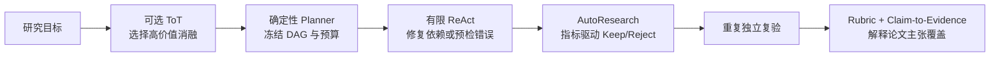

# ScholarAgent AutoResearch 项目介绍

## 1. 项目定位

ScholarAgent AutoResearch 是 Sea-Mult-Agent 中面向科研代码仓库的受限自动实验子系统。它接收一个已有可运行 baseline 的仓库和显式 `ResearchSpec`，让模型在白名单文件内提出小改动，再用冻结的 guard、evaluator、主指标和预算进行真实运行。候选只有达到预声明的最小提升才会保留；失败、退化或越界修改会被拒绝并回滚。搜索结束后，系统还会脱离候选生成模型，按规格重复独立复验最佳版本。

一句话概括：

> 把“让 Agent 反复改代码”变成一个评测标准不漂移、修改范围受控、过程可追踪、结果可复验的科研实验闭环。

| 项目属性 | 当前内容 |
|---|---|
| 所属系统 | Sea-Mult-Agent / ScholarAgent |
| 主要输入 | Git 仓库、`autoresearch.spec/v1`、可选上传附件 |
| 主要输出 | TrialLedger、最佳候选、重复验证统计、执行资源证据、可视化实验记录 |
| 执行环境 | Docker 沙箱；具体任务可使用 CPU 或配置后的 GPU |
| 当前契约 | `autoresearch.spec/v1`、`autoresearch.ledger/v1`、`autoresearch.validation/v1` |
| 当前定位 | 可运行研究原型，不是零配置通用 AutoML，也不是全自动科学家 |

## 2. 为什么需要专用 AutoResearch

一次性 Coding Agent 通常以“代码是否修改完成、测试是否通过”为终点。科研优化还需要持续回答四个问题：

1. 评测器、数据、指标和预算是否在搜索开始前固定。
2. 失败或退化的修改是否真的恢复到了上一个最佳版本。
3. 每个提升能否追溯到对应代码哈希、命令、输出和指标。
4. 搜索阶段得到的最佳分数能否在同一环境中再次运行得到。

AutoResearch 因此不把 LLM 当作拥有最终决定权的研究者。模型只产生可证伪的候选假设和结构化文件内容；确定性的 Go harness 负责路径校验、文件写入、真实执行、指标解析、Keep/Reject、回滚和证据记录。

## 3. 系统架构


架构图提供[可编辑 SVG 源文件](../assets/autoresearch-architecture.svg)。四个区域分别表示确定性编排、冻结研究契约、受限沙箱执行，以及证据与产品界面。

生产计划固定包含仓库发现、工作区准备、规格冻结、运行时创建、依赖安装、候选循环、重复独立复验和证据汇总。即使系统启用了 LLM Planner，模型也不能删除规格冻结或验证节点。

## 4. 核心能力

| 模块 | 已实现能力 | 作用 |
|---|---|---|
| 确定性规划 | 为明确的 AutoResearch 意图生成固定 8 节点 DAG | 防止模型临时省略安全关键步骤 |
| `ResearchSpec` | 声明 editable、protected、命令、指标、方向、阈值、依赖、搜索预算和验证次数 | 在搜索前冻结研究目标和允许范围 |
| Research Coding Agent | 读取有限源码上下文并生成结构化候选 | 把仓库级代码修改交给专用子 Agent |
| Baseline | 任何模型改动前先运行 guard 和 evaluator | 没有有效基线就不启动搜索 |
| 候选白名单 | 最多 8 个已有 editable 文件，每轮最多修改 3 个 | 限制修改范围并保持补丁可审阅 |
| Keep/Reject | 只按冻结主指标、方向和 `min_delta` 判定 | 将“能运行”和“指标改善”分开 |
| 最佳版本回滚 | 失败、退化、非法候选恢复上一个最佳快照 | 搜索过程中始终保留已知最佳状态 |
| 完整性检查 | 保护文件 SHA-256 与非 editable 工作区指纹 | 发现 evaluator、数据或其他源码的持久篡改 |
| TrialLedger | 记录假设、命令、耗时、输出摘要、指标、决策、文件哈希和资源摘要 | 让最佳候选来源及执行投入可以追溯 |
| 重复独立复验 | 不调用候选模型，重新核对哈希并执行 1 至 5 组冻结命令 | 用逐次结果、均值、标准差和失败率发现漂移或间歇失败 |
| 前端可视化 | 展示 baseline/best、趋势、Keep/Reject、耗时、补丁和资源摘要 | 用户无需阅读原始 JSON 即可理解实验过程 |
| 证据链集成 | 可与论文 Rubric、Claim-to-Evidence Graph 和 Benchmark Adapter 协同 | 把局部指标提升放回论文复现和自有数据评测语境 |

## 5. 借鉴了哪些项目和论文

这里的“借鉴”不等于复制代码。表中区分了直接采用的方法、方向启发、工程对照和路线图依据，也明确标出本项目没有实现的部分。

| 来源 | 原工作提供的关键能力 | ScholarAgent 中的落地 | 关系与边界 |
|---|---|---|---|
| [karpathy/autoresearch](https://github.com/karpathy/autoresearch) | 在小型真实训练任务中反复改代码，以固定时长和单一指标比较，提升则保留，否则丢弃 | Baseline、有限候选、固定预算、真实 evaluator、Keep/Reject 和实验账本 | 最直接的循环原型。ScholarAgent 扩展为跨仓库 `ResearchSpec`、多文件白名单、保护文件、DAG 和独立复验 |
| [ReAct](https://arxiv.org/abs/2210.03629) | 让推理、动作和环境观察交错进行，根据新错误更新下一步行动 | 依赖安装和 Benchmark 预检使用“错误日志 -> 结构化修复动作 -> 重跑”的有限循环 | 只用于局部故障恢复；动作有白名单和次数上限，不保存模型隐藏思维链，也不负责 Keep/Reject |
| [Tree of Thoughts](https://arxiv.org/abs/2305.10601) | 同时探索多个候选路径，评估后选择、回溯或剪枝 | 轻量消融先生成候选，再按信息增益、相关性、可复现性、时间成本和风险做预算选择 | 只用于实验设计，不进入每一轮 AutoResearch 代码搜索 |
| [The AI Scientist](https://arxiv.org/abs/2408.06292) | 将想法、代码、实验、可视化、论文写作和模拟评审连接为开放式科研链 | AutoResearch 的 Artifact 可继续交给结果分析、可视化和报告模块 | 属于端到端方向启发。本项目没有宣称全自动科学发现，也不把自动 reviewer 当作科学真值 |
| [Agent Laboratory](https://arxiv.org/abs/2501.04227) | 以文献、实验、写作阶段组织研究 Agent，并支持用户在各阶段反馈 | ScholarAgent 使用 Librarian、Coder、Research Coding、Sandbox 和 Data 等专业角色 | 专业分工已经实现；规格审批、扩大 GPU 预算和导出补丁前的完整人工检查点仍在路线图 |
| [PaperBench](https://arxiv.org/abs/2504.01848) | 用作者参与编写的分层 rubric，将 20 篇论文复现拆成 8,316 个可评分任务 | 论文复现链先冻结 Claim Rubric，再把主张、准则与真实 Artifact 绑定为 Claim-to-Evidence Graph | Rubric 影响上层复现验收，不替代 AutoResearch 内部的冻结主指标 |
| [CORE-Bench](https://arxiv.org/abs/2409.11363) | 用真实论文代码和数据构造计算复现任务，并同时评测通用与任务专用 Agent | 设置专用 Research Coding Agent，负责仓库调试、环境内重跑、Benchmark 适配和 AutoResearch | 借鉴其“科研复现需要专用 scaffold 和真实运行”的任务建模；尚未完成公开 CORE-Bench 全量对照 |
| [SWE-agent](https://arxiv.org/abs/2405.15793) | 说明专门设计的 Agent-Computer Interface 会影响仓库导航、代码编辑和测试能力 | Research Coding Agent 使用有限源码上下文、结构化补丁、宿主校验和测试反馈 | 属于工程对照，没有移植 SWE-agent 的 ACI，也不宣称达到其 benchmark 指标 |
| [CORE-Bench 2026 分析](https://arxiv.org/abs/2606.26158) | 将 Agent 评价从准确率扩展到构念有效性、OOD、效率、可靠性、模型与 scaffold、人机协作 | 重复验证和命令资源证据先覆盖可靠性与效率的一小部分；OOD 和人工协作继续进入路线图 | 不能据此声称完成全面 Agent 评估 |
| [MLE-bench](https://arxiv.org/abs/2410.07095) | 在真实机器学习工程任务上评测 Agent，并研究不同资源扩展方式 | TrialLedger 与验证报告显式汇总命令数量和耗时 | 只是评价维度借鉴；当前摘要不含 GPU、token 或费用 |
| [Microsoft R&D-Agent](https://github.com/microsoft/RD-Agent) | 将研究提议与开发实现分工，并对部分公开评测报告多次独立 seed 的均值与标准差 | 最佳候选可重复独立进程复验，报告逐次分数、均值、标准差和失败率 | 当前不会自动切换 seed，不能称为等价多 seed 评测 |

更细的来源事实、本地代码落点和风险标记见[项目介绍证据表](refs/evidence-map.md)。

## 6. 这些方法如何协作

项目没有把多个 Agent 论文名堆成一个通用循环，而是把它们安排在不同决策层：



| 决策层 | 负责的问题 | 不负责的问题 |
|---|---|---|
| ToT 消融设计 | 预算内优先做哪些参数、模块、数据规模、随机种子或成本实验 | 不修改 evaluator，不决定候选代码是否 Keep |
| ReAct 局部修复 | 根据 pip 或预检错误选择有限修复动作并重跑 | 不展开无界搜索，不改变科研指标 |
| AutoResearch 循环 | 候选代码是否在冻结指标上真实改善 | 不自动判断论文主张是否成立 |
| Rubric 与证据图 | 运行 Artifact 是否覆盖论文的分层主张和验收准则 | 不反向篡改搜索阶段的分数 |

## 7. 相比原始 autoresearch 和通用 Agent 的差异

相对 `karpathy/autoresearch` 的单 GPU、单文件、单训练任务，ScholarAgent 关注的是跨仓库工程治理：

- 用版本化 `ResearchSpec` 描述不同仓库的文件、命令和指标，而不是把规则写死在一个训练脚本里。
- 同时保护 evaluator、benchmark、spec 和非 editable 源码，模型不能通过修改评分规则制造提升。
- 由固定 DAG 串起仓库准备、运行时、搜索、验证和报告，并通过 SSE 与 Artifact 观察整个过程。
- 除逐轮实验账本外，再执行 1 至 5 次不调用候选模型的独立进程复验，并记录统计量与资源摘要。
- 把最佳指标与论文主张 Rubric、自有数据 Benchmark 和前端证据视图连接起来。

相对通用 Coding Agent，本项目有意减少模型权限：

- 模型不能改计划、命令、指标键、阈值或预算。
- 模型不能直接操作文件系统，只能返回结构化候选；Go harness 决定是否写入。
- evaluator 和 guard 使用参数数组与 executable allowlist，不接受候选生成的任意 shell 命令。
- 搜索失败时保留 baseline 或最佳候选，不把“所有候选被拒绝”伪装成研究成功。
- 系统不会自动提交或推送最佳代码，最终科研判断仍属于用户。

这些差异首先改善可控性、可观察性和证据完整性。项目尚未通过统一公开任务集证明成功率、成本或 OOD 泛化优于通用 Agent，因此不做这种结论。

## 8. 用户如何使用

目标仓库至少需要满足三个条件：有可以执行的 baseline、能够输出结构化主指标的 evaluator，以及一份明确 editable/protected 范围的 `ResearchSpec`。

示例请求：

```text
用 https://github.com/OWNER/REPOSITORY 做 AutoResearch，
按 autoresearch.json 运行，最多 3 轮，总时长不超过 15 分钟，独立复验 3 次。
```

最小规格示意：

```json
{
  "version": "autoresearch.spec/v1",
  "name": "bounded-research-example",
  "objective": "Improve macro F1 without changing the evaluator.",
  "editable_files": ["candidate.py"],
  "protected_files": ["evaluator.py", "benchmark.json"],
  "eval_command": ["python3", "evaluator.py"],
  "guard_commands": [["python3", "-m", "py_compile", "candidate.py"]],
  "metric_key": "metrics.macro_f1",
  "direction": "maximize",
  "min_delta": 0.001,
  "max_trials": 3,
  "max_wall_seconds": 300,
  "validation_runs": 3,
  "dependencies": []
}
```

运行结束后主要得到：

| Artifact | 用途 |
|---|---|
| `research_spec` | 冻结后的文件、命令、指标、预算和哈希契约 |
| `research_trial_ledger` | Baseline 与每轮候选的事实记录 |
| `research_best_candidate` | 最佳分数和最终文件哈希 |
| `research_validation_report` | 逐次复验状态、观察分数、均值、标准差、失败率、完整性和资源证据 |
| `research_best_metrics` | 经全部请求轮次验证后发布的主指标与稳定性摘要 |

## 9. 当前完成度与可信边界

| 状态 | 能力 |
|---|---|
| 已实现 | 固定 DAG、ResearchSpec、上传 spec、Baseline、有限候选、Keep/Reject、回滚、哈希保护、TrialLedger、重复独立复验、命令资源摘要和 Trial 可视化 |
| 已实现但有前提 | 跨仓库运行要求仓库已有兼容 baseline、evaluator 和明确 spec；GPU 运行要求部署侧配置 Docker GPU 与匹配镜像 |
| 部分实现 | 重复进程验证已记录均值、标准差和失败率，但不会自动切换 seed；执行资源摘要还不是完整 GPU 成本账本；账本按节点结束写入，还不能从任意 Trial 中点恢复 |
| 尚未实现 | 隐藏评测服务、多 seed 统计接受规则、OOD 套件、完整人工检查点、逐行代码 diff 和自动导出 PR |
| 明确不承诺 | 自动生成科学真值、自动判断一个指标提升即可证明论文、零配置适配任意仓库、已优于通用 Agent |

哈希保护可以证明命令前后持久文件没有变化，但不能单独排除可见测试集过拟合、运行时 monkey patch、侧信道或 GPU 非确定性。高价值实验仍应使用隐藏数据、只读挂载、多 seed、人工审批和独立环境复现。

## 10. 示例与界面

仓库提供一个不依赖网络、GPU或第三方 Python 包的[意图路由 AutoResearch 示例](../../examples/autoresearch/intent_router/)，用于验证规格、baseline、候选筛选、重复验证和 evaluator 契约。前端会在 `autoresearch_run` 节点展示指标趋势、Keep/Reject、耗时、假设、补丁哈希和资源摘要。


建议继续阅读：

- [产品能力与工作流](01_product_workflow.md)
- [Planner 与研究契约](02_planner_and_contracts.md)
- [Research Coding AutoResearch Harness](03_research_coding_harness.md)
- [评测器、安全与证据边界](04_evaluator_security_and_evidence.md)
- [示例与验收](05_example_and_acceptance.md)
- [研究依据、项目差异与路线图](06_research_basis_and_roadmap.md)
- [重复验证与执行资源证据](07_repeated_validation_and_resource_evidence.md)

## 11. 可直接使用的项目简介

ScholarAgent AutoResearch 是一个面向科研代码仓库的受限自动实验系统。它借鉴 `karpathy/autoresearch` 的“小改动、固定预算、真实指标、Keep/Reject”循环，并结合 ReAct 的局部错误修复、Tree of Thoughts 的预算内消融设计、PaperBench 的分层 Rubric、CORE-Bench 的专用复现 Agent，以及 MLE-bench/R&D-Agent 对可靠性与资源证据的关注。系统通过版本化 ResearchSpec 冻结可编辑文件、评测器、数据、命令、指标、搜索预算和验证次数，由专用 Research Coding Agent 提出候选，再由确定性 Go harness 在 Docker 沙箱中执行、判定和回滚；每轮实验写入 TrialLedger，最终最佳候选还需重复独立复验并报告统计量。项目的重点不是让 Agent 无边界地“自主科研”，而是让自动实验过程更可控、可追踪、可解释和可复现。
