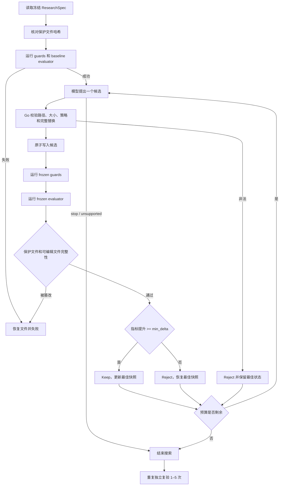

# Research Coding AutoResearch Harness

## 1. 状态机



## 2. Baseline

任何模型改动前先运行全部 guard 和 evaluator。baseline 失败时，不进入候选生成，因为此时无法区分候选效果和环境故障。baseline Trial 的编号为 0，写入同一 TrialLedger。

## 3. 候选生成

模型每轮只看到：

- 完整冻结 spec。
- baseline、当前最佳分数和最近最多 4 条 Trial 摘要。
- 当前最佳版本的 editable 文件内容。

模型看不到由 harness 主动提供的保护文件内容。每轮最多改 3 个 editable 文件，必须返回完整内容和逐文件原因。Go 端拒绝新文件、越界路径、重复路径、空修改，以及新引入的安装、网络、子进程、假指标和硬编码预测构造。

## 4. Keep/Reject

最大化指标时：

```text
delta = candidate_score - best_score
```

最小化指标时：

```text
delta = best_score - candidate_score
```

只有 `delta > 0` 且 `delta >= min_delta` 才 Keep。执行失败、guard 失败、指标缺失、指标非数值、退化或提升不足都会 Reject。Reject 后按内容和权限恢复上一个最佳快照，而不是恢复最初 baseline。

## 5. TrialLedger

`autoresearch.ledger/v1` 记录：

- spec SHA-256、指标键、方向和预算。
- baseline、当前最佳分数、完成和接受次数。
- 保护文件与最终最佳候选文件哈希。
- 每次 Trial 的假设、状态、决策和原因。
- 每个补丁的路径、原因、前后 SHA-256。
- guard/evaluator 参数数组、exit code、耗时和 stdout/stderr 有限预览。
- 搜索阶段的命令总数、guard/evaluator 次数、成功/失败数、命令累计耗时和墙钟耗时。
- 停止原因和开始、结束时间。

TrialLedger 是追加式实验事实记录，不包含模型隐藏思维过程。当前按节点结束或失败时写入 Artifact，尚不是逐轮事务持久化；后端进程在单轮中途硬崩溃时，仍可能丢失该节点尚未提交的轮次。

资源摘要由 harness 根据逐轮命令结果重算并校验，不能只修改汇总字段伪造较低成本。它当前描述 CPU/沙箱命令执行，不等同于 GPU、token 或货币成本账本。

## 6. 终止条件

- 达到 `max_trials`。
- 达到 `max_wall_seconds` 或上层 context 取消。
- 模型返回 `stop` 或 `unsupported`。
- 模型 API 失败或返回非法结构时，保留 baseline/最佳候选并停止生成。
- baseline 失败、保护文件变化或无法恢复文件时，任务失败。

候选全部被拒绝不是系统失败。只要 baseline 有效且研究完整性没有被破坏，任务仍会完成，并明确记录“最佳结果仍是 baseline”。
