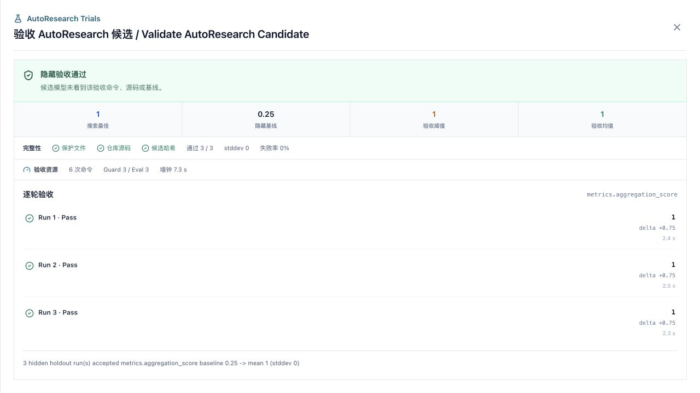

# 示例与验收记录

## 1. 内置示例

示例目录：[`examples/autoresearch/intent_router`](../../examples/autoresearch/intent_router/)

它用标准库实现一个六分类意图路由 Benchmark：

- `candidate.py` 是唯一可编辑文件。
- `evaluator.py`、`benchmark.json` 和 `autoresearch.json` 是保护文件。
- guard 使用 `python3 -m py_compile`。
- evaluator 输出 `accuracy`、`macro_f1`、`p95_latency_ms` 和数据/候选 SHA-256。
- 主指标为 `metrics.macro_f1`，最大化，最小提升为 `0.001`。
- 最佳候选使用 `validation_runs=3` 启动三次独立进程复验。

这个示例验证 harness，不代表 BERT 或 Qwen 的完整训练。真实 GPU 训练可以使用同一 spec，把 editable、dependencies 和命令替换成训练入口与冻结验证入口。

## 2. 2026-08-06 本地基线

执行：

```bash
cd scholar-agent
python3 examples/autoresearch/intent_router/evaluator.py
# 或：make example-autoresearch
```

稳定结果字段：

```json
{
  "sample_count": 26,
  "metrics": {
    "accuracy": 0.6538461538461539,
    "macro_f1": 0.672875816993464
  },
  "dataset_sha256": "331ecf7f1a1d7356c3d9217ed0f657668b44f77f413191ccf030d2050694068f",
  "candidate_sha256": "7d39da592567260604ed6f411fcdbaadde0becab5ca3a8c55485ba301ee3deba",
  "status": "ok"
}
```

`p95_latency_ms` 随机器负载变化，不作为 golden value。

## 3. 2026-08-07 重复验证实测

同一冻结候选和 evaluator 连续启动 3 个真实 Python 进程：三次 `macro_f1` 都是 `0.672875816993464`，均值相同，总体标准差与失败率均为 `0`；三次数据和候选 SHA-256 一致。机器可读记录见 [`results/2026-08-07_repeated_validation.json`](../../examples/autoresearch/intent_router/results/2026-08-07_repeated_validation.json)。

这是 CPU 轻量 harness 验收，不是 BERT/Qwen 训练、多 seed 评测或论文结论。重复验证实现与资源口径见[重复验证与执行资源证据](07_repeated_validation_and_resource_evidence.md)。

## 4. 前端 Trial 与隐藏验证可视化

`autoresearch_run` 节点完成后，执行面板默认进入“实验”标签，直接解析 `autoresearch.ledger/v1`：

- 顶部汇总 baseline、best、有效提升和 Keep 数量。
- SVG 趋势图同时支持 maximize 与 minimize 指标，不新增图表运行时依赖。
- Trial 列表展示 Keep/Reject、指标、相对变化、耗时、假设、原因和补丁文件哈希。
- 资源摘要展示命令总数、guard/evaluator 分布、失败命令、命令累计耗时和墙钟耗时。
- 支持节点侧栏与全屏视图；损坏或未知版本账本会显示降级错误，不影响原始报告入口。



前端使用 Node 内置测试验证正常账本、双重 JSON 编码、minimize 指标、损坏数据和耗时格式：

```bash
cd scholar-agent/frontend
npm test
```

README 截图使用当前组件回放 LightRAG 真实远端结果；可复现入口为 [`frontend/test/runtime-preview.html`](../../frontend/test/runtime-preview.html)。视觉验收覆盖 `1280x720`、`390x844` 和 `320x700`；窄屏无横向溢出或按钮文字裁切。

## 5. Harness 回归场景

[`autoresearch_test.go`](../../backend/internal/agent/autoresearch_test.go) 使用真实文件写入、冻结 spec、模拟模型 API 和模拟沙箱覆盖：

| 场景 | 期望 |
|---|---|
| baseline `0.5` | Trial 0 建立初始最佳值 |
| 候选 1 得分 `0.8` | `kept`，最佳快照更新 |
| 候选 2 得分 `0.4` | `rejected`，文件恢复到 `0.8` 版本 |
| 搜索 evaluator 重放 | 文件哈希与 `0.8` 得分同时匹配，报告模式为 `search_evaluator_replay` |
| 模型输出坏 JSON | 记录一个 Reject，下一轮收到严格 schema 提示，剩余预算继续 |
| 模型在可见 case 失败时 Stop | Stop 请求被 Reject，不提前结束搜索 |
| 隐藏 holdout 未达门槛 | 验证任务与报告节点完成，但报告为 `status=failed` |
| 三次真实进程复验 | 每次运行 `py_compile + evaluator`，均值、标准差、失败率和资源摘要正确 |
| 第二次复验从 `0.8` 漂移到 `0.79` | 继续完成三轮并以 `passed=2/3`、`failure_rate=1/3` 判失败 |
| 复验首轮篡改 evaluator | 立即停止剩余两轮、计入 unfinished，并恢复 evaluator 与最佳候选 |
| evaluator 在 Trial 中被改 | 任务 `compromised`，evaluator 与 candidate 都恢复 |
| 非 editable 源码在运行中被改 | 工作区指纹失败，源码与 candidate 都恢复 |
| 恢复路径的父目录被换成符号链接 | 拒绝恢复，不向工作区外写入 |
| 指标是字符串或无最终 JSON | 拒绝，不把日志文本当指标 |

同一测试文件还包含本地进程 harness：真实执行 `py_compile` 和 Python evaluator，完成 `0.25 -> 0.9` 的 Keep、账本生成和三次公开 evaluator 重放。模型 HTTP 响应仍使用固定 fixture，因此候选生成离线、可重复；命令执行、文件写入、哈希、指标解析和统计均走真实代码路径。

运行：

```bash
cd scholar-agent/backend
go test ./internal/agent -run AutoResearch -v
go test ./internal/planner ./internal/api ./internal/scheduler
```

## 6. 端到端成功标准

1. API 将明确请求识别为 `AutoResearch`。
2. Planner 固定生成 8 个节点，关键节点 Agent 和 Artifact 契约通过校验。
3. 规格加载后包含保护文件哈希，用户预算只能被收紧。
4. baseline 失败时不调用候选模型。
5. 每轮只有真实、有限数值指标达到阈值才 Keep。
6. Reject 和 compromised 路径恢复正确文件。
7. TrialLedger 能解释每个最佳结果来自哪一轮、哪组源码哈希。
8. 声明的每次最终验证都通过后才生成成功状态；报告必须标明验证模式，并包含均值、标准差和失败率。
9. `autoresearch_run` 节点无需阅读原始 JSON 即可查看趋势、决策和修改摘要。

当前 Trial 视图不保存完整逐轮源码，因此只能显示补丁文件、原因和前后哈希，不能恢复逐行 diff。完整源码审阅仍应结合工作区、最终候选 Artifact 和版本控制系统。

## 7. 2026-08-10 真实外部仓库验收

远端完整部署通过上传 spec/evaluator/holdout 的产品入口运行了提交可追踪的 rank-bm25、Tenacity、LightRAG 与 GraphRAG。四组搜索都采用 `3 x worst`，公开分数分别从 `5/9、6/7、4/8、6/12` 提升到满分，新的隐藏 holdout 都达到 `4/4`，最终 3/3 重复验证通过。四份初始记录保存实际 checkout SHA；提交锁定机制在随后两次 LightRAG 运行中验证。完整机器记录保存于 [`examples/autoresearch/real_repositories/results`](../../examples/autoresearch/real_repositories/results/)。

该过程还真实复现并修复了运行镜像缺 Git、Python 版本不匹配、工作区缓存污染、仓库 HEAD 漂移、单次指标不可靠、满分平台浪费预算、候选提前 Stop、坏 JSON 终止整轮和 Ledger 决策枚举不一致等问题。早期 GraphRAG 公开 `11/11`、隐藏 `3/4` 的负结果没有删除；新版把已知失败移入公开契约后使用全新 holdout。完整步骤、机器记录、资源口径和不做过度声明的边界见[真实外部仓库实验](08_real_repository_experiments.md)。
