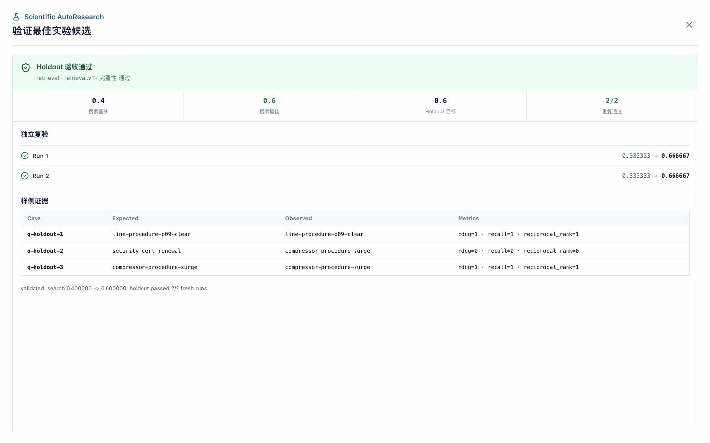

# 通用 Scientific AutoResearch：定位、协议与当前边界

## 1. 核心定位

ScholarAgent 的目标不是只复现 RAG，也不是只替一个仓库修 Bug，而是把一类科研问题统一成可执行闭环：

> 给定论文或代码、研究数据、候选方法空间、可信评测器、目标指标和计算预算，系统自动提出有限候选、真实运行、保留提升、拒绝退化、达到目标后停止，并在未参与搜索的 Holdout 上复验最佳结果。

RAG 只是第一个内置领域 Adapter。相同内核可以用于分类模型、时间序列、推荐系统、图算法、编译优化或其他论文任务，前提是该领域能够提供可执行 evaluator 和有限候选空间。

## 2. 两种候选模式

| 模式 | 候选是什么 | 适用场景 | 当前入口 |
|---|---|---|---|
| `code_patch` | 白名单源码文件的受限修改 | 论文代码有 Bug、实现与论文声明不一致、需要算法级小改动 | 仓库 + `autoresearch.spec/v1` |
| `strategy_config` | 方法分支与有限域参数配置 | 不知道哪种方法/模块/超参数适合自己的数据 | 数据 + 内置 Adapter，或可移植 `experiment.spec/v1` |

两种模式共享真实执行、固定指标、预算、目标停止和最终验收，但不能混为一谈。代码模式由模型提出补丁并回滚文件；配置模式不允许模型改 evaluator，而是在冻结的离散空间中生成候选树。

## 3. 通用研究契约

一次可信自动研究至少需要五类输入：

1. **研究对象**：论文仓库、模型、算法实现或可调用系统。
2. **数据**：训练/搜索用例和独立 Holdout；只有原始语料而没有标签，无法证明方法优劣。
3. **候选空间**：方法开关、模块组合和参数有限域。
4. **评测器**：返回机器可读指标和样例证据的真实命令。
5. **停止契约**：主指标、方向、最小提升、目标值、候选数、墙钟时间和复验次数。

配置搜索使用以下稳定版本：

- `experiment.dataset/v1`：Adapter 产出的数据、映射、能力和文件哈希。
- `experiment.spec/v1`：方法分支、参数值域、命令、指标和预算。
- `experiment.evaluation/v1`：每个 evaluator 进程必须输出的指标、资产哈希和样例证据。
- `experiment.ledger/v1`：冻结策略空间、baseline、候选父子关系、Keep/Reject、资源和停止原因。
- `experiment.validation/v1`：独立 Holdout 重复验证。

核心数据结构见 [`experiment_research.go`](../../backend/internal/models/experiment_research.go)，执行内核见 [`agent/experiment_research.go`](../../backend/internal/agent/experiment_research.go)。

## 4. Adapter 边界

通用 Harness 不需要知道“什么是 BM25”或“什么是 Transformer”。Adapter 只负责：

- 把领域数据转成 evaluator 能读取的冻结资产。
- 声明方法分支和每个参数允许的离散值。
- 提供搜索和 Holdout 命令。
- 按统一 JSON 契约返回指标与样例级证据。

当前提供两种 Adapter 接入方式：

### 内置 Adapter

`retrieval.v1` 自动识别语料、查询、相关文档 ID、split 和可选关系边，生成 BM25、TF-IDF、RRF 混合与图增强分支。实现见 [`experiment_retrieval_adapter.go`](../../backend/internal/agent/experiment_retrieval_adapter.go)。这证明零配置领域 Adapter 可以接入通用内核，不表示项目只支持检索。

### 可移植 Adapter

任意论文领域可以上传 `experiment.json`、evaluator 和数据文件。命令使用 `{asset:filename}` 引用上传资产，使用 `{config_path}` 接收 Harness 生成的候选配置。例如：

```json
{
  "version": "experiment.spec/v1",
  "name": "classifier method search",
  "domain": "classification",
  "candidate_kind": "strategy_config",
  "objective": "maximize macro F1",
  "search_command": ["python3", "{asset:evaluator.py}", "--data", "{asset:search.jsonl}", "--config", "{config_path}"],
  "holdout_command": ["python3", "{asset:evaluator.py}", "--data", "{asset:holdout.jsonl}", "--config", "{config_path}"],
  "strategies": [
    {
      "name": "linear",
      "description": "linear baseline",
      "parameters": [
        {"name": "c", "values": [0.1, 1.0, 10.0], "default": 1.0}
      ]
    }
  ],
  "metric_key": "macro_f1",
  "direction": "maximize",
  "min_delta": 0.001,
  "target_score": 0.8,
  "max_trials": 8,
  "max_parallel_trials": 1,
  "evaluation_isolation": "serial/v1",
  "max_wall_seconds": 900,
  "validation_runs": 3,
  "dependencies": ["scikit-learn>=1.4,<2"]
}
```

上传文件会复制到隔离工作区并冻结 SHA-256；用户声明的旧哈希不会被信任。Portable Adapter 的实现见 [`experiment_portable_adapter.go`](../../backend/internal/agent/experiment_portable_adapter.go)。

## 5. 结果驱动候选树

配置搜索不是让模型输出隐藏思维过程。它是一棵可审计的实验树：

1. 第一个方法默认配置建立 baseline。
2. 其余方法默认配置形成一级“方法消融”分支。
3. 每个分支按一次只改变一个参数生成子候选。
4. evaluator 的真实主指标决定 Keep/Reject。
5. Keep 分支继续展开相邻参数；候选 ID 去重。
6. 达到 `target_score`、耗尽 Trial、耗尽墙钟或搜索完空间时停止。

启用 Python Research Optimizer 时，队列中的下一候选由 `contextual-ucb/v1` 根据冻结数据特征和已验证跨任务经验选择；Go 仍校验候选属于当前队列，并在服务异常时退回确定性 FIFO。每个节点记录 `parent_id`、`depth`、`changed_parameter`、完整参数、Policy 版本、propensity、预测/实际 Reward、分数、相对最佳值、耗时和判定原因，前端直接渲染为候选与参数消融树。它和论文理解阶段的两层 ToT 不同：ToT 负责在运行前选高信息增益实验，结果驱动树负责在运行中用真实指标筛选配置。

### ToT 设计与两层异步

当前 Scientific AutoResearch 不再把整个搜索藏在一个线性节点中：

1. 契约冻结后，`ablation_design` 使用两层受限 ToT 展开参数、模块、数据、稳定性和成本方向；它与 `prepare_runtime -> install_dependencies` 分支异步执行。
2. 两个分支在 `experiment_run` 汇合。ToT 产物的 SHA-256 和探索分支数写入 TrialLedger，用于解释“运行前考虑过什么”；它不能覆盖冻结策略空间，也不能自行宣布实验成功。
3. 运行期按最小深度形成候选前沿。若契约声明 `shared-readonly/v1`，Harness 最多并发 1 至 4 个同层候选；否则强制 `serial/v1`。
4. 并发候选各自使用独立配置文件，账本记录 `batch`、`worker` 与 `peak_parallelism`。结果即使以不同顺序完成，也按 Policy 的固定选择顺序提交 Keep/Reject，避免完成时序改变最佳候选。
5. 某个 worker 达到目标时，同批已经启动的候选仍会完成并入账，下一批不再启动。这是可见的并发预算开销，不会被隐藏成“只运行了一次”。

内置 `retrieval.v1` evaluator 只读冻结数据，因此用户明确请求“并发 3 路”时可以使用共享只读模式。Portable Adapter 默认串行；只有契约作者确认 evaluator 不写共享状态并显式声明隔离模式后，才允许提高并行度。这里实现的是**受限同层并发**，不是 MCTS 式任意异步树搜索。

Reward 仅用于学习“下次先尝试什么”，不参与 Keep/Reject。只有最终 Holdout 为 `validated` 的 campaign 会成为后续策略历史；完整协议见 [Python Research Optimizer](10_python_research_optimizer.md)。

## 6. 为什么结果更可信

- 搜索命令、Holdout 命令、数据和 evaluator 都在运行前冻结哈希。
- Candidate 只能写入独立配置文件，不能修改 evaluator 或数据。
- Keep/Reject 由 Go 根据进程输出决定，不接受 Agent 自报分数。
- evaluator 必须回传它实际读取的资产哈希，否则结果被拒绝。
- Search 与 Holdout 使用分离文件；Holdout 不参与候选选择。
- 最佳配置在新进程中重复运行，报告同时展示搜索分数和 Holdout 分数。
- TrialLedger 保留失败候选，不把“尝试过但没提升”从记录中删除。

## 7. 真实检索示例

[`examples/scientific-autoresearch/retrieval`](../../examples/scientific-autoresearch/retrieval/) 使用 13 条工业知识、5 条搜索查询和 3 条 Holdout 查询真实运行内置 Adapter。固定 `NDCG@1` 后：

- BM25 baseline：Search `0.4000`，Holdout `0.3333`。
- TF-IDF 与普通 RRF：Search 均为 `0.4000`，被 Reject。
- 图增强分支：Search `0.6000`，确定性 FIFO 基线在第 3 轮达到目标后停止。
- 最佳配置 Holdout：`0.6667`，两个新进程通过 `2/2`。

这证明通用协议、真实 evaluator、目标停止和 Holdout 闭环可以运行，不证明图增强在所有数据上更好，也不证明任意论文已经零配置适配。

接入 Python Optimizer 后又连续运行两个 HTTP campaign：冷启动任务用了 2 个候选；该任务通过 Holdout 并写入 Experience Store 后，第二个同数据任务以 `0.9333` 的选择概率首先运行 `graph_hybrid`，只用 1 个候选达到同一 Search 与 Holdout 结果。机器记录见 [`optimizer_experience_result.json`](../../examples/scientific-autoresearch/retrieval/optimizer_experience_result.json)。这验证了“经验落库 -> 只读取已验证历史 -> 改变候选顺序”的实现，不足以证明未见数据集上的泛化。


上图是产品内的真实交互视图，由前端直接解析 `experiment.ledger/v1` fixture。顶部同时展示 ToT 分支数和 `3/3` 峰值并发；三个一级方法候选保留相同 batch、不同 worker，策略树展示全部有限域、真实分数和目标停止后的剪枝状态。点击节点可以查看配置、Policy、propensity、预测/实际 Reward、耗时与 Keep/Reject 原因，也可以切换时间线核对确定性入账顺序。这棵树是可公开、可复核的实验谱系，不是模型私有思维过程；fixture 负责稳定重放 UI，并发行为由 Go 集成测试真实执行验证。



验收页把搜索分数与 Holdout 分数分开呈现，并展示两个新进程的逐次结果和样例级证据。机器可读 FIFO 基线见 [`result.json`](../../examples/scientific-autoresearch/retrieval/result.json)，策略经验复验见 [`optimizer_experience_result.json`](../../examples/scientific-autoresearch/retrieval/optimizer_experience_result.json)；本次运行环境是本地 CPU，不冒充 Docker/GPU 或第三方官方 Benchmark。

## 8. 当前能力与目标之间的差距

| 能力 | 当前状态 |
|---|---|
| 任意仓库的受限代码修复 AutoResearch | 已支持，需要可运行 baseline 和 `autoresearch.json` |
| 任意领域的配置搜索 | 已支持 Portable Adapter 协议，需要 evaluator 和候选空间 |
| 检索/RAG 数据的零配置适配 | 已支持轻量内置 Adapter |
| ToT 设计与环境准备异步 | 已支持固定 DAG 双分支，搜索前汇合并保留 ToT 产物哈希 |
| 多策略候选并发 | 已支持 `shared-readonly/v1` 下 1-4 路同层并发；Portable Adapter 默认串行 |
| 任意异步树搜索 / MCTS | 尚未支持；当前批次只从同一最小深度前沿取候选 |
| 任意论文上传后自动生成可靠 Adapter | 尚未完全支持；Research Coding Agent 具备仓库分析和 Benchmark 代码生成基础，但还没有对所有领域做自动契约验收 |
| 自动证明全局最优 | 不支持；系统只能返回给定候选空间、数据、指标和预算内观察到的最佳配置 |
| 无标签数据自动判断效果 | 不支持；可做无监督代理指标，但不能冒充业务正确率 |

下一阶段的关键工作不是继续堆更多 Agent，而是让 Research Coding Agent 自动生成 Portable Adapter 后，先通过公开契约测试、数据泄漏检查和小样本预检，再交给通用 Harness。这会把“所有论文”从目标逐步变成可验证的 Adapter 覆盖率，而不是一句无法验收的承诺。
