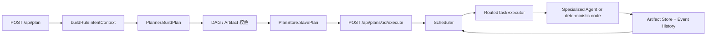

# Planner、Scheduler 与数据模型参考

本文以当前生产路径为准，说明 `POST /api/plan` 如何形成可执行 DAG，并重点记录 AutoResearch 新增的规划与数据契约。最后核对日期：2026-08-06。

## 1. 代码入口

| 模块 | 文件 | 责任 |
|---|---|---|
| API 计划入口 | [`plan_runtime.go`](../backend/internal/api/plan_runtime.go) | 规则意图、附件、计划持久化、审批和执行 API |
| 基础路由 | [`routes.go`](../backend/internal/api/routes.go) | `DetectIntentType`、单节点兼容入口、健康检查 |
| Planner | [`planner.go`](../backend/internal/planner/planner.go) | 确定性模板、DAG/Artifact 契约和关键节点校验 |
| Planner Agent | [`agent_planner.go`](../backend/internal/planner/agent_planner.go) | 非关键流程的 LLM DAG 提议、归一化和模板回退 |
| Scheduler | [`scheduler.go`](../backend/internal/scheduler/scheduler.go) | Ready 判定、并发、重试、租约、预算和失败传播 |
| Executor | [`executor.go`](../backend/internal/scheduler/executor.go) | 合并 Artifact、路由 Agent、标准化执行结果 |
| 图模型 | [`graph.go`](../backend/internal/models/graph.go) | `PlanGraph`、`TaskNode`、`TaskEdge` |
| 运行契约 | [`runtime.go`](../backend/internal/models/runtime.go) | `TaskContract`、审批和计划预算 |
| AutoResearch 模型 | [`autoresearch.go`](../backend/internal/models/autoresearch.go) | ResearchSpec、TrialLedger、最佳候选和验证报告 |

旧的 `Planner.GeneratePlan` 和 `/api/execute` 仍用于兼容或测试；正式完整执行路径是 `BuildPlan -> PlanStore -> Scheduler.ExecutePlan`。

## 2. 创建和执行链



Scheduler 只把同时满足以下条件的节点设为 `ready`：

1. 所有 `dependencies` 已完成。
2. 所有 `required_artifacts` 已由上游产生。
3. 计划未取消、未超预算，节点没有有效的其他执行租约。

节点完成时，Executor 从 `task.metadata.artifact_values` 读取显式值，并按 `output_artifacts` 写回计划级 Artifact。下游不会从自然语言日志猜测输入。

## 3. Planner 决策顺序

`BuildPlan` 的顺序是：

1. `Custom_Benchmark` 或携带数据集的明确 Benchmark：固定 13 节点流程，包含独立 Benchmark Agent 的审计、切分、Metric/Reward 契约和隐藏验收。
2. `AutoResearch`：固定 8 节点流程。
3. 其他意图在模型可用时调用 Planner Agent。
4. 模型拓扑经过 task type、Agent、Artifact 和关键节点校验。
5. 模型不可用或结果不合法时使用确定性模板。

把 Benchmark 和 AutoResearch 放在 LLM Planner 之前，是为了避免模型省略冻结评测、重复验证或数据证据节点。

## 4. 当前意图与典型拓扑

| Intent type | 规划策略 | 主要节点 |
|---|---|---|
| `Paper_Reproduction` | 模板或校验后的 Planner Agent | 论文解析、Claim Rubric、仓库、环境、调试 baseline、对比、证据图 |
| `Framework_Evaluation` | 模板或校验后的 Planner Agent | 框架研究、隔离分支、各自运行时、统一报告 |
| `Code_Execution` | 模板或校验后的 Planner Agent | 生成代码、依赖、运行时、执行、验证 |
| `Custom_Benchmark` | 固定模板 | 数据审计、安全切分、Metric/Reward 冻结、仓库适配、公开预检、无标签 test 推理、隐藏指标重算 |
| `AutoResearch` | 固定模板 | 仓库、ResearchSpec、运行时、Keep/Reject、重复复验、资源证据、报告 |
| `General` | 模板或 Planner Agent | 通用研究、综合或回答 |

规则分类器会优先识别 AutoResearch，再识别论文复现、框架评估和代码执行。原因是自动实验请求常同时包含“代码、运行、评测、论文”等低特异性词。

## 5. `PlanGraph`

关键字段：

| 字段 | 作用 |
|---|---|
| `id` / `trace_id` | 计划标识和事件追踪 |
| `intent_type` / `user_intent` | 归一化类型和原始请求 |
| `owner_id` / `session_id` | 本地会话所有权 |
| `status` / `approval` | 计划状态和审批记录 |
| `budget` / `usage` | 总尝试、总时长和实际使用 |
| `nodes` / `edges` | 执行节点和控制/数据边 |
| `artifacts` | 跨节点命名产物 |
| `meta` | 各状态节点数量 |

## 6. `TaskNode` 与 `TaskContract`

`TaskNode` 同时声明控制依赖和数据依赖：

- `dependencies`：上游 task ID。
- `required_artifacts`：执行前必须存在的命名产物。
- `output_artifacts`：成功后必须发布的产物。
- `assigned_to`：逻辑 Agent。
- `type`：Agent 内部确定性分发键。
- `parallelizable`、`priority`、`retry_limit`、`timeout_seconds`：调度约束。
- `execution_id`、`execution_epoch`、lease 字段：防止迟到结果覆盖。

每个节点还包含 `contract.version=v1`：

```json
{
  "version": "v1",
  "input_artifacts": ["workspace_path"],
  "output_artifacts": ["research_spec"],
  "allowed_tools": ["repository.read", "metrics.validate"]
}
```

当前 `allowed_tools` 是可审计声明，尚不是独立 capability token 系统。真正的文件和命令权限仍由 Agent harness 与沙箱校验。

## 7. AutoResearch 规划契约

固定节点顺序：

```text
repo_discovery
repo_prepare
autoresearch_spec
prepare_runtime
install_dependencies
autoresearch_run
autoresearch_validate
verify_result
```

`validateCriticalNodeContracts` 要求：

- 仓库节点存在且 `repo_prepare` 输出工作区。
- `autoresearch_spec` 由 `research_coding_agent` 执行，消费工作区并输出 `research_spec` 与 `dependency_spec`。
- 运行时和依赖安装节点存在。
- `autoresearch_run` 消费工作区、`prepared_runtime`、spec，并输出 TrialLedger 和最佳候选。
- `autoresearch_validate` 消费冻结证据并输出验证报告。

用户可以写“最多 N 次实验”“总时长 N 分钟”和“最终验证 N 次”；旧的“独立复验 N 次”表达仍兼容。Planner 分别限制为最多 8 次、60 分钟和 5 次；spec 与 Agent 还会再次限幅。未明确请求时，重复验证默认 1 次。验证轮次共享模板节点的 600 秒上限；计划总时长在研究循环预算之上增加 900 秒，用于克隆、建环境、验证和报告。

## 8. AutoResearch 数据模型

### `ResearchSpec`

控制面事实：editable/protected 文件、guard/eval 命令、指标键、方向、最小提升、Trial/时长预算、验证次数、依赖、保护文件哈希和非 editable 工作区指纹。

### `ResearchTrial`

实验事实：编号、假设、补丁哈希、命令 exit code 与有限输出、指标、相对最佳值变化、Keep/Reject 决策和时间。

### `ResearchTrialLedger`

聚合事实：spec hash、baseline、最佳分数、接受次数、最终文件哈希、全部 Trial、停止原因与可重算的命令资源摘要。

### `ResearchValidationReport`

最终证据：spec/ledger hash、期望分数、逐次观察分数、均值、总体标准差、失败率、保护文件和最佳候选完整性、逐轮命令结果、资源摘要与验证状态。

完整字段见 [AutoResearch Planner 与契约](autoresearch/02_planner_and_contracts.md)。

## 9. 修改指引

### 新增普通 Task type

1. 在 Planner Agent prompt 的 canonical type 白名单中加入类型。
2. 在 `normalizePlannerTaskType` 和 `normalizePlannerAssignedTo` 注册。
3. 在 `applyPlannerNodeDefaults` 补 Artifact 默认值。
4. 在目标 Agent 或 Executor 中实现执行分支。
5. 补 Planner、Agent、Artifact 和失败路径测试。

### 修改安全关键流程

Paper Reproduction、Custom Benchmark 和 AutoResearch 不应只修改 Planner prompt。先修改确定性模板和 `validateCriticalNodeContracts`，再调整 Agent harness 和模型契约。

### 新增 AutoResearch 字段

需要同时考虑：

1. `ResearchSpec` JSON 版本兼容。
2. spec 归一化和硬上限。
3. Planner 输入预算是否可被用户扩大。
4. TrialLedger 是否记录实际执行值。
5. 最终验证是否重新检查该字段，并正确区分公开重放与隐藏 holdout。
6. 示例、单测和模块文档是否同步。

## 10. 验证

```bash
cd scholar-agent/backend
go test ./internal/planner ./internal/scheduler ./internal/api
go test ./internal/agent -run AutoResearch -v
```

前端和完整仓库验证见 [`docs/autoresearch/05_example_and_acceptance.md`](autoresearch/05_example_and_acceptance.md)。
