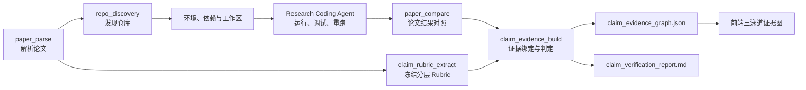
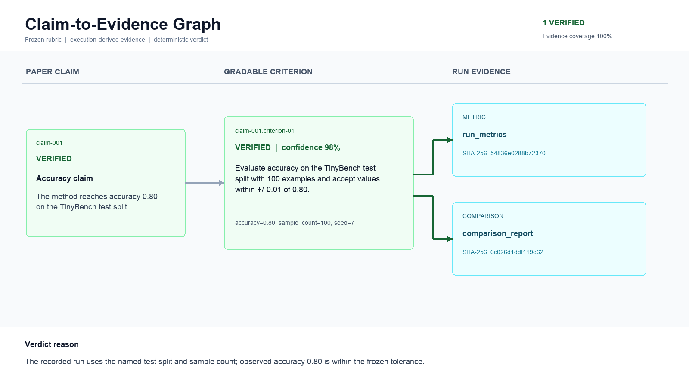

# Claim-to-Evidence Graph

## 1. 功能定位

Claim-to-Evidence Graph 把论文复现从“仓库代码是否成功运行”拆成可独立验收的四层对象：

```text
论文 -> 顶层主张 -> 可独立打分的准则 -> 真实运行证据
```

这里的“拆得更细”不是增加更多 Agent，而是细化验收粒度。一次命令退出码为 0 只能证明程序运行过，不能直接证明论文的精度、效率、消融或稳健性结论已经复现。

当前实现包含两个固定节点：

| 节点 | Agent | 时机 | 输出 |
|---|---|---|---|
| `claim_rubric_extract` | Librarian | 论文解析后、仓库实验前 | `claim_rubric`、`claim_rubric_report` |
| `claim_evidence_build` | Data | 对比、修复重跑和可选绘图后 | `claim_evidence_graph`、`claim_verification_report` |

## 2. 为什么做这个能力

[PaperBench](https://openai.com/index/paperbench/) 没有只判断最终代码能否运行，而是为 20 篇 ICML 论文建立分层 rubric，拆成 8,316 个可独立评分任务。这说明论文复现更适合使用分层验收对象，而不是单一成功标记。

[CORE-Bench](https://arxiv.org/abs/2409.11363) 将计算可复现性作为独立 Agent 任务评估，并报告专用的 CORE-Agent 优于通用 AutoGPT。它支持本项目继续强化“科研复现专用 scaffold”，而不是把所有工作都交给一个通用 Coding Agent。

[2026 年 CORE-Bench 分析](https://arxiv.org/abs/2606.26158) 进一步把关注点扩展到 OOD 泛化、效率、可靠性、模型与 scaffold 的作用，以及人机协作。Claim-to-Evidence Graph 因此不只保存一个准确率，还显式保存证据覆盖、不可验证项、缺失资产和判定理由。

这些研究是设计动机，不是实现正确性的替代证明。Sea-Mult-Agent 采用自己的 Artifact、Scheduler、受限调试和前端交互契约，并通过本地测试验证这些契约。

## 3. 执行架构



Rubric 必须在查看运行结果之前冻结。后续节点只能引用它的 ID 和 SHA-256，不能根据实验结果改写验收标准。

## 4. 数据契约

### 4.1 Frozen Rubric

顶层结构版本为 `claim.rubric/v1`：

```json
{
  "version": "claim.rubric/v1",
  "paper_title": "Paper title",
  "source_artifact": "parsed_paper",
  "sha256": "...",
  "claims": [
    {
      "id": "claim-001",
      "title": "Accuracy claim",
      "statement": "...",
      "source_locator": "Table 1",
      "claim_type": "quantitative",
      "importance": 0.9,
      "criteria": [
        {
          "id": "claim-001.criterion-01",
          "description": "Evaluate the reported metric under the paper protocol.",
          "metric_name": "accuracy",
          "required_evidence": ["paper", "run", "metric"]
        }
      ]
    }
  ]
}
```

Go 后端负责规范化数量、字段、ID、容差和哈希；模型不能自行指定稳定 ID。

### 4.2 Evidence Graph

图结构版本为 `claim.evidence/v1`，包含：

- 自包含的主张标题、原始陈述、来源和类型
- 每个准则的状态、置信度、观测值、理由和证据 ID
- 上游 Artifact 的类型、可用性、SHA-256 和有限摘要
- 主张总数、准则总数、各状态计数和证据覆盖率

允许的状态只有：

| 状态 | 含义 |
|---|---|
| `verified` | 所有准则都有直接执行证据支持 |
| `partially_reproduced` | 只有部分准则或部分目标达到 |
| `contradicted` | 直接证据与论文主张冲突 |
| `unverifiable` | 当前证据不足，不能下结论 |
| `blocked_by_missing_asset` | 缺数据、权重、凭证、授权资产或必要硬件 |

## 5. 判定边界

模型负责理解语义并提出判定，Go harness 负责执行以下不可绕过的检查：

1. `claim_id` 和 `criterion_id` 必须来自冻结 Rubric。
2. Rubric 必须保持后端规范化后的稳定 ID 与字段；即使篡改者重新计算哈希，非规范结构也会被拒绝。
3. 每个准则必须恰好返回一次；漏项、重复项或未知 ID 会使整次判定降级。
4. 状态和置信度必须在白名单与数值范围内。
5. `verified`、`partially_reproduced` 和 `contradicted` 至少引用一个执行派生产物：`run_metrics`、`rerun_metrics`、`comparison_report` 或 `result_plot`。
6. 引用不存在或不可用的 Artifact 不计为证据。
7. 模型不可用、请求失败或 JSON 非法时，所有准则保持 `unverifiable`，系统不会伪造成功。

证据正文有单产物和总上下文大小限制；图中保存哈希和有限摘要，完整内容仍保留在原 Artifact 中。

## 6. 前端可视化

节点完成后，后端通过独立的 `structured_data` 字段发送图 JSON。前端不会把它显示成代码，而是生成三条固定泳道：

```text
论文主张 -> 独立判定准则 -> 运行证据
```

- 绿色：已验证
- 黄色：部分复现
- 红色：与证据矛盾
- 灰色：不可验证
- 蓝色：缺少必要资产
- 没有引用证据的准则会连接到显式“证据缺口”节点
- 支持缩放、平移、全屏查看和点击节点阅读理由、观测值、来源与证据哈希

固定泳道和确定性位置用于降低连线交叉；证据只展示被准则实际引用的节点，避免把全部上游产物堆进图中。



截图使用 [`test/claim-evidence/expected_graph.json`](../test/claim-evidence/expected_graph.json) 离线渲染，其数据由真实 Agent harness golden test 生成并比对。

## 7. 代码位置

| 模块 | 文件 |
|---|---|
| 数据模型 | [`backend/internal/models/claim_evidence.go`](../backend/internal/models/claim_evidence.go) |
| Rubric 与图构建 harness | [`backend/internal/agent/claim_evidence.go`](../backend/internal/agent/claim_evidence.go) |
| Planner 固定 DAG | [`backend/internal/planner/planner.go`](../backend/internal/planner/planner.go) |
| 模型提示词 | [`backend/internal/prompts/prompts.go`](../backend/internal/prompts/prompts.go) |
| Artifact 路由与结构化输出 | [`backend/internal/scheduler/executor.go`](../backend/internal/scheduler/executor.go) |
| 前端图组件 | [`frontend/src/features/claim-evidence/ClaimEvidenceGraphView.tsx`](../frontend/src/features/claim-evidence/ClaimEvidenceGraphView.tsx) |

## 8. 验证

```bash
cd scholar-agent/backend
go test ./internal/agent ./internal/planner ./internal/scheduler ./internal/api

cd ../frontend
npm run lint
npm run build
```

测试覆盖 Rubric 稳定 ID、哈希与非规范重哈希拒绝，无直接运行证据时的强制降级、模型漏判时的整体降级、Planner 最终证据汇合节点，以及 JSON Artifact 类型。

可重复样例、固定输入、golden graph 和截图生成脚本位于 [`test/claim-evidence/`](../test/claim-evidence/)。

## 9. 当前限制

- 语义判定仍依赖模型，Go 只验证证据引用与边界，不理解所有领域指标。
- 当前图是一次计划内的静态证据快照，还没有跨多次运行的时间序列对比。
- 尚未实现人工逐准则覆核、签名和双人审批。
- Smoke 复现只能支持对应范围内的结论，不能自动升级为完整论文复现。
