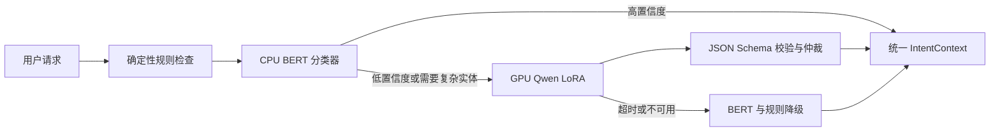

# Intent 双模型微调教程：CPU BERT 与 GPU Qwen

本文面向第一次接触模型微调的开发者，目标是在 ScholarAgent 中提供两套可以选择的意图识别配置：

- CPU 配置：`BAAI/bge-small-zh-v1.5` 加分类头，负责快速、稳定的固定类别判断。
- GPU 配置：`Qwen/Qwen3-0.6B` 加 LoRA，负责意图识别、实体抽取和约束生成。

两套配置不是互相替代，也不要求每次请求都同时运行。项目最终支持 `cpu`、`gpu`、`auto` 和 `compare` 四种模式。

结构原理请分别阅读：

- [03_bert_cpu_architecture.md](03_bert_cpu_architecture.md)
- [04_qwen_gpu_architecture.md](04_qwen_gpu_architecture.md)

## 1. 最终系统长什么样



推荐把 Go 后端作为编排者，而不是让前端直接访问模型服务。这样模型地址、鉴权、超时、回退和日志都集中在后端。

## 2. 四种可选配置

| 模式 | 执行路径 | 适用场景 |
|---|---|---|
| `cpu` | 规则 + BERT | 本地开发、无 GPU 部署、低延迟请求 |
| `gpu` | 规则 + Qwen | 调试 Qwen、研究结构化生成能力 |
| `auto` | 先 BERT，低置信度再 Qwen | 推荐的产品默认模式 |
| `compare` | BERT 和 Qwen 都运行 | 教学演示、离线评测、分析模型分歧 |

建议环境变量：

```bash
INTENT_ROUTER_MODE=auto
INTENT_CPU_URL=http://127.0.0.1:8091
INTENT_GPU_URL=http://127.0.0.1:8092
INTENT_CPU_MIN_CONFIDENCE=0.85
INTENT_CPU_TIMEOUT_MS=500
INTENT_GPU_TIMEOUT_MS=3000
```

`compare` 模式只用于实验或管理界面，不建议让生产请求每次都占用 GPU。

## 3. 先冻结统一标签和输出协议

第一版学习以下四个语义类别：

```text
Framework_Evaluation
Paper_Reproduction
Code_Execution
General
```

`Custom_Benchmark` 暂时由确定性规则处理，因为模型仅看到文字时，无法可靠知道用户是否真的上传了 CSV、JSONL 等数据文件。

两种模型最终都转换成同一种响应：

```json
{
  "intent_type": "Paper_Reproduction",
  "confidence": 0.96,
  "entities": {
    "paper_title": "Attention Is All You Need",
    "needs_ablation": true
  },
  "constraints": {
    "max_experiments": 3
  },
  "confidence_source": "router_calibration",
  "source": "qwen_lora",
  "model_version": "intent-qwen-v1",
  "latency_ms": 186
}
```

BERT 第一版只负责标签和概率，实体由 Go 规则补充：

```json
{
  "intent_type": "Paper_Reproduction",
  "confidence": 0.91,
  "entities": {},
  "constraints": {},
  "source": "bert_cpu",
  "model_version": "intent-bge-v1",
  "latency_ms": 28
}
```

## 4. 数据集如何共用

项目现有测试集：

```text
docs/intent/benchmarks/2026-04-22_intent_eval_dataset.jsonl
```

它有 80 条样本，每类 20 条。应把它冻结为测试集，不能同时作为训练数据。

建议第一版数据规模：

| 划分 | 建议规模 | 用途 |
|---|---:|---|
| Train | 800 条以上 | 更新模型参数 |
| Dev | 160 条以上 | 选超参数和早停 |
| Test | 现有 80 条 | 与历史规则结果比较 |
| OOD Test | 100 条以上 | 测试新表达、错别字、多意图和中英混合输入 |

### 4.1 BERT 使用的样本

```json
{"id":"train-0001","text":"复现论文并运行三组轻量消融","label":"Paper_Reproduction"}
```

### 4.2 Qwen 使用的样本

```json
{
  "id": "train-0001",
  "messages": [
    {
      "role": "user",
      "content": "复现论文并运行三组轻量消融"
    },
    {
      "role": "assistant",
      "content": "{\"intent_type\":\"Paper_Reproduction\",\"entities\":{\"needs_ablation\":true},\"constraints\":{\"max_experiments\":3}}"
    }
  ]
}
```

Qwen 数据比 BERT 多了实体和约束标注。两个版本必须共享相同的样本 ID 和数据划分，才能公平比较。

## 5. BERT 微调过程

第一候选是 `BAAI/bge-small-zh-v1.5`。它是轻量 BERT 编码器，增加一个分类头后即可训练。

训练过程：

1. Tokenizer 把文本转换为 token ID。
2. BERT 把整句话编码成向量。
3. 分类头把句向量映射成四个 logits。
4. Softmax 把 logits 转换成四类概率。
5. 使用分类交叉熵更新分类头和编码器参数。
6. 在 Dev 集 Macro-F1 不再提升时停止训练。

训练配置的保守起点：

```yaml
model: BAAI/bge-small-zh-v1.5
max_length: 128
learning_rate: 2.0e-5
epochs: 5
batch_size: 32
weight_decay: 0.01
warmup_ratio: 0.1
precision: fp16
seeds: [13, 42, 77]
```

这些值只是起点，最终值必须由 Dev 集决定，不能根据 Test 集反复调整。

## 6. Qwen 微调过程

GPU 配置使用 `Qwen/Qwen3-0.6B`，通过监督微调学习输出严格 JSON。第一版使用 FP16 LoRA，不需要为了 0.6B 模型立即引入 4-bit QLoRA。

训练过程：

1. 用 Qwen chat template 拼接 system、user 和 assistant 消息。
2. 关闭 thinking，只训练直接输出的 JSON，避免 `<think>` 内容进入结构化结果。
3. 将 user 部分设为不计算损失，只监督 assistant 的目标 JSON。
4. 冻结基础模型参数。
5. 在注意力层和 MLP 层插入低秩 LoRA 矩阵。
6. 只更新 LoRA 参数。
7. 保存 LoRA Adapter、基础模型 revision、Tokenizer 和 JSON Schema。

训练配置的保守起点：

```yaml
model: Qwen/Qwen3-0.6B
max_length: 256
learning_rate: 1.0e-4
epochs: 3
micro_batch_size: 8
gradient_accumulation_steps: 4
precision: fp16
lora_rank: 16
lora_alpha: 32
lora_dropout: 0.05
target_modules:
  - q_proj
  - k_proj
  - v_proj
  - o_proj
  - gate_proj
  - up_proj
  - down_proj
seeds: [13, 42, 77]
```

V100 不原生支持 BF16，所以训练配置必须明确使用 FP16。意图文本很短，不需要使用 Qwen 的完整长上下文。

## 7. 两种微调的本质区别

| 项目 | BERT 分类微调 | Qwen LoRA/SFT |
|---|---|---|
| 模型结构 | 双向 Encoder | 因果 Decoder |
| 目标 | 选择固定类别 | 逐 token 生成 JSON |
| 损失 | 类别交叉熵 | 下一个 token 预测损失 |
| 参数更新 | 通常全量更新 | 通常只更新 LoRA |
| 数据标注 | 文本 + 标签 | 文本 + 完整 JSON |
| 推理 | 一次前向计算 | 自回归生成多个 token |
| 置信度 | Softmax，便于校准 | 不接受模型自报分数，需要路由器额外估计和校准 |
| 输出稳定性 | 只能输出合法标签 | 需要 Schema 校验和失败回退 |
| 部署 | CPU 即可 | 推荐 GPU |

## 8. 自动模式如何决策

建议按以下顺序实现：

1. 先处理附件类型、GitHub URL、arXiv ID 等确定性信息。
2. 调用 CPU BERT。
3. BERT 置信度大于等于 `0.85` 时接受分类结果。
4. 低于阈值、前两名概率接近、存在多意图或需要复杂实体时调用 Qwen。
5. Qwen 输出通过 JSON Schema 校验后参与仲裁。
6. Qwen 超时或输出非法时保留 BERT 结果，并标记降级原因。
7. 两个模型都不确定时生成澄清问题，而不是强行分类。

不要简单规定“Qwen 永远覆盖 BERT”。模型分歧时应保留两个候选、概率、耗时和采用理由。
Qwen 生成内容中的自报置信度不能直接进入仲裁；如需统一分数，应使用独立校准集和路由器侧的评分方法，并记录 `confidence_source`。

## 9. 评测和上线门槛

至少记录这些指标：

- Accuracy
- Macro-F1
- 每类 Precision、Recall 和 F1
- 混淆矩阵
- OOD Macro-F1
- BERT 置信度校准误差
- JSON 合法率
- 实体字段 Exact Match / F1
- CPU/GPU P50、P95 延迟
- 模型文件大小和单请求显存

当前规则基线报告中的 Macro-F1 是 `0.8729`。建议首版上线门槛：

```text
Macro-F1 >= 0.92
每类 Recall >= 0.85
三个随机种子的结论一致
Qwen JSON 合法率 >= 0.99
模型异常时规则回退成功率 = 1.00
```

## 10. V100 实验环境

当前 HAI 机器已经确认具备 Tesla V100-SXM2 32GB。使用项目专用环境，不修改平台 base 环境：

```bash
ssh hai-gpu
source /root/miniforge3/etc/profile.d/conda.sh
conda create -n scholar-intent --clone base -y
conda activate scholar-intent
python -c 'import torch; print(torch.cuda.is_available(), torch.cuda.get_device_name(0))'
```

再安装训练和服务依赖。正式实验应把版本写进锁定文件，而不是长期使用未固定版本：

```bash
python -m pip install datasets accelerate scikit-learn peft fastapi uvicorn
```

长任务使用后台日志和 PID，训练后立即同步这些产物回本地：

- 最佳和最后 checkpoint
- LoRA Adapter
- 模型 revision 和依赖锁定文件
- 数据集 SHA256 和 split manifest
- 训练日志、预测文件和评测报告

远端服务只绑定 `127.0.0.1`，本地测试通过 SSH 隧道访问，不直接暴露无鉴权公网端口：

```bash
ssh -N -L 8092:127.0.0.1:8092 hai-gpu
```

## 11. 推荐仓库结构

```text
intent-model/
├── README.md
├── configs/
│   ├── bert_cpu.yaml
│   └── qwen_gpu_lora.yaml
├── data/
│   ├── train.jsonl
│   ├── dev.jsonl
│   ├── test.jsonl
│   └── split_manifest.json
├── schemas/
│   └── intent_context.schema.json
├── src/
│   ├── train_bert.py
│   ├── train_qwen_lora.py
│   ├── evaluate.py
│   └── service.py
└── tests/
    ├── test_dataset.py
    ├── test_schema.py
    └── test_service.py
```

## 12. 实施顺序

1. 定义标签、JSON Schema 和模型响应协议。
2. 冻结现有 80 条 Test 数据。
3. 创建并人工检查 Train、Dev 和 OOD Test。
4. 训练 CPU BERT，先建立可部署基线。
5. 在 V100 上训练 Qwen LoRA。
6. 实现两个 FastAPI 推理服务。
7. 在 Go 后端加入 `IntentOrchestrator` 和规则回退。
8. 实现 `cpu/gpu/auto/compare` 配置。
9. 前端展示模型选择、耗时、置信度、分歧和回退原因。
10. 保存可复现实验报告后再决定产品默认模式。

## 参考资料

- [BGE-small-zh-v1.5 模型卡](https://huggingface.co/BAAI/bge-small-zh-v1.5)
- [Qwen3-0.6B 模型卡](https://huggingface.co/Qwen/Qwen3-0.6B)
- [Qwen3 官方仓库与技术报告](https://github.com/QwenLM/Qwen3)
- [当前意图路由基准报告](benchmarks/2026-04-22_intent_eval_report.md)
