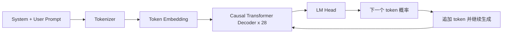
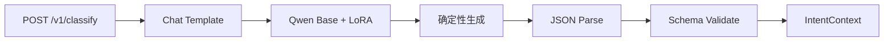

# Qwen3-0.6B GPU 意图模型：结构、生成与 LoRA

本文解释 ScholarAgent 的 GPU 意图方案如何使用 `Qwen/Qwen3-0.6B` 生成结构化 `IntentContext`，以及 Decoder-only、因果注意力、GQA、RoPE、RMSNorm、SwiGLU 和 LoRA 分别在做什么。

双模型整体方案见 [02_dual_model_finetuning_guide.md](02_dual_model_finetuning_guide.md)。

## 1. Qwen 在这里解决什么问题

Qwen 不只选择一个固定标签，还要生成实体和约束：

```text
输入：复现 Attention Is All You Need，使用 smoke 模式，最多做三组消融
```

```json
{
  "intent_type": "Paper_Reproduction",
  "entities": {
    "paper_title": "Attention Is All You Need",
    "needs_ablation": true
  },
  "constraints": {
    "reproduction_mode": "smoke",
    "max_experiments": 3
  }
}
```

这不是固定分类头，而是结构化文本生成任务。

## 2. Decoder-only 结构



“Decoder-only”表示模型使用已有 token 预测下一个 token。生成 JSON 时，它会依次生成 `{`、字段名、冒号、字段值，直到结束 token。

## 3. 因果注意力

Qwen 使用 Causal Self-Attention。第 `t` 个位置只能看到自己和它之前的 token，不能偷看训练目标中的未来 token。

```text
位置 1 可以看：1
位置 2 可以看：1, 2
位置 3 可以看：1, 2, 3
...
```

这种限制由上三角 Attention Mask 实现。训练时整段目标可以并行计算，但每个位置的预测只能依赖过去；推理时则必须逐步生成。

它与 BERT 的关键区别是：

- BERT 的输入 token 可以双向互相理解。
- Qwen 的生成位置只能使用左侧上下文。

## 4. Qwen3-0.6B 的具体结构

官方 `config.json` 中的主要参数：

| 参数 | 数值 | 含义 |
|---|---:|---|
| 模型类型 | Dense Causal LM | 稠密 Decoder-only 模型，不是 MoE |
| Decoder 层数 | 28 | 重复 28 个 Transformer Block |
| Hidden Size | 1024 | 主残差流的隐藏维度 |
| Query Heads | 16 | Query 注意力头数量 |
| KV Heads | 8 | Key/Value 头数量，使用 GQA |
| Head Dimension | 128 | 单个注意力头维度 |
| Intermediate Size | 3072 | MLP 中间维度 |
| Vocabulary Size | 151936 | Tokenizer 词表规模 |
| Max Positions | 40960 | 原始配置支持的最大位置数 |
| Activation | SiLU | 门控 MLP 使用的非线性函数 |
| Normalization | RMSNorm | 每层使用 RMS 归一化 |
| Position Encoding | RoPE | 旋转位置编码 |
| Tied Embedding | true | 输入词嵌入和输出 LM Head 共享权重 |

本项目的意图请求很短，训练时使用 `max_length=256` 即可。完整 40960 上下文既没有必要，也会浪费显存和训练时间。

## 5. Grouped-Query Attention

普通 Multi-Head Attention 可以让每个 Query Head 都拥有独立的 Key 和 Value Head。Qwen3-0.6B 使用 16 个 Query Heads、8 个 KV Heads，即两个 Query Heads 共享一组 Key/Value。

```text
Q heads:  Q1 Q2 | Q3 Q4 | ... | Q15 Q16
KV heads:   KV1 |   KV2 | ... |    KV8
```

这叫 Grouped-Query Attention，简称 GQA。它减少推理时需要保存的 KV Cache，在保持多个 Query 视角的同时降低生成成本。

## 6. RoPE 位置编码

Qwen 使用 Rotary Position Embedding。RoPE 不直接给 token 加一个固定位置向量，而是在计算注意力前，根据位置旋转 Query 和 Key 的部分维度。

这样点积注意力能够感知 token 之间的相对位置。对于意图识别，RoPE 让模型区分：

```text
先复现论文，再做消融
先做消融设计，但暂时不要复现
```

两句话包含相似词汇，但顺序和任务含义不同。

## 7. RMSNorm 和 SwiGLU 风格 MLP

Qwen 使用 RMSNorm 稳定隐藏状态。与 LayerNorm 相比，RMSNorm 主要依据均方根缩放，不进行均值中心化，计算更简洁。

Qwen 的 MLP 使用门控结构，可以概括为：

```text
gate = SiLU(W_gate x)
value = W_up x
output = W_down (gate * value)
```

`gate_proj` 决定哪些信息应该通过，`up_proj` 提供待变换内容，逐元素相乘后通过 `down_proj` 回到隐藏维度。

这也是 LoRA 常见目标模块中出现 `gate_proj`、`up_proj`、`down_proj` 的原因。

## 8. 从隐藏状态到下一个 token

最后一层隐藏状态经过 LM Head，得到整个词表上的 logits：

```text
hidden: [batch, sequence, 1024]
lm_logits: [batch, sequence, 151936]
```

Softmax 后得到下一个 token 的概率分布。推理时可以贪心选择或采样。

意图 JSON 要求稳定，因此推荐：

```yaml
do_sample: false
max_new_tokens: 160
enable_thinking: false
```

`enable_thinking=false` 应在 chat template 阶段设置。不要为了展示“创造性”开启高温采样，也不要让 `<think>` 内容混入 JSON。这个任务需要可重复，而不是多样。

## 9. 监督微调数据如何进入模型

训练样本由 chat template 转成一串 token：

```text
<system>你是意图识别器，只输出合法 JSON。</system>
<user>复现论文并做三组消融</user>
<assistant>{"intent_type": ...}</assistant>
```

推荐只对 assistant 的 JSON token 计算损失：

```text
System tokens     label = -100
User tokens       label = -100
Assistant tokens  label = token_id
```

`-100` 表示该位置不参与交叉熵。这样模型学习“给定请求后怎样生成目标 JSON”，而不是浪费容量去复述用户输入。

构造模板时应显式关闭 thinking。例如在支持该参数的 Qwen Tokenizer 中使用：

```python
text = tokenizer.apply_chat_template(
    messages,
    tokenize=False,
    add_generation_prompt=True,
    enable_thinking=False,
)
```

## 10. 自回归语言模型损失

对于目标 token 序列 `y1, y2, ..., yT`，损失可以写成：

```text
Loss = -sum(log P(yt | prompt, y1, ..., y(t-1)))
```

模型不是直接知道整个 JSON 对不对，而是在每个位置学习正确的下一个 token。因此即使 token 准确率很高，也仍可能出现少一个引号或括号的情况，服务端必须做 JSON Schema 校验。

## 11. LoRA 的原理

全量微调需要为每个大矩阵保存梯度和优化器状态。LoRA 冻结原矩阵 `W`，只学习两个低秩矩阵：

```text
W' = W + scale * B * A
```

其中：

- `W`：冻结的基础模型权重。
- `A`、`B`：需要训练的小矩阵。
- `rank`：低秩维度，例如 16。
- `scale`：通常由 `lora_alpha / rank` 决定。

如果原矩阵是 `[1024, 1024]`，全量更新需要约一百万个参数；LoRA rank 为 16 时，新增参数约为：

```text
1024 * 16 + 16 * 1024 = 32768
```

这让训练显存和 checkpoint 大小显著下降。

## 12. LoRA 放在哪些模块

意图任务的建议起点：

```yaml
target_modules:
  - q_proj
  - k_proj
  - v_proj
  - o_proj
  - gate_proj
  - up_proj
  - down_proj
lora_rank: 16
lora_alpha: 32
lora_dropout: 0.05
```

注意力投影影响模型如何组合上下文，MLP 投影影响模型如何变换语义特征。是否需要覆盖所有模块，应通过 Dev 集消融确认。

## 13. V100 训练注意事项

当前远端 GPU 是 Tesla V100-SXM2 32GB，训练时注意：

- 使用 FP16，不使用 BF16。
- Qwen3-0.6B 足够小，第一版直接 FP16 LoRA。
- `max_length=256`，不要照搬长上下文示例。
- 固定三个随机种子并保存每次结果。
- 可以开启 Gradient Checkpointing，但 0.6B 模型未必需要。
- 不要只保存 Adapter；必须同时记录基础模型精确 revision。
- 训练完成立即同步 checkpoint、日志和评测产物到本地。

## 14. JSON 输出防线

模型输出不能直接进入 Planner。建议经过四层检查：

1. JSON 解析成功。
2. 通过 `intent_context.schema.json`。
3. `intent_type` 属于允许标签。
4. 实体和约束只包含白名单字段，数值在允许范围内。

失败时：

```text
第一次失败：使用更短的修复提示重试一次
第二次失败：回退到 BERT + 规则
仍低置信度：向用户提出澄清问题
```

不要无限重试，也不要从破损 JSON 中用字符串切片猜字段。

## 15. GPU 推理服务



开发阶段可以用 Transformers + FastAPI。服务应只监听远端 `127.0.0.1:8092`，通过 SSH 隧道访问，不直接开放无鉴权公网端口。

## 16. Qwen 方案的边界

Qwen 擅长：

- 同时识别意图、实体和约束
- 处理多意图、上下文和自然语言歧义
- 在固定 Schema 内生成较丰富结果
- 后续扩展澄清问题和路由理由

它不天然保证：

- 每次都输出合法 JSON
- 生成的 confidence 已经过校准
- 比 BERT 更快或更便宜
- 小数据微调后一定优于强规则
- 所有生成字段都来自用户原文

所以 Qwen 输出必须保留来源、模型版本、验证状态和降级路径。
不要要求模型在目标 JSON 中“自报 confidence”并直接用于自动决策；这个数字可能只是符合文本格式，并不代表统计意义上的正确概率。

## 17. 与 BERT 的结构对照

| 项目 | BERT/BGE | Qwen3-0.6B |
|---|---|---|
| 主体 | Transformer Encoder | Causal Transformer Decoder |
| 注意力 | 双向 | 因果遮罩 |
| 输出 | 分类 logits | 下一个 token logits |
| 训练目标 | 正确类别 | 正确目标序列 |
| 参数策略 | 小模型可全量微调 | 推荐 LoRA |
| 推理次数 | 一次前向 | 多步自回归 |
| 主要部署 | CPU | GPU |
| 主要防线 | 概率校准 | JSON Schema 与事实约束 |

## 18. 学习检查表

阅读完本文后，应能回答：

- 为什么 Decoder-only 只能看到左侧 token？
- Qwen 为什么需要逐 token 生成 JSON？
- GQA 为什么能降低 KV Cache 成本？
- RoPE 如何让注意力感知位置？
- RMSNorm 和门控 MLP 分别做什么？
- LoRA 为什么只训练少量参数？
- 为什么 Qwen 输出必须经过 Schema 校验？
- 为什么 V100 使用 FP16 而不是 BF16？

## 参考资料

- [Qwen3-0.6B 模型卡](https://huggingface.co/Qwen/Qwen3-0.6B)
- [Qwen3-0.6B 官方配置](https://huggingface.co/Qwen/Qwen3-0.6B/blob/main/config.json)
- [Qwen3 官方仓库与技术报告](https://github.com/QwenLM/Qwen3)
- [LoRA: Low-Rank Adaptation of Large Language Models](https://arxiv.org/abs/2106.09685)
