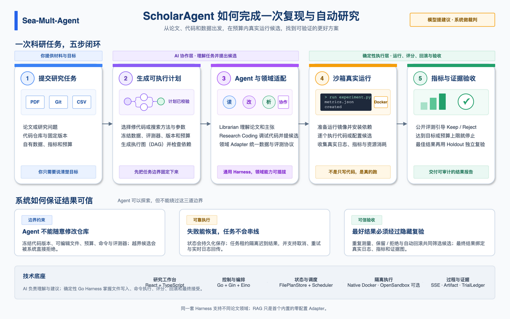
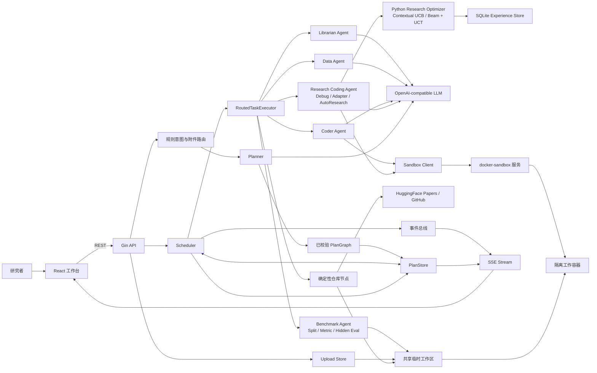
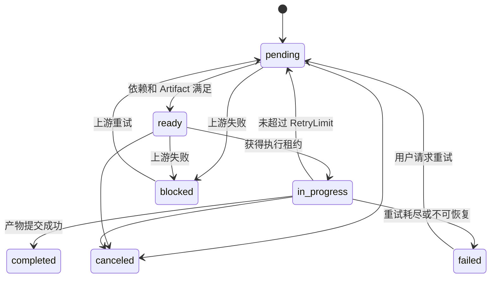
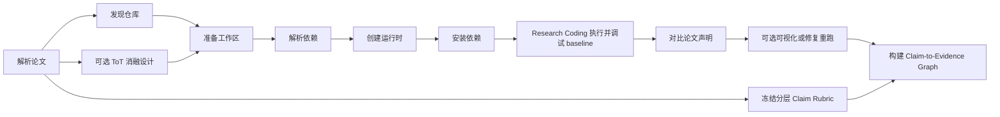

# ScholarAgent 项目架构

本文描述 `scholar-agent/` 当前已经实现并可运行的架构。它以代码为准，重点说明服务边界、核心数据模型、Agent 调度、论文复现、Benchmark Harness、持久化与安全边界。早期设想和尚未接入主链的模块不会被写成现有能力。

最后核对日期：2026-08-19。

## 1. 架构目标

ScholarAgent 是一个面向论文复现和预算受限自动研究的单机多 Agent 执行系统。它把用户目标转换为带依赖和产物契约的 DAG，在受限容器中执行代码，并把节点状态、日志、候选树、指标和报告实时返回前端。RAG 是领域 Adapter 示例，不是核心架构边界。

当前架构遵循四个原则：

1. **控制面和执行面分离**：Backend 负责任务规划、状态和调度，Docker Sandbox 负责不可信代码执行。
2. **Artifact 驱动协作**：Agent 不共享隐式内存，下游通过命名 Artifact 接收上游结果。
3. **模型负责建议，代码负责约束**：LLM 可以规划、生成和修复；DAG 校验、预算、哈希、指标重算和沙箱策略由确定性代码执行。
4. **自动化必须有边界**：ToT、ReAct、重试、并发、运行时长和样本数都有明确上限。



总图的可编辑源文件见 [`ArchitectureDiagram.drawio`](../../ArchitectureDiagram.drawio)。该图按新用户的阅读顺序压缩成五步流程，本章继续展开完整组件边界；Native Docker 是默认执行引擎，OpenSandbox 是可选 fallback，BERT/Qwen 意图模型不属于默认生产请求链。

## 2. 系统总览



系统分成四个主要运行单元：

| 运行单元 | 默认端口 | 主要职责 |
|---|---:|---|
| `frontend` | `5173` | 对话、上传、PDF 阅读、DAG 展示、执行控制和结果查看 |
| `backend` | `8080` | API、意图路由、Planner、Scheduler、Agent、PlanStore、SSE |
| `docker-sandbox` | `8082`，Compose 仅绑定本机 | 创建容器、执行 Python/命令、流式回传 stdout/stderr、清理容器 |
| `research-optimizer` | `8090`，Compose 仅绑定本机 | 数据集特征、候选优先级、策略决策记录和跨任务 SQLite 经验 |

`ai-services/intent_recognition` 是可选 Python 原型服务。它不在默认 Compose 中启动，也没有接入当前 Backend 的生产请求链。

## 3. 仓库结构

```text
scholar-agent/
├── frontend/                   # React + TypeScript 工作台
├── backend/
│   ├── cmd/api/                # 独立 Backend 入口
│   ├── cmd/app/                # 内嵌前端和本地沙箱的单文件入口
│   ├── internal/api/           # HTTP、身份、上传、SSE
│   ├── internal/planner/       # LLM Planner、模板兜底、DAG 校验
│   ├── internal/scheduler/     # 调度、租约、仓库发现与工作区准备
│   ├── internal/agent/         # 专业 Agent、ToT、ReAct、Benchmark Harness
│   ├── internal/models/        # PlanGraph、Task、Artifact、Event 契约
│   ├── internal/store/         # 内存和文件 PlanStore
│   ├── internal/events/        # 计划级内存事件总线
│   └── internal/sandbox/       # Sandbox HTTP 客户端
├── docker-sandbox/             # 独立 Go 沙箱服务和 Docker 引擎
├── research-optimizer/         # Python 学习面和 Experience Store
├── ai-services/                # 可选 Python AI 服务
├── examples/                   # 可运行示例和验收脚本
├── docs/                       # 架构、功能和实验文档
├── scripts/                    # Unix / Windows 启动脚本
├── docker-compose.yml
└── Makefile
```

根目录的 `docker-core/` 是早期或底层 Docker 相关代码与配置。当前默认网站服务的沙箱入口是 `scholar-agent/docker-sandbox/`。

## 4. 前端架构

前端入口是 [`ScholarApp.tsx`](../frontend/src/app/ScholarApp.tsx)，主要由以下部分组成：

| 模块 | 职责 |
|---|---|
| `useScholarChatFlow` | 会话、消息、附件上传、创建计划、浏览器本地持久化 |
| `useScholarRuntime` | 启动/审批/取消计划，订阅 SSE，维护节点日志和结果状态 |
| `buildGraphLayout` | 把 Backend 的 `PlanGraph` 转换为 React Flow 节点和边 |
| `GraphPanel` | DAG 画布、缩放、节点选择和状态展示 |
| `ExecutionSidebar` | 日志、报告、代码、指标和图片视图 |
| `PdfPanel` / `usePdfAssistFlow` | PDF 阅读、划词与辅助问答 |
| `scholarApi` | REST、SSE 和上传协议封装 |

前端会话保存在浏览器 `localStorage`。它用于恢复界面，不是服务端账户系统。计划和执行状态仍以后端 `PlanStore` 为准。

前端有两条执行路径：

- **计划执行**：创建完整 DAG，调用 `/api/plans/:id/execute`，再通过 `/api/plans/:id/stream` 订阅事件。这是正式主链。
- **单节点执行**：调用 `/api/execute` 直接运行一个 Agent。它适合调试和手动运行，不具备完整计划的持久化、审批、租约和依赖治理。

## 5. Backend 分层

### 5.1 API 层

[`routes.go`](../backend/internal/api/routes.go) 和 [`plan_runtime.go`](../backend/internal/api/plan_runtime.go) 提供以下边界：

- 对话与单节点执行
- 文件上传和读取
- 计划创建、查询、审批、执行、取消
- 失败节点重试和 Agent 重分配
- 事件历史与计划级 SSE
- PDF 代理和服务健康检查

所有 `/api` 请求都经过可选静态 Bearer Token 中间件。计划和上传还会检查 `X-User-Id` 或匿名 Cookie 对应的所有者。

### 5.2 Planner

[`planner.go`](../backend/internal/planner/planner.go) 输出 `PlanGraph`。规划顺序如下：

1. API 用规则提取任务类型、仓库 URL、论文信息、复现模式和附件。
2. 自有数据 Benchmark 生成固定 13 节点 DAG；仓库代码 AutoResearch 生成固定 8 节点 DAG；上传数据的方法/参数 AutoResearch 生成固定 8 节点 DAG，其中 ToT 设计与运行环境准备是可并行分支。
3. 其他任务在配置 LLM 后优先调用 Planner Agent。
4. 模型输出会经过任务类型归一化、Agent 白名单、Artifact 契约和 DAG 校验。
5. 模型不可用或输出不合法时，回退到确定性模板。

当前主要意图类型：

| Intent type | 典型流程 |
|---|---|
| `Paper_Reproduction` | 论文解析、仓库发现、环境准备、执行和论文声明对比 |
| `Framework_Evaluation` | 共同协议、并行框架实现、独立运行和比较报告 |
| `Code_Execution` | 代码生成、依赖、运行和结果验证 |
| `Custom_Benchmark` | 用户数据分析、仓库适配、预检、正式评测和证据校验 |
| `AutoResearch` | 仓库代码补丁，或由 Domain Adapter 驱动的方法/参数候选；统一执行 Keep/Reject、目标停止、Holdout 和资源证据 |
| `General` | 通用研究或处理节点 |

[`internal/Intent`](../backend/internal/Intent/) 和 Python 意图服务目前不是这条生产路径的一部分。当前 API 使用 [`buildRuleIntentContext`](../backend/internal/api/plan_runtime.go)，Planner Agent 负责后续拓扑生成。

### 5.3 Scheduler

[`scheduler.go`](../backend/internal/scheduler/scheduler.go) 是 DAG 状态机。它只把同时满足以下条件的节点提升为 `ready`：

- 所有依赖节点已完成。
- 所有 `required_artifacts` 已存在。

当前 API 创建的 Scheduler 最大并发数为 2。若 Ready 集合中存在非并行节点，会优先只执行一个串行节点；否则按优先级和创建时间选择并行节点。

Scheduler 负责：

- 任务超时、节点重试和计划总预算
- 失败传播与下游 `blocked`
- 取消、人工重试和 Agent 重分配
- `execution_id`、`lease_owner`、`execution_epoch` 执行租约
- 丢弃重分配或取消后返回的迟到结果
- 将日志、状态和 Artifact 同时写入事件历史并发布到事件总线

默认计划预算是 100 次任务尝试和 2100 秒。部署可通过 `PLAN_MAX_TASK_ATTEMPTS` 与 `PLAN_MAX_DURATION_SECONDS` 收紧。

### 5.4 Routed Task Executor

[`executor.go`](../backend/internal/scheduler/executor.go) 把 `TaskNode` 转换为 Agent 可执行的 `Task`，合并节点输入和上游 Artifact，再按 `assigned_to` 路由。

有两个容易混淆的边界：

- `sandbox_agent` 是逻辑角色，目前由 `CoderAgent` 中的运行时准备、依赖安装和代码执行方法处理，并不是独立的 Agent 结构体。
- `repo_discovery` 和 `repo_prepare` 是确定性 Backend 节点，直接由 Scheduler 层实现，不经过 LLM Agent 路由。

## 6. 核心数据模型

核心契约位于 [`backend/internal/models`](../backend/internal/models/)：

| 模型 | 作用 |
|---|---|
| `PlanGraph` | 一次可执行计划，包含所有者、预算、审批、节点、边、Artifact 和统计 |
| `TaskNode` | DAG 节点，包含依赖、输入输出契约、Agent、优先级、重试和租约 |
| `TaskContract` | 版本化的输入 Artifact、输出 Artifact 和允许工具边界 |
| `Artifact` | 节点间传递的命名结果，记录类型、生产者、值和元数据 |
| `PlanEvent` | 状态、日志、Artifact 和终态事件，带 `trace_id` 与任务 span |
| `ResearchSpec` | AutoResearch 可编辑/保护文件、命令、指标、方向、阈值、搜索预算与验证次数 |
| `ResearchTrialLedger` | baseline 和每个候选的补丁哈希、命令、指标、决策、停止原因与资源摘要 |
| `ResearchValidationReport` | 最佳文件完整性、重复 evaluator 结果、均值、标准差、失败率与资源摘要 |
| `ExperimentDatasetManifest` | 领域 Adapter 产出的数据映射、能力、资产路径和 SHA-256 |
| `ExperimentResearchSpec` | Model 分支、参数有限域、搜索/Holdout 命令、指标、目标、预算、Beam、探索通道、Agent 上限和 evaluator 隔离模式 |
| `ExperimentTrialLedger` | ToT 计划哈希、配置候选父子关系、Search Agent、派发/完成顺序、UCB/UCT、路线 Top-K、峰值并发、指标和停止原因 |
| `ExperimentValidationReport` | 最佳配置在独立 Holdout 进程中的 baseline 对照、目标判定和样例证据 |



Artifact 同时承担数据接口和可追踪证据的作用。例如 `repo_url`、`dependency_spec`、`prepared_runtime`、`run_metrics` 和 `evaluation_report` 都是显式契约，不靠 Agent 猜测上一步输出。

## 7. Agent 与推理模式

| Agent | 当前实现 |
|---|---|
| `ChatAgent` | 通用问答；代码型问题可委托 Coder |
| `LibrarianAgent` | 论文解析、资料归纳、方法声明提取和实验前冻结 Claim Rubric |
| `CoderAgent` | 代码生成、依赖解析、运行时准备、安装、执行与修复 |
| `DataAgent` | 指标分析、论文对比、Claim-to-Evidence 判定、报告和受限消融设计 |
| `BenchmarkAgent` | 数据审计、train/validation/test 物理切分、泄漏检查、Metric/Reward 契约、隐藏标签验收和指标重算 |
| `ResearchCodingAgent` | 论文仓库调试、Repository Adapter、代码补丁 AutoResearch，以及 Domain Adapter 驱动的方法/参数 AutoResearch |

Librarian、Coder、Data 和 Chat 使用 Eino 编排 OpenAI-compatible Chat Model。模型地址、模型名和密钥通过环境变量或配置文件提供。

### 7.1 ToT 的位置

ToT 只用于“轻量消融设计”，实现位于 [`ablation_tot.go`](../backend/internal/agent/ablation_tot.go)：

1. 模型生成参数、模块、数据规模、随机种子和运行成本五类一级方向，Go 去重并补齐类别。
2. 模型评估一级分支，Go 使用固定公式评分，并选出预算可行的高价值父节点。
3. 模型只细化这些父节点，产生带 `parent_id`、`depth` 和 `expansion_reason` 的二级单变量候选。
4. Go 校验父子谱系、重新评估与打分，并在实验数、GPU 时间、总时长和类别多样性预算内选择；每个候选记录独立的入选或剪枝原因。

搜索深度固定为 2，一级分支最多 5，展开 beam 最多 3，所有候选合计最多 8，默认最多选择 3 个实验。模型失败时保留已完成层级并使用确定性候选或评分，不会无限展开思维树。前端通过 `ablation_plan` 中的谱系、入选和剪枝字段直接渲染方案树。

这里的树发生在**实验设计阶段**：第二层由论文上下文和模型评估驱动，不读取尚未执行的真实实验结果。实际候选能否提升指标，仍由后续 Sandbox/AutoResearch 执行、冻结 evaluator 与 Artifact 证明。

### 7.2 ReAct 的位置

ReAct 用于局部故障修复，不用于全局拓扑搜索：

- 依赖安装最多尝试 3 次。模型根据 pip 错误选择删除、替换、重写依赖或升级 Python 镜像，规则再处理标准库误识别和 Python 版本不匹配。
- Research Coding Agent 的论文调试最多运行 3 次、修复 2 轮；只允许修改模型已读取的现有 Python 文件，失败后恢复原文件。
- Benchmark 预检最多 3 次。每次只能替换受控适配器文件，正式评测阶段不再自动修改代码。
- 代码运行遇到缺失模块时允许一次最小补装并重跑。

这种划分保持了“全局方案选择有预算，局部修复有次数，正式结果不漂移”。

### 7.3 Research Coding Agent 的内部架构

Research Coding Agent 是 Scheduler 后面的仓库级专用执行器，不是另一套 Planner。`RoutedTaskExecutor` 把节点输入和上游 Artifact 组装成运行时 Task，再交给 `ResearchCodingAgent.ExecuteTask` 按任务类型分发：

```text
Planner TaskNode
    -> Scheduler / Artifact Relay
        -> ResearchCodingAgent.ExecuteTask
            -> Paper Debug Harness
                -> 有限上下文 -> 模型补丁提议 -> Go 校验与备份 -> Sandbox 重跑 -> 补丁证据
            -> Benchmark Harness
                -> 数据契约 -> 适配器 -> 预检修复 -> 正式运行 -> Go 指标重算
            -> AutoResearch Harness
                -> ResearchSpec -> baseline -> 候选补丁 -> Keep/Reject -> TrialLedger -> 最终验证
            -> Experiment Harness
                -> Domain Adapter -> ExperimentSpec -> Model 默认穷举
                -> UCB + Beam/UCT 参数树 -> 目标停止 -> Holdout
```

它在启动时复用 Coder 的 Chat Model 和 Sandbox Client，但不复用 Coder 的任务状态。每次调试的运行次数、文件备份和补丁清单都只存在于当前任务内，跨节点状态通过显式 Artifact 传递。模型只能提出结构化方案或代码内容；路径检查、写入、回滚、源码指纹和结果校验都由 Go harness 完成。

完整组件图、任务入口、状态机和 Artifact 契约见 [`research_coding_agent.md`](research_coding_agent.md)。

## 8. 论文复现流程

标准论文复现主链如下：



关键实现边界：

- 仓库发现优先使用用户指定 GitHub URL；否则查询 HuggingFace Papers API，并可使用 GitHub 搜索或内置候选兜底。
- 工作区准备会浅克隆仓库、扫描代码和依赖文件、复制上传材料，并输出 `repo_manifest`。
- baseline 入口由 Research Coding Agent 执行；运行错误最多触发 2 轮有限源码补丁，成功时记录补丁哈希，失败时恢复原文件。
- 系统根据用户请求和本机 CPU、内存、磁盘、GPU 探测选择 `smoke` 或 `full`。
- `full` 模式或部署强制审批时，计划进入 `awaiting_approval`，未批准不能执行。
- `smoke` 是结构和执行链验证，不等同于完整数据训练或论文指标复现。
- `claim_rubric_extract` 在运行前冻结主张和独立判定准则；`claim_evidence_build` 在末端绑定指标、对照、补丁和图表 Artifact。没有直接运行证据时，准则不能标记为已验证。
- 前端通过 `structured_data` 接收图 JSON，以“主张 -> 准则 -> 证据”三泳道展示状态、理由和证据哈希。完整契约见 [`claim_evidence_graph.md`](claim_evidence_graph.md)。

## 9. 自有数据 Benchmark 流程

上传 CSV、TSV、JSON 或 JSONL 并要求对公开仓库做 Benchmark 时，系统生成固定流程：

```text
Benchmark Agent 数据审计 -----------------------+
仓库发现 -> 工作区准备 -------------------------+-> 安全切分与泄漏检查
                                                   -> 冻结 Metric / Reward / Evaluator
                                                   -> Research Coding 生成适配器
                                                   -> 解析依赖与准备沙箱
                                                   -> 最多 8 条 validation 预检与修复
                                                   -> validation 正式运行
                                                   -> 无标签 test 推理
                                                   -> Benchmark Agent 隐藏指标重算
                                                   -> 最终报告
```

Benchmark Harness 的信任边界不是“模型说成功”，而是：

- 原始文件、三个 split、Metric/Reward Contract、evaluator、适配器和仓库源码均有哈希或指纹检查。
- 分类默认分层哈希，回归默认分位数分层；显式 group/time 列切换为组隔离或时间切分。
- `test_features` 不包含目标列，隐藏标签位于容器工作区之外。
- 生成代码只能写入 `.scholar/benchmark/`，目标仓库源码不能被修改。
- 输出文件必须是普通文件，符号链接、超大文件和格式错误会被拒绝。
- 分类指标由 Go 重算 `accuracy` 和 `macro_f1`；回归重算 `mae` 和 `rmse`；简单生成重算 `exact_match` 和 `token_f1`。
- 隐藏预测必须按冻结 ID 覆盖全部测试样本，Adapter 自报的隐藏指标不参与最终判定。
- Reward 固定为候选优先级信号，不参与 Keep/Reject 或隐藏验收。

完整 Benchmark 边界见 [`benchmark_agent.md`](benchmark_agent.md)，论文仓库适配与调试见 [`research_coding_agent.md`](research_coding_agent.md)。

## 10. AutoResearch 流程

明确要求 `AutoResearch`、自动实验或持续优化，并提供公开仓库时，系统生成固定主链：

```text
仓库发现 -> 工作区准备 -> 冻结 ResearchSpec
    -> 创建运行时 -> 安装规格依赖
    -> baseline + 有限候选 Keep/Reject
    -> 公开重放或隐藏 holdout -> 证据报告
```

它的关键边界是：模型只提出 editable 文件候选，Go harness 冻结 evaluator、benchmark、命令、指标、搜索预算和验证次数；eval/guard 直接引用的小型源码只读进入诊断上下文，数据文件不进入。候选必须给出失败用例到修改点的调用路径诊断。退化候选恢复到上一个最佳版本，最终结果必须按声明的 1 至 5 次重复运行并与 TrialLedger 对齐。当前最多 8 个 Trial、最长 3600 秒，每轮最多修改 3 个已有白名单文件。

前端在现有 DAG、SSE 日志和 Artifact 面板上增加了 AutoResearch “实验”视图：展示 baseline/best、指标趋势、Keep/Reject、耗时、调用路径诊断、假设、候选文件哈希与命令资源摘要，并支持全屏及窄屏布局。重复验证报告还保存逐次分数、均值、总体标准差和失败率；当前不保存完整逐轮源码，所以还没有逐行 diff。完整模块文档见 [`autoresearch/`](autoresearch/)。

### 10.1 数据与配置 AutoResearch

用户上传数据并明确要求搜索方法、模块或超参数时，系统仍使用 `AutoResearch` 意图，但生成另一条固定主链：

```text
数据适配 -> 冻结 ExperimentSpec -> +-> 两层 ToT 实验设计 --------+
                                  \-> 创建运行时 -> 安装依赖 ---+
                                      -> 多策略候选批次 Keep/Reject
                                      -> Holdout 重复验收 -> 证据报告
```

`experimentDomainAdapter` 是领域边界。内置 `retrieval.v1` 能从语料、带标注查询和可选关系边自动生成契约；`portable.v1` 能加载任意论文领域上传的 `experiment.json`、evaluator 和数据。通用 Go Harness 不包含检索知识，只读取有限候选空间和 argv 命令，每次写一个候选配置后执行冻结 evaluator。

一级候选是不同 Model 组合的默认配置，Go 通过阶段屏障保证这些默认配置全部真实运行。参数阶段每个子候选一次只改变一个离散参数：外层 UCB 根据路线 Top-K Reward、访问次数、成本和可选 Contextual prior 分配预算；每条路线以 Top-K Beam 加低访问探索通道限制前沿；内层 UCT-style 分数选择父路径。Go 从冻结资产抽取有界规范样本，Python Research Optimizer 不挂载工作区；Go 会复核数据指纹、候选、Beam/探索身份和全部数值统计，服务不可用时运行本地分层 UCB/UCT fallback。只读 evaluator 最多使用 4 个异步 Search Agent，Portable Adapter 默认 `serial/v1`。Coordinator 单线程拥有队列和 Ledger，Agent 完成后按真实完成顺序入账，virtual visits 防止并发选择集中在同一路线。`ExperimentTrialLedger` 保存 `strategy_space`、Beam 配置、路线 Top-K、`backprop_path`、Agent ID、派发/完成顺序以及 UCB/UCT 组成。前端提供全局榜单、参数树和时间线，根节点默认分数不会被后代调度统计覆盖。

科学接受与学习奖励严格分离：Keep/Reject 仍只由冻结主指标和 `min_delta` 决定；Reward 使用相对 baseline 的方向归一化增益减去运行成本，仅供后续候选排序。Search 只读取公开调参集；最终节点在独立 Holdout 文件上同时重跑 baseline 与最佳候选，并要求数据和 evaluator 哈希保持不变。只有 Holdout 状态为 `validated` 的 campaign 才会进入跨任务策略历史，Reject 和失败候选仍保留以避免幸存者偏差。完整协议见 [`autoresearch/09_general_scientific_autoresearch.md`](autoresearch/09_general_scientific_autoresearch.md)和 [`autoresearch/10_python_research_optimizer.md`](autoresearch/10_python_research_optimizer.md)。

## 11. 文件上传与数据流

上传实现在 [`uploads.go`](../backend/internal/api/uploads.go)：

1. 前端以 multipart 上传文件，单计划最多引用 8 个附件。
2. Backend 校验扩展名、检测 MIME、限制大小并计算 SHA-256。
3. 文件按用户 ID 哈希和上传 UUID 分目录保存，文件和元数据权限为 `0600`。
4. 创建计划时只允许当前所有者引用附件。
5. 仓库工作区节点把文件复制到 `.scholar/uploads/`，并拒绝不安全的符号链接路径。

默认最大单文件 32 MiB。Compose 使用独立 `scholar-upload-data` 卷。当前没有上传删除和自动过期机制，长期部署需要外部生命周期管理。

## 12. 状态、事件与持久化

`PlanStore` 有两种实现：

- 未设置 `PLAN_STORE_PATH`：仅使用内存，进程退出后计划消失。
- 设置 `PLAN_STORE_PATH`：使用单个 JSON 快照文件保存计划和事件，写入采用临时文件、`fsync` 和原子替换。

Compose 默认把快照写到 `/app/data/plans.json`，对应 `scholar-plan-data` 卷。

Backend 重启时会把中断的 `in_progress` 计划和节点恢复为 `pending` 并清除旧租约。恢复后不会自动重新启动执行，需要客户端再次调用执行接口。

事件同时写入 PlanStore 和内存 Event Bus。SSE 订阅先回放历史事件，再接收实时事件，并定期从持久化历史补漏。因此慢客户端即使错过内存广播，也能从事件历史恢复。

常用事件包括：

```text
plan_started
task_ready
task_started
task_log
artifact_created
task_completed
task_retrying
task_failed
task_blocked
task_result_discarded
plan_completed / plan_failed / plan_canceled
```

## 13. Sandbox 执行面

Backend 通过 [`SandboxClient`](../backend/internal/sandbox/opensandbox.go) 调用独立沙箱服务。沙箱服务优先使用原生 Docker；只有显式设置 `ENABLE_OPENSANDBOX_FALLBACK=true` 时才会尝试 OpenSandbox。

默认 Docker 容器策略：

| 项目 | 默认值 |
|---|---|
| CPU | `2` |
| 内存 | `4g` |
| PID | `256` |
| Linux capabilities | `ALL` dropped |
| Privilege escalation | `no-new-privileges` |
| 网络 | `bridge` |
| 工作区挂载 | 仅允许 `SANDBOX_WORKSPACE_ROOTS` 下的真实目录 |
| GPU | 默认关闭；通过 `SANDBOX_DOCKER_GPUS` 显式请求 |

论文仓库工作区位于系统临时目录。Compose 把宿主机 `/tmp` 同时挂到 Backend 和 Sandbox 服务，使沙箱创建的工作容器可以挂载同一工作区。

`bridge` 只表示容器网络隔离，不表示离线。对不需要联网的实验，应设置 `SANDBOX_NETWORK_MODE=none`。镜像白名单、只读根文件系统和非 root 用户也需要通过对应环境变量显式开启。

## 14. 安全与信任边界

| 边界 | 已有措施 | 当前限制 |
|---|---|---|
| 外部 API | 可选静态 Bearer Token、CORS 白名单 | 不是 OIDC、RBAC 或生产级用户系统 |
| 用户身份 | HttpOnly Cookie、请求头归一化、计划和上传所有权检查 | `X-User-Id` 可由客户端声明，不构成强认证 |
| PDF 代理 | 只允许 HTTP(S)、阻断私网/本机 IP、限制大小和重定向 | 仍会访问外部不受信任主机 |
| Backend 到 Sandbox | 独立 Bearer Token，Compose 只在本机暴露 8082 | Token 为空时不鉴权 |
| 工作容器 | CPU/内存/PID、cap drop、挂载根目录、可选镜像白名单 | 默认网络为 `bridge`，默认根文件系统可写 |
| Benchmark | 路径、哈希、源码指纹、输出和指标确定性检查 | 不能证明数据语义和论文评测口径科学等价 |

最重要的部署风险是 Docker Socket。`docker-sandbox` 挂载 `/var/run/docker.sock`，因此沙箱服务本身拥有较高的宿主机控制能力。不要把 8082 暴露到公网，也不要把当前单机原型当作零信任多租户平台。

## 15. 部署形态

### 本地开发

分别启动 Vite、Backend 和 Sandbox：

```bash
make run-sandbox
make run-backend
make run-frontend
```

### Docker Compose

[`docker-compose.yml`](../docker-compose.yml) 启动三服务拓扑：Nginx 前端、Go Backend、Go Sandbox，并创建计划和上传两个持久卷。这是当前完整网站服务的默认部署方式。

### 单文件应用

`make package` 会先构建前端并嵌入 Go 二进制。`backend/cmd/app` 在同一进程中提供 Web/API，并在未配置外部 `SANDBOX_URL` 时启动本地沙箱 HTTP 服务。它仍依赖宿主机 Docker，不是无容器运行模式。

### GPU 部署

GPU 透传要求宿主机安装 NVIDIA Container Toolkit，并设置 `SANDBOX_DOCKER_GPUS=all` 或指定设备。默认沙箱镜像不保证包含 CUDA 和深度学习框架，`SANDBOX_DEFAULT_IMAGE` 仍需选择匹配镜像。

## 16. 可观测性与验证

Backend、Sandbox 和单文件应用会同时写 stdout 与本地日志文件：

```text
logs/backend.log
logs/docker-sandbox.log
logs/app.log
```

`GET /api/health` 汇总 Backend 和 Sandbox 状态；Sandbox 健康信息包含 Docker Server、GPU 请求和 NVIDIA Runtime 可用性。

本地验证入口：

```bash
make lint
make test
make build
make eval
```

测试分布在：

- `backend/internal/**/**_test.go`：规划、调度、Agent、API、存储和安全
- `backend/tests/`：跨模块流程
- `backend/evals/`：确定性 Agent 规划评测
- `docker-sandbox/internal/**/**_test.go`：容器策略与安全
- `examples/paper-reproduction/`：可运行的论文复现链路验收
- `examples/autoresearch/intent_router/`：冻结 evaluator 的轻量 AutoResearch 基线
- `examples/scientific-autoresearch/retrieval/`：通用配置搜索内核的真实检索 Adapter 实验

## 17. 扩展方式

### 新增任务类型

1. 在 Planner 模板或 Planner Agent 归一化中注册 `task.Type`。
2. 明确 `required_artifacts`、`output_artifacts` 和 `allowed_tools`。
3. 在 Routed Task Executor 或对应 Agent 中实现执行逻辑。
4. 为契约校验、成功、失败和 Artifact 传播补测试。

新增科研领域优先实现 `experimentDomainAdapter`，或提供 Portable `experiment.json`，而不是复制一套搜索循环。Adapter 只负责数据映射、有限策略空间与 evaluator；预算、候选谱系、Keep/Reject、哈希和 Holdout 由通用 Harness 负责。

### 新增 Agent

1. 实现 `scheduler.AgentRunner`。
2. 在 API 初始化并注入 `RoutedTaskExecutor`。
3. 扩展 `resolveRunner`、Planner Agent 白名单和工具白名单。
4. 在前端 Agent 视觉映射和报告展示中注册。

### 更换持久化

实现 [`PlanStore`](../backend/internal/store/plan_store.go) 接口即可替换内存或 JSON 文件存储。多实例部署需要事务数据库、分布式租约或 Leader Election，不能直接共享当前 JSON 文件。

### 更换执行引擎

沙箱层已抽象 Native Docker 与 OpenSandbox。新引擎需要保持创建、删除、Python、命令和流式执行的协议，并继续满足挂载、资源和认证约束。

## 18. 当前限制与演进方向

当前是可靠性增强后的单机研究原型，不是完整生产平台：

- Scheduler 和文件 PlanStore 面向单 Backend 实例，没有分布式队列和跨实例锁。
- 用户身份是轻量会话隔离，不是强认证；也没有组织、角色和细粒度权限。
- 上传和临时仓库工作区缺少完整的保留期、配额与后台清理任务。
- `/api/execute` 是兼容和调试旁路，治理能力弱于正式 PlanGraph 执行。
- LLM Planner 是尽力而为能力，关键任务依赖验证器和模板兜底。
- Python 意图微服务尚未接入默认主链。
- 默认容器可联网，Docker Socket 仍是高权限边界。
- 论文完整复现和任意仓库 Benchmark 都不保证成功，系统只对实际执行证据负责。
- 代码候选 AutoResearch 要求显式 ResearchSpec；配置候选可使用 Portable Adapter，但除检索外尚不能保证从任意论文和数据零配置生成可靠 Adapter。
- 保护文件哈希不能替代独立评测服务、防数据泄漏审计、多 seed 或人工科研判断；预算内最佳也不等于全局最优。

面向生产部署的优先演进顺序应是：强认证与租户隔离、数据库和对象存储、异步任务队列、沙箱服务独立主机化、资源配额与生命周期清理，最后再考虑水平扩展 Planner 和 Agent。

## 19. 相关文档

- [本地启动指南](local_startup_guide.md)
- [Agent Runtime P0/P1](agent_runtime_p0_p1.md)
- [受限 ToT 消融与文件上传](tot_ablation_and_uploads.md)
- [Research Coding Agent](research_coding_agent.md)
- [Benchmark Agent](benchmark_agent.md)
- [AutoResearch 模块文档](autoresearch/)
- [Claim-to-Evidence Graph](claim_evidence_graph.md)
- [后端规划与模型参考](backend_planner_models_reference.md)
- [项目目录速查](project_structure_frontend_backend.md)
- [用户手册](user_manual.md)
