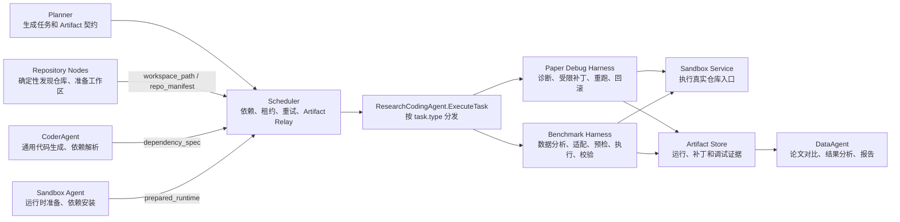
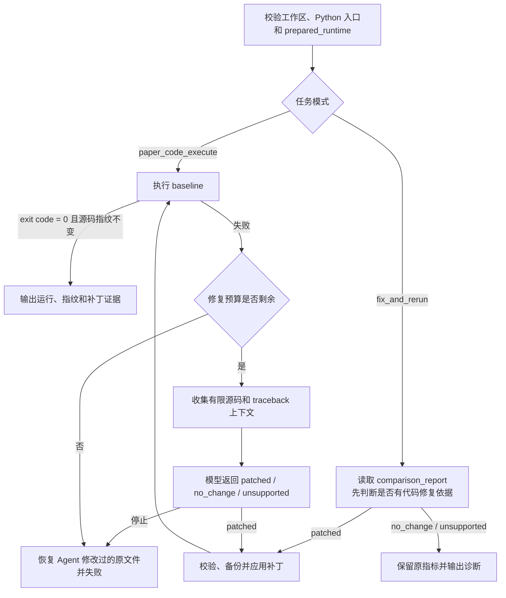

# Research Coding Agent

## 目标与职责

`research_coding_agent` 是一个面向科研仓库的受限 Coding Sub-Agent，负责两类需要真实阅读、修改和验证代码的工作：

1. 论文仓库代码运行失败或结果差异明显时，定位有限源码上下文，生成最小补丁并在同一沙箱中重跑。
2. 用户上传自有数据后，为指定公开仓库生成独立 Benchmark 适配器，完成预检、修复、正式评测和证据校验。

底层 `CoderAgent` 继续提供通用代码生成、依赖解析和沙箱能力；Research Coding Agent 负责仓库级诊断、受控写入、重跑和证据闭环。它不会把一次代码运行成功解释成论文结论已经复现。

## 总体架构

Research Coding Agent 不是独立调度器，也不负责从零完成整条论文复现。它是 Scheduler 后面的专用执行器：Planner 把仓库级调试或 Benchmark 节点分配给 `research_coding_agent`，Scheduler 汇集上游 Artifact 后调用统一入口，Agent 再按 `task.type` 进入论文调试或 Benchmark harness。



### 代码组件

| 组件 | 文件 | 责任 |
|---|---|---|
| Agent 入口 | [`research_coding_agent.go`](../backend/internal/agent/research_coding_agent.go) | 注入 Chat Model 和 Sandbox Client；校验任务类型并分发 |
| 论文调试 harness | [`paper_debug_harness.go`](../backend/internal/agent/paper_debug_harness.go) | 收集错误上下文、请求最小补丁、校验并写入、重跑、回滚、生成证据 |
| 数据分析 | [`benchmark_dataset.go`](../backend/internal/agent/benchmark_dataset.go) | 确定性读取上传数据并建立 `dataset_manifest` |
| 适配器生成 | [`benchmark_adapter.go`](../backend/internal/agent/benchmark_adapter.go) | 选择仓库入口方案、生成受控适配器并执行静态策略检查 |
| Benchmark harness | [`benchmark_harness.go`](../backend/internal/agent/benchmark_harness.go) | 小样本预检、有限修复、正式运行、输出检查和指标重算 |
| Prompt 契约 | [`prompts.go`](../backend/internal/prompts/prompts.go) | 约束模型返回结构、修复范围和禁止行为 |
| 计划路由 | [`planner.go`](../backend/internal/planner/planner.go) | 生成 `paper_code_execute`、`fix_and_rerun` 和 Benchmark 节点 |
| 运行时路由 | [`executor.go`](../backend/internal/scheduler/executor.go) | 把上游 Artifact 转为任务输入，并将 Agent 输出写回计划 Artifact |

`ResearchCodingAgent` 本身只保存两个共享依赖：Chat Model 和 Sandbox Client。每个任务的运行次数、备份、诊断和补丁记录都保存在当前调用的局部状态中；跨节点数据通过 Artifact 传递，不依赖 Agent 内存中的隐藏会话。

### 任务入口

统一入口 `ExecuteTask` 只接受下面 7 类任务：

| Task type | 必要上游输入 | 执行模块 | 主要输出 |
|---|---|---|---|
| `paper_code_execute` | `workspace_path`、`code_file_path`、`prepared_runtime`、`repo_manifest` | Paper Debug Harness | `run_metrics`、`paper_debug_report`、`paper_patch_manifest` |
| `fix_and_rerun` | 上述输入，加 `run_metrics`、`paper_debug_report`、`comparison_report` | Paper Debug Harness | `rerun_metrics`、`rerun_report`、`gap_debug_report`、`gap_patch_manifest` |
| `dataset_profile` | 上传文件及列映射 | Dataset Profiler | `dataset_manifest` |
| `benchmark_adapter_generate` | `dataset_manifest`、`workspace_path`、`repo_manifest` | Adapter Generator | 方案、适配器 spec 和代码 |
| `benchmark_adapter_preflight` | 适配器、数据契约、`prepared_runtime` | Benchmark Harness | 冻结后的适配器和预检报告 |
| `benchmark_execute` | 已通过预检的适配器和运行时 | Benchmark Harness | 经逐样本重算的指标、预测路径、运行清单 |
| `benchmark_validate` | 数据契约、指标和运行清单 | Evidence Validator | 数据哈希、样本数、数值范围复核报告 |

不在白名单中的任务会直接失败，不会回退到通用模型执行。

### 与其他 Agent 的边界

| 角色 | 负责 | 不负责 |
|---|---|---|
| Repository Nodes | 确定性发现仓库、克隆并准备工作区 | 生成或修复仓库代码 |
| `CoderAgent` | 通用代码生成、依赖解析；当前也承载 `sandbox_agent` 的运行时实现 | 根据论文运行错误修改仓库源码 |
| `Sandbox Agent` | 作为逻辑角色创建隔离运行时、安装解析后的依赖 | 决定该改哪段论文代码 |
| `ResearchCodingAgent` | 在已有工作区和运行时中诊断、受控修改、重跑、回滚和记录证据 | 论文检索、容器生命周期、最终科研结论判断 |
| `DataAgent` | 对比论文声明、分析指标、选择受限消融、生成报告 | 写入或修复仓库源码 |

因此，环境搭建错误先由依赖安装链处理；进入 `paper_code_execute` 后仍然失败，且证据指向仓库代码缺陷时，才进入源码调试链。缺数据、checkpoint、凭证、硬件或论文口径不一致不属于代码补丁可以解决的问题。

### 控制流与证据流

1. Planner 为节点声明 `required_artifacts` 和 `output_artifacts`。
2. Scheduler 只在依赖完成后创建运行时 Task，并把上游 Artifact 放入 `task.inputs`。
3. Research Coding Agent 校验工作区、入口和 `prepared_runtime`，再执行对应 harness。
4. 模型只能提出结构化方案或完整文件替换内容，不能直接访问文件系统。
5. Go harness 负责路径校验、策略校验、备份和真实写入；Sandbox Service 只执行通过校验的工作区。
6. 结果通过 `task.metadata.artifact_values` 返回，Scheduler 再写入计划级 Artifact Store，供 DataAgent 或后续节点消费。

这个设计把“模型判断”“文件修改”“代码执行”“结果认定”拆开：模型负责提出候选修复，Go 代码负责执行边界，沙箱负责隔离运行，确定性校验器负责接受或拒绝结果。

## 论文代码调试

论文复现的 baseline 节点使用 `paper_code_execute`，由 Research Coding Agent 负责执行。若入口运行失败，系统会：

1. 收集入口文件、traceback 命中的仓库文件和 `repo_manifest` 中有限的 Python 候选。
2. 最多向模型请求 2 轮最小修复，每轮最多修改 3 个已存在且已提供给模型的 Python 文件。
3. 在同一个 `prepared_runtime` 中重跑，总运行次数最多 3 次。
4. 每次运行前后检查仓库源码指纹，拒绝执行期间发生的未授权源码修改。
5. 成功时记录补丁路径、原因和前后 SHA-256；修复预算耗尽时恢复所有被 Agent 修改的原文件。

### 执行状态机



baseline 模式先运行再诊断；结果差异模式先读取 `comparison_report` 判断补丁是否合理。两种模式共用同一套路径校验、补丁策略、备份、源码指纹和 Artifact 输出逻辑。

### 内部步骤

1. **入口校验**：工作区必须是普通目录；入口必须是工作区内现有、非符号链接的 `.py` 文件；运行时 ID 必须来自上游 `prepared_runtime`。
2. **真实执行**：在已挂载工作区中执行 `python3 <entry>`，stdout/stderr 实时回传。
3. **上下文收集**：按顺序读取入口、traceback 命中文件、`repo_manifest` 候选和入口同目录 Python 文件。
4. **修复提议**：模型返回 `patched`、`no_change` 或 `unsupported`，以及诊断、文件路径、完整替换内容和逐文件原因。
5. **Go 端校验**：目标必须是模型已看到的现有文件；拒绝越界路径、符号链接、空补丁、重复路径和禁止构造。
6. **写入与重跑**：首次修改前保存内容和权限，原子替换文件后在同一运行时重跑。
7. **成功提交或失败回滚**：成功保留补丁并写入哈希；失败恢复所有被 Agent 修改的文件。

如果用户明确要求排查“结果与论文不一致”，Planner 会增加 `fix_and_rerun` 节点。该节点消费 `comparison_report`、原始指标和前一次调试报告，只有证据支持代码缺陷时才生成补丁；缺少数据、checkpoint、凭证、算力或科学口径不一致时返回 `no_change` 或 `unsupported`，不会通过伪造指标来“修好”结果。

论文调试相关 Artifact：

| Artifact | 内容 |
|---|---|
| `run_metrics` | baseline 的真实 stdout/stderr 结果 |
| `paper_debug_report` | baseline 运行次数、诊断、源码指纹和修复状态 |
| `paper_patch_manifest` | baseline 阶段补丁路径、原因和前后哈希 |
| `rerun_metrics` | 结果差异修复后的重跑结果；未修改时保留原指标 |
| `rerun_report` / `gap_debug_report` | 结果差异诊断和重跑报告 |
| `gap_patch_manifest` | 结果差异阶段应用的补丁证据 |

报告状态与任务状态的关系：

| 报告状态 | 含义 | 任务结果 |
|---|---|---|
| `passed` | 首次或未改代码的运行成功 | `completed`，发布运行 Artifact |
| `repaired` | 应用至少一个受控补丁后运行成功 | `completed`，发布运行与补丁 Artifact |
| `no_change` | 结果差异证据不足以支持代码修改 | `fix_and_rerun` 完成并保留原指标 |
| `unsupported` | 问题需要缺失的数据、模型、凭证、硬件或人工判断 | `fix_and_rerun` 完成并记录原因 |
| `failed` | baseline 无法修复、补丁非法、执行异常或预算耗尽 | 任务失败；回滚 Agent 补丁，报告保存在任务 `result/error`，不发布成功 Artifact |

### 调试边界

- 只修改临时克隆工作区中的现有 Python 文件，不修改原始远端仓库。
- 不允许补丁引入 `pip install`、shell 安装、mock/fake 论文方法、硬编码指标或凭证。
- 单文件最多 96 KiB，模型源码上下文最多 8 个文件、总计 256 KiB。
- 失败时恢复 Agent 首次修改前的内容；任务结果中保留结构化失败报告。
- 代码修复只能证明该执行错误被消除，不能证明论文方法、数据和指标已经完整复现。

固定预算来自代码常量，不由模型决定：

| 边界 | 当前值 |
|---|---:|
| 总执行次数 | 3 |
| 总修复轮数 | 2 |
| 每轮最多修改文件 | 3 |
| 模型最多读取源码文件 | 8 |
| 单文件上限 | 96 KiB |
| 总源码上下文上限 | 256 KiB |
| 单次 stdout/stderr 报告预览 | 4000 bytes |

## 自有数据 Benchmark

### 最短用法

1. 在聊天输入框上传 `CSV`、`TSV`、`JSON` 或 `JSONL` 数据。
2. 在同一条指令中提供公开 GitHub 仓库，并尽量写明输入列和标签列。
3. 检查生成的 DAG 后执行计划。

示例：

```text
用 https://github.com/OWNER/REPOSITORY 跑 benchmark，
输入列是 review，标签列是 label，最多运行 500 条样本。
```

如果数据只有输入、没有标签，需要明确说明是推理、延迟或吞吐评测：

```text
用 https://github.com/OWNER/REPOSITORY 对上传的 prompts.jsonl 做推理延迟 benchmark，
输入列是 prompt，最多运行 100 条。
```

### 执行链

系统为这类请求生成固定的 11 节点 DAG：

```text
分析上传数据 --------------------------+
                                      |
获取仓库 -> 准备工作区 ----------------+-> 生成评测适配器
                                            -> 解析依赖
                                            -> 准备运行时
                                            -> 安装依赖
                                            -> 8 条样本预检与修复
                                            -> 正式运行
                                            -> 校验证据
                                            -> 生成报告
```

对应的运行时任务类型如下：

| 步骤 | Agent | Task type |
|---|---|---|
| 数据分析 | Research Coding | `dataset_profile` |
| 仓库获取 | Coder | `repo_discovery` |
| 工作区准备 | Coder | `repo_prepare` |
| 适配器生成 | Research Coding | `benchmark_adapter_generate` |
| 依赖解析 | Coder | `resolve_dependencies` |
| 运行时准备 | Sandbox | `prepare_runtime` |
| 依赖安装 | Sandbox | `install_dependencies` |
| 预检与修复 | Research Coding | `benchmark_adapter_preflight` |
| 正式评测 | Research Coding | `benchmark_execute` |
| 证据校验 | Research Coding | `benchmark_validate` |
| 汇总报告 | Data | `framework_report` |

用户明确提供仓库 URL 时，仓库发现节点直接采用该 URL，跳过论文检索；仓库是否可克隆由后续工作区节点实际验证。

### 数据契约

`dataset_profile` 不依赖模型，使用 Go 代码读取数据并生成 `dataset_manifest`：

```json
{
  "version": "benchmark.dataset/v1",
  "name": "reviews.csv",
  "format": "csv",
  "sha256": "...",
  "row_count": 500,
  "input_column": "review",
  "target_column": "label",
  "suggested_task": "classification",
  "mapping_confidence": 1,
  "requires_confirmation": false
}
```

当前支持：

- `CSV`、`TSV`
- JSON 对象数组，或包含 `data`、`records`、`items`、`examples` 数组的 JSON
- 每行一个对象的 `JSONL`
- 分类、回归和无标签推理评测

系统会重新计算上传文件的 SHA-256。显式指定的列不存在、文件哈希变化、数据为空或列映射不明确时，任务会停止，不会猜测后继续运行。

### 适配器生成

适配器生成分两次模型调用：

1. 比较最多 3 个入口方案：仓库原生评测入口、框架 API、最小 import wrapper。
2. 只为选中的方案生成一个 Python 适配器。

模型看到的仓库上下文有固定上限：最多 12 个文件、单文件最多 12 KiB、总计最多 80 KiB。优先读取 README、依赖文件，以及名称包含 `eval`、`test`、`infer`、`predict`、`benchmark`、`model`、`trainer`、`config` 的文件。

生成文件只能位于：

```text
.scholar/benchmark/adapter.py
.scholar/benchmark/benchmark.json
```

适配器必须实现这些命令行参数：

```text
--dataset --output-dir --limit --repo-root --seed
```

并写出：

```text
metrics.json
predictions.jsonl
run_manifest.json
```

缺少入口证据时，模型应返回 `unsupported`，而不是编造 API 或指标。

### 预检与 ReAct 修复

正式运行前固定使用最多 8 条样本预检。预检失败时，错误日志和当前适配器会交给 ReAct 修复，但有以下边界：

- 总尝试次数最多 3 次。
- 只允许替换 `.scholar/benchmark/adapter.py`。
- 不重新规划仓库，也不修改仓库源码。
- 如果检测到 `.scholar` 以外的源码变化，立即停止，不再修复。
- 正式评测阶段不继续自动修复，防止结果口径在运行中漂移。

这部分使用 ReAct，不使用 ToT。候选入口比较是受限方案选择，也不展开无界搜索树。

### 确定性校验

模型不能自行宣布评测成功。Go harness 会检查：

- 适配器代码 SHA-256 与预检后的 spec 一致。
- 每次沙箱运行前后，数据文件和适配器文件的 SHA-256 保持不变。
- `run_manifest.json` 的数据 SHA-256、样本数和状态符合契约。
- `metrics.json` 只包含有限数值。
- `predictions.jsonl` 每行是 JSON，且包含 `prediction`；有标签时还必须包含 `target`。
- 预测行数等于声明的样本数，并且不超过用户预算和数据总量。
- 分类任务从逐样本结果重算 `accuracy`、`macro_f1`。
- 回归任务从逐样本结果重算 `mse`、`mae`。
- 重算值与上报指标不一致时，整次运行失败。
- 输出文件必须是普通文件，符号链接和超大文件会被拒绝。

仓库执行前后还会计算 `.scholar` 之外的源码指纹。仓库预埋的 `.scholar` 符号链接也会在写入适配器或复制数据前被拒绝。

生成代码会静态拒绝常见网络客户端、子进程和安装命令。若部署要求严格离线，还应设置 `SANDBOX_NETWORK_MODE=none`；默认 `bridge` 网络只提供容器隔离，不等于断网。

### 主要 Artifact

| Artifact | 内容 |
|---|---|
| `dataset_manifest` | 数据格式、哈希、行数、列和任务类型 |
| `benchmark_adapter_plan` | 最多 3 个入口候选和选择依据 |
| `benchmark_adapter_spec` | 入口、指标、依赖和代码哈希 |
| `benchmark_generated_code` | 初始适配器源码 |
| `benchmark_preflight_report` | 每次预检、错误和修复记录 |
| `validated_benchmark_adapter_spec` | 预检通过后的冻结契约 |
| `benchmark_run_metrics` | 正式运行原始指标 |
| `benchmark_run_manifest` | 数据哈希、样本数、seed 和运行状态 |
| `benchmark_predictions_path` | 工作区内逐样本预测文件路径 |
| `benchmark_validation_report` | Go 端确定性校验结果 |
| `evaluation_report` | Data Agent 生成的最终说明 |

### 预算

默认正式运行最多 1000 条样本，也不会超过数据总行数。用户可以在指令中写“最多 N 条样本”，当前硬上限为 100000 条。

预检固定最多 8 条、最多 3 次。依赖安装继续使用现有 Coder ReAct 修复链，次数和运行时预算由计划治理配置控制。

### API 示例

先上传：

```bash
curl -sS -X POST http://localhost:8080/api/uploads \
  -H 'X-User-Id: benchmark-demo' \
  -H 'X-Session-Id: benchmark-demo-session' \
  -F 'file=@reviews.csv'
```

取得返回的 `id` 后创建计划：

```bash
curl -sS -X POST http://localhost:8080/api/plan \
  -H 'Content-Type: application/json' \
  -H 'X-User-Id: benchmark-demo' \
  -H 'X-Session-Id: benchmark-demo-session' \
  -d '{
    "intent": "用 https://github.com/OWNER/REPOSITORY 跑 benchmark，输入列 review，标签列 label，最多 500 条样本",
    "attachments": ["UPLOAD_ID"]
  }'
```

返回的 `intent_context.intent_type` 应为 `Custom_Benchmark`。

## 可信边界

这里的“可信”表示输入、代码、运行和指标之间有可追踪证据，不表示系统能够自动判断所有科研结论是否成立。

当前明确不支持：

- 私有仓库认证和任意 Git 服务地址。
- Benchmark 流程中的自动训练、微调或仓库源码修改；论文调试只会修改临时克隆工作区，并保留补丁证据。
- 需要人工下载许可证数据、私有 checkpoint 或交互式 GUI 的仓库。
- 任意二进制数据集和高度定制的数据加载协议。
- 自动判断数据分布、标签定义和论文评测口径在科学上完全等价。
- 对所有仓库保证成功；缺少稳定入口时会返回 `unsupported` 或保留失败证据。

## 验证

```bash
cd scholar-agent/backend
go test ./internal/agent ./internal/planner ./internal/scheduler ./internal/api

cd ../frontend
npm run lint
npm run build
```

后端测试包含 CSV/JSONL 数据分析、两阶段适配器生成、首次预检失败后的 ReAct 修复、正式运行、指标重算、Artifact 路由、上传所有权和符号链接逃逸阻断。
