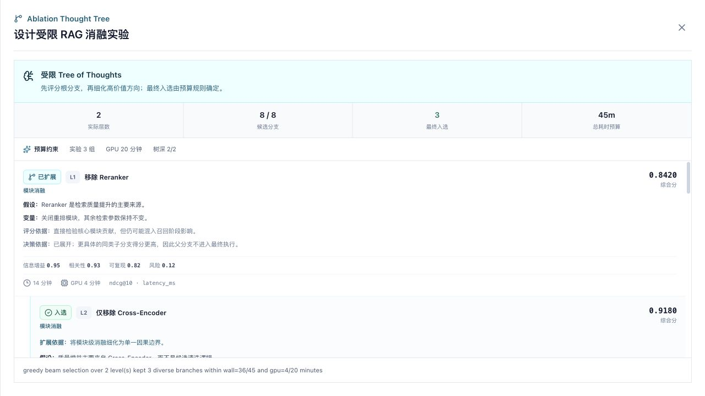

# 受限 ToT 消融设计与文件上传

## 目标

论文复现任务在用户明确提出“消融、参数敏感性、模块移除、随机种子稳定性或运行成本对照”时，新增一个 `ablation_design` 节点。该节点使用两层、受限的 Tree of Thoughts 先比较宽泛方向，再细化高价值分支，并只保留预算内的少量方案。

文件上传用于给计划附加论文、实验配置、笔记或小型数据文件。上传文件由后端保存并校验，计划请求只传文件 ID，不接受客户端文件路径。

## 运行流程

```text
上传文件
  -> POST /api/uploads
  -> 返回 upload ID
  -> POST /api/plan { intent, attachments }
  -> Parse Paper
  -> Repo Discovery -----------+
  -> Ablation Design (ToT) ----+-> Prepare Workspace
                                 -> Resolve Dependencies
                                 -> Prepare Runtime
                                 -> Install Dependencies
                                 -> Execute Selected Ablations
                                 -> Compare With Paper Claims
```

`Repo Discovery` 和 `Ablation Design` 都依赖论文解析，可以并行执行。`Prepare Workspace` 等待二者完成，并取得 `ablation_plan` 后生成实际实验入口。

## ToT 设计

正常情况下，ToT 经过四个有界阶段：

1. **根分支生成**：模型提出候选，系统按类别去重并补齐缺失维度，最多保留 5 个一级方向。
2. **根分支评估**：模型评估每个方向的信息增益、任务相关性、可复现性和风险；Go 重新限幅并计算统一分数。
3. **高价值分支细化**：系统只把预算可行、得分靠前的最多 3 个父分支交给模型，要求每个子分支只细化一个因果变量。一级和二级分支合计不超过 8 个。
4. **子分支评估与剪枝**：模型评估新增子分支，Go 校验 `parent_id`、类别、深度、ID 唯一性和字段完整性，再在实验数、GPU 时间、总耗时和类别多样性约束下选择。每个候选都会记录入选或剪枝的确定性 `decision_reason`。

模型候选缺少某类消融时，系统会从五类内置候选中补齐缺失维度。子分支必须指向本轮允许展开的父节点，并与父节点保持相同类别；不合法的谱系会直接丢弃。模型调用失败时保留已经完成的层级，并使用确定性默认分数继续，不会阻断整个计划。

例如，一级分支可以是“移除 Reranker”，二级分支再把它细化成“只移除 Cross-Encoder，其他检索参数保持不变”。这样最终入选的是更容易解释的单变量对照，而不是同时改动多个模块的大组合。

系统随后进行确定性的预算选择。评分公式为：

```text
score = 0.40 * information_gain
      + 0.30 * relevance
      + 0.20 * reproducibility
      - 0.07 * normalized_time_cost
      - 0.03 * risk
```

允许的候选类别固定为：

| 类别 | 用途 |
|---|---|
| `parameter` | 参数或结构敏感性 |
| `module` | 模块移除或开关 |
| `data_scale` | 数据量、序列长度等规模变化 |
| `seed_stability` | 固定多随机种子重复 |
| `runtime_cost` | 延迟、吞吐和内存成本 |

默认预算为：

```text
最大实验数：3
最大 GPU 时间：30 分钟
最大总耗时：60 分钟
搜索深度：2
候选上限：8
```

请求中可以直接覆盖部分预算，例如：

```text
复现 Transformer，并做最多 2 组轻量消融，总耗时 30 分钟。
```

当前预算解析支持“最多 N 组消融/实验”“总耗时 N 分钟”和 GPU 分钟表达。

## 结构化产物

`ablation_design` 输出：

| Artifact | 内容 |
|---|---|
| `ablation_plan` | 搜索策略、预算、全部候选、父子谱系、实际深度、评分、入选和剪枝结果 |
| `selected_ablation_configs` | 最终进入执行阶段的候选 |
| `ablation_selection_report` | 候选数量、入选数量和预算摘要 |

`ablation_plan.strategy` 固定为 `bounded_tree_of_thoughts`。每个候选包含 `parent_id`、`depth`、四项评分、`evaluation_reason`、`decision_reason` 和可选的 `expansion_reason`；计划额外记录 `actual_depth` 与 `expanded_parent_ids`。这些字段由前端直接渲染为方案树，展示哪些父节点被展开、哪些子节点入选、哪些候选因预算或类别约束被剪枝。



截图由真实 React 节点面板加载结构化回归样例生成，用于验证父子谱系与响应式布局；其中的分数是界面测试数据，不是某个 RAG Benchmark 的实验结论。

## 能力边界

当前 ToT 负责回答“预算有限时，先做哪几组消融更有信息量”。它不会把模型预测分数当成真实性证明，也不会声称入选方案已经提升论文指标。真实提升仍需后续执行节点运行 baseline 与候选配置，并由冻结 evaluator、重复测量和 Artifact 验收。

当前二级分支根据论文上下文和一级分支评估生成，还不是“执行一个候选后，把真实指标反馈给模型，再继续长出下一层”的结果驱动树搜索。后者需要为每个分支建立隔离工作区、真实执行、checkpoint 和独立预算，属于 AutoResearch Harness 的后续扩展。

## Attention Smoke 执行

对于当前已经验证的 Attention 轻量复现，入选类别会转换为真实运行配置：

| 入选类别 | 运行配置 |
|---|---|
| `parameter` | heads `1/2/8`，与 4-head baseline 对照 |
| `module` | 关闭 attention scaling、关闭 residual |
| `data_scale` | sequence length `8/32` |
| `seed_stability` | seed `17/47` |
| `runtime_cost` | batch size `1/4` |

实验始终保留 baseline。运行时检测 CUDA；CUDA 可见时使用 GPU，否则使用 CPU。每个结果都记录类别、配置、延迟、注意力熵、输出 L2 和参数量，并给出相对 baseline 的变化百分比。

其他论文目前会得到通用的结构化消融计划，但还需要仓库适配器把选中候选映射到该仓库的训练参数或配置文件。系统不会假装这些通用候选已经在任意论文代码上执行。

## 文件上传 API

### 上传

```http
POST /api/uploads
Content-Type: multipart/form-data
X-User-Id: USER_ID
X-Session-Id: SESSION_ID

file=@paper.pdf
```

返回示例：

```json
{
  "id": "2e52d6b5-72de-437f-934d-62178d37003c",
  "name": "paper.pdf",
  "content_type": "application/pdf",
  "size": 1832048,
  "sha256": "...",
  "content_url": "/api/uploads/2e52d6b5-72de-437f-934d-62178d37003c/content",
  "created_at": "2026-07-20T00:00:00Z"
}
```

### 创建带附件的计划

```http
POST /api/plan
Content-Type: application/json
X-User-Id: USER_ID
X-Session-Id: SESSION_ID

{
  "intent": "分析附件中的配置并做最多 2 组轻量消融",
  "attachments": ["2e52d6b5-72de-437f-934d-62178d37003c"]
}
```

上传 ID 必须属于当前用户。文本类附件最多提取前 64 KiB 进入论文解析上下文；所有附件都会在仓库工作区的 `.scholar/uploads/` 下形成只供本次计划使用的副本，并记录到 `repo_manifest.uploaded_files`。

## 上传限制

默认单文件上限为 32 MiB，可通过以下配置调整：

```env
UPLOAD_ROOT=/app/uploads
UPLOAD_MAX_MB=32
```

支持：

```text
.pdf .txt .md .json .jsonl .yaml .yml .toml .py .ipynb .csv .tsv
```

安全措施包括：

- 按用户哈希目录隔离文件。
- 服务端生成 UUID，不使用原文件名作为存储路径。
- 校验扩展名和实际内容类型。
- 使用请求体和文件大小双重限制。
- 保存 SHA-256。
- 下载和计划引用时重新校验所有权。
- 工作区副本不参与仓库源码入口扫描。

## 前端操作

聊天输入框左下角的附件按钮支持多选。文件上传完成后显示名称、大小和移除按钮；上传过程中不能提交计划。一个计划最多引用 8 个附件。

只上传文件而不填写指令时，前端使用默认任务：

```text
请分析上传的材料，并设计预算受限的轻量消融实验。
```

## 验证

后端测试覆盖：

- 两层 ToT 的根分支评分、父节点选择、子分支生成与二次评分。
- 子分支父 ID、同类谱系、深度、候选上限、预算和类别多样性校验。
- 8 个同类模型候选仍会被去重并补齐为五类根方向；模型显式给出的零分不会被默认分覆盖。
- 每个入选或剪枝候选都有可审计的确定性决策原因。
- Planner 插入 `ablation_design` 并把 artifact 传给工作区节点。
- Attention runner 只包含被选类别对应的实验配置。
- 上传、内容读取、用户隔离和文本摘要。

前端解析测试同时覆盖渐进树、旧版单层计划兼容和非法父子关系拒绝；界面通过 TypeScript、ESLint、Vite 生产构建以及 `1280 x 720`、`390 x 844` 两种视口验证。

### 本地端到端验收

2026-07-20 使用 Web UI 上传本功能文档，并提交：

```text
复现 Attention Is All You Need，并根据附件做最多 2 组轻量消融，
总耗时 30 分钟，GPU 时间不超过 10 分钟。
```

实际结果：

- Planner 生成 9 个节点，包含独立的 `ablation_design` 节点。
- 节点面板显示 `2 组 / GPU 10 分钟 / 总耗时 30 分钟`。
- ToT 补齐五类候选覆盖后，选择了参数消融和模块移除两个不同类别。
- 选择结果累计使用 `10/10` GPU 分钟和 `30/30` 总耗时，没有越过预算。
- 390 x 844 窄屏无横向溢出，浏览器控制台无报错。

这里验证的是实验设计与计划链路。候选方案是否真的在 GPU 上完成，需要继续执行工作区准备、依赖安装和实验节点，并以运行产物为准。

### 2026-08-11 渐进树回归

- 后端模拟完整四阶段模型响应：根生成、根评估、子生成、子评估。
- 断言高价值 `module` 父分支被展开，最终选择更具体的 `module_isolated` 子分支。
- 非白名单父节点、跨类别子节点和重复 ID 会被拒绝。
- 前端使用 5 个一级候选与 3 个二级候选回放方案树；窄屏 `390 x 844` 的页面宽度与视口同为 390 px，控制台无报错。

该回归证明“分支确实生成、建立谱系并被确定性剪枝”，不代表这些界面样例已经跑过真实 RAG 数据集。
